# খাতা ERP

***Every taka, every item and every employee, accounted for in one place, in Bangla or English.***

    

A production-grade ERP for medium-sized organizations: organization, HR and payroll, inventory, purchasing, sales, accounting and reporting. It is built as a **modular monolith** with a Java / Spring Boot backend on PostgreSQL and a React + TypeScript web application.

> **ভাষা / Language:** the web application opens in **Bangla** (বাংলা); switch to English with **বাংলা | English** at the top right. Your choice is remembered ([localization](docs/LOCALIZATION.md)).

## 📘 **[User manual: run and use the ERP, step by step →](docs/USER_MANUAL.md)**

**New here? Start with the [user manual](docs/USER_MANUAL.md).** It explains how to run the ERP and walks through the demo company with screenshots of every business process. It also covers setting up your own company, the Docker images and troubleshooting.

## Key features (মূল বৈশিষ্ট্য)

-  **Bangla and English interface** (বাংলা ও ইংরেজি): Bangla is the default and English is one click away. Amounts show as **৳২৫,০০০.০০** with Bengali digits, and your choice follows you to every device.
-  **Double-entry accounting** (দু'তরফা হিসাব): every stock movement, purchase and sale posts to the **general ledger** (সাধারণ খতিয়ান) automatically. The database itself refuses unbalanced entries and postings into closed periods.
-  **Stock engine** (মজুত ব্যবস্থাপনা): warehouses and locations, stock reservation, counts, transfers and **valuation** (মূল্যায়ন), with a stock check before anything is issued.
-  **Purchasing** (ক্রয়): requisition → **purchase order** (ক্রয় আদেশ) with approval → goods receipt → supplier bill, checked by the **three-way match**.
-  **Selling** (বিক্রয়): quotation → **sales order** (বিক্রয় আদেশ) with a **credit check** → delivery → invoice → customer payment.
-  **HR and payroll** (মানবসম্পদ ও বেতন): employee records, **leave** (ছুটি) with accruals, attendance, and a monthly **payroll run** (বেতন প্রক্রিয়া) with payslips and a bank file.
-  **Reports and dashboards** (প্রতিবেদন ও ড্যাশবোর্ড): 36 reports, including the **trial balance** (রেওয়ামিল), profit and loss and balance sheet, exported to **CSV, Excel or PDF**.
-  **Security** (নিরাপত্তা): **two-step verification** (দ্বি-ধাপ যাচাই), a permission check on every request, **segregation of duties** (who prepares cannot approve), encrypted personal data, and each company's data kept apart by the database.
-  **Audit trail** (নিরীক্ষা লগ): every change records who, what and when. Posted ledgers are never edited, only **reversed** (বিপরীত দাখিলা).

## Built with (যা দিয়ে তৈরি)

**Backend** (ব্যাকএন্ড)
- **Java 25** (LTS) with **Spring Boot 4.1** and **Spring Modulith 2.1** for the modular monolith and its module boundaries
- **jOOQ 3.21** for type-safe SQL, with classes generated from the database schema
- **Flyway 12** for database migrations
- **Spring Security 7** with **Argon2id** password hashing (BouncyCastle) and TOTP two-step verification
- **springdoc-openapi 3.1** for the OpenAPI document the frontend is typed from
- **db-scheduler** for background jobs, **AWS SDK v2 (S3)** for files, **OpenPDF** for payslip PDFs and **FastExcel** for XLSX exports

**Database and storage** (ডেটাবেস ও ফাইল সংরক্ষণ)
- **PostgreSQL 18** with row-level security for company isolation
- **S3-compatible object storage** (SeaweedFS locally) for attachments, payslips and report exports
- **Mailpit** to catch e-mails in local development

**Frontend** (ওয়েব অ্যাপ)
- **React 19** and **TypeScript 5.9**, built with **Vite 8**
- **TanStack Router** for routing and **TanStack Query** for server data
- **Tailwind CSS 4** with **shadcn/ui** (Radix UI) components and **lucide** icons
- **React Hook Form** and **Zod** for forms and validation
- **decimal.js** for exact amounts (never floating point) and **openapi-typescript** for the API types
- **Noto Sans Bengali** and **Geist** fonts, with typed Bangla and English message catalogs

**Testing and quality** (পরীক্ষা ও মান)
- **JUnit 6**, **Testcontainers 2** and **ArchUnit** on the backend, with **JaCoCo** coverage and **Spotless** formatting
- **Vitest** and **Testing Library** for frontend unit tests
- **Playwright** with **axe-core** for end-to-end flows and accessibility (WCAG 2.2 AA)
- **ESLint** with typescript-eslint

**Build and delivery** (বিল্ড ও ডেলিভারি)
- **Gradle 9.8** with locked dependency versions, and **npm** for the frontend
- **Docker** images (Eclipse Temurin JRE, **nginx** for the web app) and **Docker Compose** for the local stack
- **GitHub Actions** CI with image, dependency and secret scans

## Services (সার্ভিস)

When the project runs locally, these services are up:

| Service | Address | What it does |
|---|---|---|
|  **Web application** (ওয়েব অ্যাপ) | <http://localhost:5173> | The ERP in the browser; this is where you sign in |
|  **Backend API** (ব্যাকএন্ড) | <http://localhost:8080/api/v1> | Business rules, permissions, posting and calculations |
|  **Database** (ডেটাবেস) | `localhost:5432` | Stores all data, with row-level security per company |
|  **File storage** (ফাইল সংরক্ষণ) | `localhost:8333` | Attachments, payslip PDFs and report exports (SeaweedFS) |
|  **Mail catcher** (ইমেইল) | <http://localhost:8025> | Shows invitation and password-reset e-mails locally |
|  **Health and metrics** (স্বাস্থ্য পরীক্ষা) | <http://localhost:8081/actuator/health/readiness> | Readiness and Prometheus metrics, internal only |

## কোন অংশ কী করে

বাঁ পাশের মেনুর প্রতিটি অংশের কাজ এক নজরে:

- **ড্যাশবোর্ড:** আপনার কাজের মূল হিসাব এক জায়গায় দেখায়। যেমন কত টাকা পাওনা, কত দিতে হবে, মজুতের মূল্য আর জনবল।
- **প্রতিষ্ঠান:** কোম্পানি, শাখা, বিভাগ, গ্রাহক ও সরবরাহকারী, কর কোড আর পরিশোধের শর্ত এখানে ঠিক করা হয়।
- **মানবসম্পদ:** কর্মচারীর তথ্য, পদ, ছুটির আবেদন ও অনুমোদন, সরকারি ছুটি আর উপস্থিতি।
- **স্ব-সেবা:** কর্মচারী নিজেই নিজের প্রোফাইল, ছুটি, উপস্থিতি আর বেতন স্লিপ দেখেন।
- **মজুত:** পণ্য, গুদাম, কোথায় কত মাল আছে, মাল আনা-নেওয়া, গণনা আর মজুতের মূল্য।
- **ক্রয়:** চাহিদাপত্র থেকে ক্রয় আদেশ, মাল গ্রহণ, ফেরত আর সরবরাহকারীর বিল।
- **বিক্রয়:** মূল্য তালিকা, কোটেশন, বিক্রয় আদেশ, ডেলিভারি, ফেরত আর গ্রাহকের ইনভয়েস।
- **হিসাবরক্ষণ:** হিসাব তালিকা, জাবেদা দাখিলা, পাওনা ও দেনা, ব্যাংক, পেমেন্ট, ব্যয় আর হিসাবকাল বন্ধ করা। কেনাবেচার হিসাব এখানে নিজে থেকেই লেখা হয়।
- **বেতন ব্যবস্থাপনা:** মাসিক বেতন হিসাব করা, অন্য একজনের অনুমোদন, হিসাবে তোলা আর পরিশোধ। বেতন স্লিপ ও ব্যাংক ফাইলও এখান থেকে।
- **প্রতিবেদন:** বিক্রয়, ক্রয়, মজুত, হিসাব ও বেতনের তৈরি প্রতিবেদন, যেমন রেওয়ামিল, আয় বিবরণী আর উদ্বৃত্তপত্র। CSV, Excel ও PDF-এ নামানো যায়।
- **প্রশাসন:** ব্যবহারকারী, তাঁদের ভূমিকা ও অনুমতি, আর কে কখন কী বদলেছে তার নিরীক্ষা লগ।

যিনি কাগজ তৈরি করেন, তিনি নিজে তা অনুমোদন করতে পারেন না। আর প্রত্যেকে কেবল নিজের অনুমতির অংশটুকুই দেখেন। বিস্তারিত ধাপগুলো [ব্যবহার নির্দেশিকায়](docs/USER_MANUAL.md) আছে।

## Repository layout (ফোল্ডার কাঠামো)

```
erp-claude/
├── README.md                     this file
├── CLAUDE.md                     rules for AI coding agents
├── .env.example                  local configuration template (copy to .env)
├── .github/workflows/ci.yml      CI: backend and frontend builds with image scans, API contract, dependency and secret scans
│
├── docs/                         the specification (normative) and the guides
│   ├── PRODUCT_SPEC.md           scope, business rules, document lifecycles, posting matrix
│   ├── ARCHITECTURE.md           modules, dependencies, transactions, events, deployment
│   ├── DATABASE.md               schemas, RLS, invariants, locking
│   ├── API.md                    REST conventions and the endpoint catalogue
│   ├── SECURITY.md               authentication, permissions, data protection, audit
│   ├── DEVELOPMENT_PLAN.md       phases 1–12 and the Definition of Done
│   ├── DECISIONS.md              ADRs and open questions
│   ├── LOCALIZATION.md           Bangla and English: preference, formatting, glossary
│   ├── USER_MANUAL.md            how to run and use it, step by step
│   └── manual/images/            the manual's screenshots (English, and Bangla bn-*.png)
│
├── infra/
│   ├── compose/                  local stack: PostgreSQL, SeaweedFS (S3), Mailpit
│   ├── db/bootstrap/             database roles (owner, migrator, app, reporting, support)
│   └── docker/                   backend and frontend images, nginx config of the SPA
│
├── backend/                      Java 25 · Spring Boot 4.1 · Spring Modulith · jOOQ
│   ├── build.gradle.kts          build, jOOQ codegen, Spotless, JaCoCo (with *.lockfile)
│   └── src/
│       ├── main/java/com/erp/
│       │   ├── ErpApplication.java
│       │   ├── platform/         shared kernel: security, web, json, money, tx, audit,
│       │   │                     idempotency, numbering, files, crypto, events, jooq
│       │   ├── auth/             users, sign-in, MFA, sessions, roles and permissions
│       │   ├── org/              companies, branches, departments, tax codes, payment terms,
│       │   │                     exchange rates, document numbering
│       │   ├── partners/         customers and suppliers
│       │   ├── hr/               employees, leave, attendance, self-service
│       │   ├── inventory/        products, warehouses, the stock engine
│       │   ├── procurement/      requisitions, purchase orders, receipts, supplier bills
│       │   ├── sales/            price lists, quotations, orders, deliveries, invoices
│       │   ├── accounting/       chart of accounts, journals, posting engine, AR/AP, payments
│       │   ├── payroll/          components, structures, runs, payslips, bank file
│       │   ├── reporting/        report catalogue, dashboards, exports
│       │   └── admin/            audit log storage and queries
│       │       └── each module:  api/ events/ (public) · application/ domain/
│       │                         persistence/ web/ (internal)
│       ├── main/resources/
│       │   ├── application*.yml  configuration and profiles (local, prod, migrate, …)
│       │   └── db/migration/     Flyway migrations V<timestamp>__<module>__<desc>.sql
│       └── test/java/com/erp/    unit and integration tests per module (Testcontainers),
│                                 ArchitectureTests, ModularityTests, support/ (fixtures)
│
└── frontend/                     React 19 · TypeScript · Vite · TanStack Router/Query
    ├── package.json              scripts: dev, build, test, lint, typecheck, api:*, demo:code
    ├── index.html
    ├── security-headers.mjs      the SPA's security headers and CSP
    ├── scripts/                  API type generation, route generation, demo TOTP codes
    ├── src/
    │   ├── main.tsx · app/       entry point, router, query client
    │   ├── api/                  generated API types and the typed client
    │   ├── auth/                 session, company context, permissions, language switch
    │   ├── i18n/                 message catalogues: bn.ts (Bangla, default), en.ts (English)
    │   ├── layout/               application shell: navigation, header, user menu
    │   ├── components/           ui/ (shadcn), data/, form/, overlay/, document/, …
    │   ├── modules/              screens: dashboard, org, hr, inventory, procurement,
    │   │                         sales, accounting, payroll, reports, admin, account
    │   ├── routes/               file-based routes (/c/$companyId/... per company)
    │   ├── lib/                  number, amount and date formatting, enums
    │   └── styles/ · index.css   Tailwind and theme
    ├── e2e/                      Playwright: business flows, smoke + accessibility,
    │   │                         localization, tablet, security headers
    │   ├── support/              seed data, fixtures, helpers
    │   └── manual/               screenshot capture for docs/USER_MANUAL.md
    └── tests/                    unit test of the security headers
```

Not committed (generated or local): `.env`, `backend/build/` (including the generated jOOQ classes), `frontend/node_modules/`, `frontend/dist/` and `frontend/src/routeTree.gen.ts`. `frontend/src/api/schema.d.ts` is committed and regenerated from the backend's OpenAPI document with `npm run api:generate`.

## Screenshots (স্ক্রিনশট)

### ড্যাশবোর্ড (Bangla)

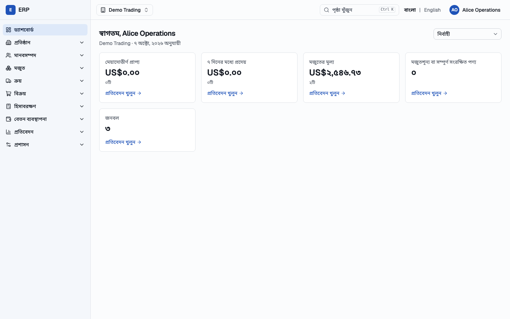

The dashboard in Bangla, the default language, shows the key figures for the signed-in user's roles in Bengali digits, with the menu on the left and the **বাংলা | English** switch at the top right.

### ইনভয়েস (Bangla)

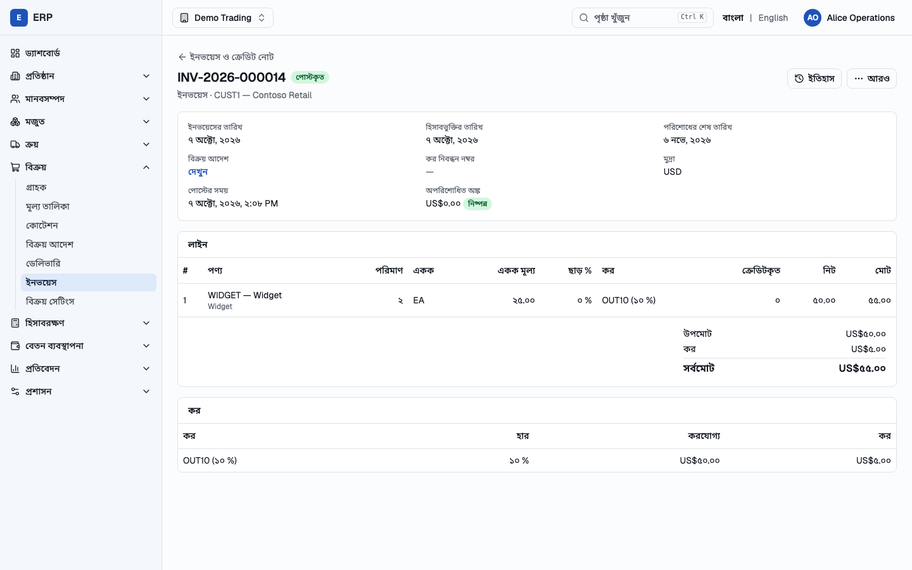

A posted customer invoice in Bangla, where labels, dates and amounts are localized while the invoice number, customer code and tax code stay unchanged.

### রেওয়ামিল (Bangla)

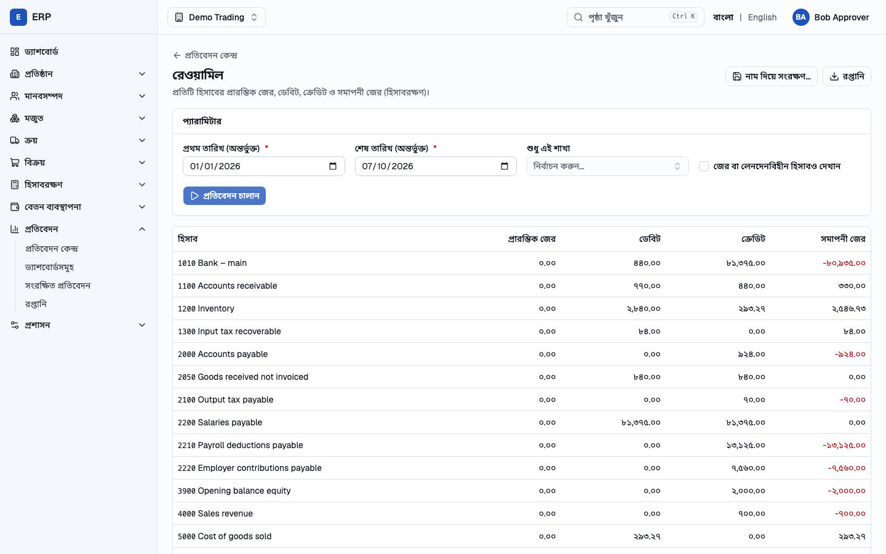

The trial balance report in Bangla lists the opening balance, debits, credits and closing balance of every account for the chosen dates.

### বেতন প্রক্রিয়া (Bangla)

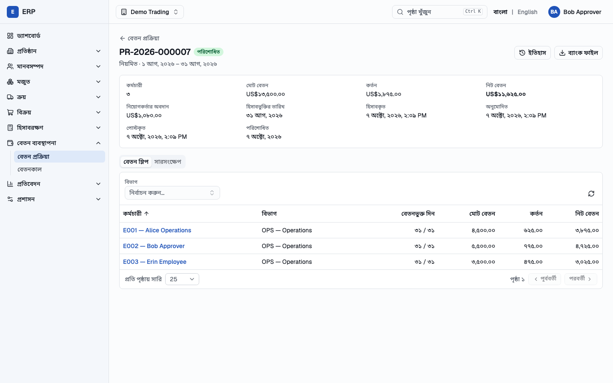

A paid payroll run in Bangla shows gross pay, deductions, the employer's contribution and net pay, with one payslip line per employee.

### Dashboard (English)

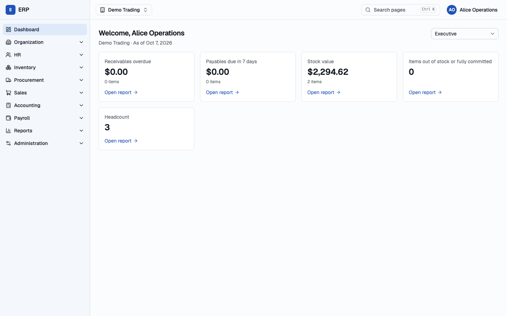

The same dashboard in English, where the menu shows only the sections the user's roles allow.

### Purchase order

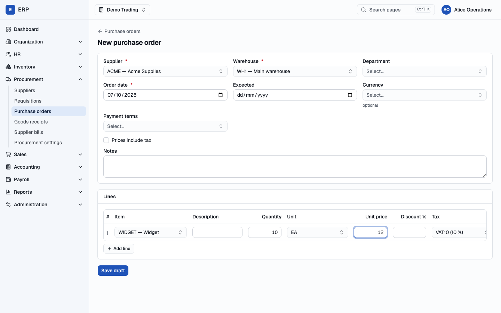

A new purchase order with its supplier, warehouse and lines, where the totals and taxes are calculated by the server rather than the browser.

### Sales order confirmation

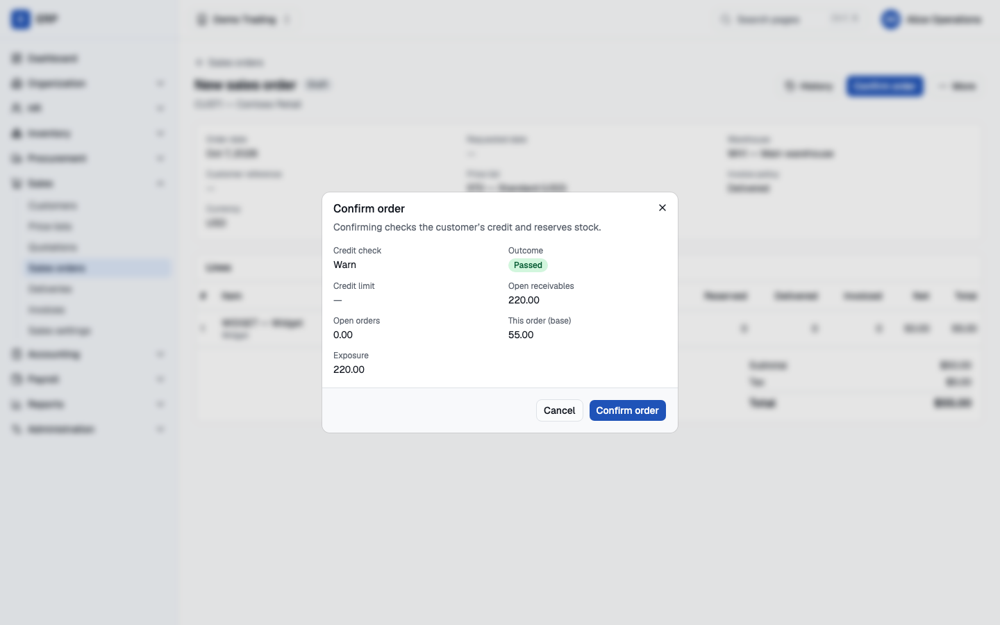

Confirming a sales order runs the customer's credit check and reserves the stock before the goods can be delivered.

### Customer invoice

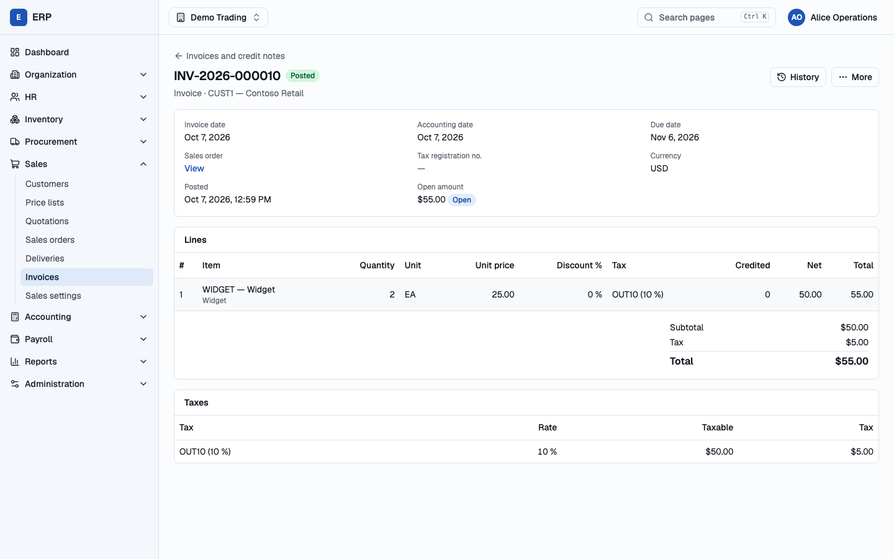

A posted customer invoice shows its open amount, which goes down as the customer's payments are allocated to it.

### Payment allocation

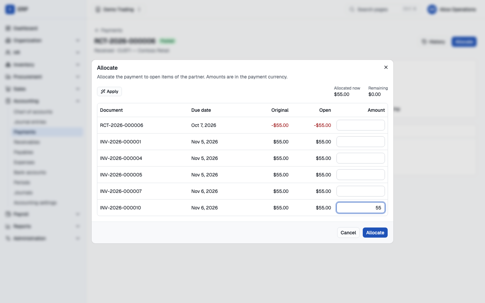

A received customer payment is allocated to the customer's open invoices, which reduces what each invoice still owes.

### Payroll run

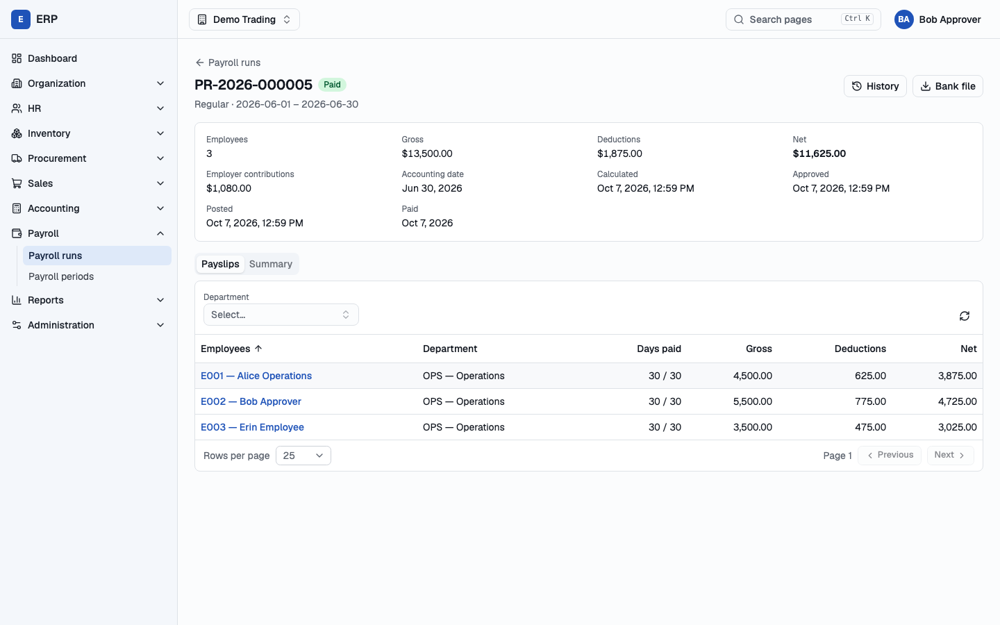

A payroll run that one person calculated and a second person approved, posted and paid, so no one can pay salaries alone.

### Trial balance

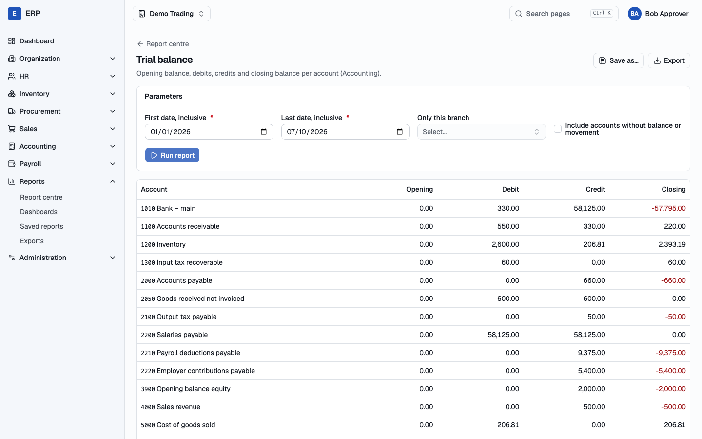

The trial balance in the report centre, which, like every report, can be exported to CSV, Excel or PDF.

More screens, step by step, are in the [user manual](docs/USER_MANUAL.md).

## How to run (কীভাবে চালাবেন)

### Demo credentials (ডেমো লগইন)

These users exist after you load the demo company (step 6 below). Open **<http://localhost:5173>** and sign in with:

| User | E-mail | Password | 6-digit code? | What they do |
|---|---|---|---|---|
| **Alice** | `alice@erp.local` | `Blue-Ocean-Lantern-2026` | yes | Daily work: buying, warehouse, selling, accounting, HR, payroll preparation, company administration |
| **Bob** | `bob@erp.local` | `Blue-Ocean-Lantern-2026` | yes | Approves what Alice prepares: purchase orders, sales overrides, payroll runs; finance and audit |
| **Erin** | `erin@erp.local` | `Blue-Ocean-Lantern-2026` | no | An employee: self-service only (her leave, attendance, payslips) |
| **Admin** | `admin@erp.local` | `Correct-Horse-Battery-77` | yes | System administrator: users, roles and companies, no company data |

**Two-step verification code** (দ্বি-ধাপ যাচাই কোড): Alice, Bob and Admin also need a 6-digit code after the password. In the demo you don't need a phone; print the current code in a terminal and type it within 30 seconds:

```bash
cd frontend
npm run demo:code alice      # or: bob, admin
```

### Run the project step by step (ধাপে ধাপে চালানো)

You need **JDK 25**, **Docker** and **Node.js 22** or newer. Run every command from the project folder.

- **1. Create the configuration file** (কনফিগারেশন ফাইল). Copy the template:
  ```bash
  cp .env.example .env
  ```
  In `.env`, replace every `change-me…` value with a long random text, and set the two keys and the first administrator:
  ```bash
  openssl rand -hex 20                    # a value for each change-me… password
  openssl rand -base64 48                 # → ERP_API_CURSOR_SIGNING_KEY=<paste>
  echo "1:$(openssl rand -base64 32)"     # → ERP_FIELD_ENCRYPTION_KEYS=<paste>
  ```
  ```bash
  ERP_BOOTSTRAP_ADMIN_EMAIL=admin@erp.local
  ERP_BOOTSTRAP_ADMIN_PASSWORD=Correct-Horse-Battery-77
  ERP_BOOTSTRAP_ADMIN_DISPLAY_NAME=System Administrator
  ```
- **2. Start the database, file storage and mail catcher** (ডেটাবেস ও অন্যান্য সার্ভিস), then wait until `postgres` and `mailpit` show `(healthy)`:
  ```bash
  docker compose --env-file .env -f infra/compose/docker-compose.yml up -d postgres mailpit s3
  docker compose --env-file .env -f infra/compose/docker-compose.yml ps
  ```
- **3. Start the backend** (ব্যাকএন্ড) in a **new terminal** and leave it running. It is ready when the log shows `Started ErpApplication`; the first start takes a few minutes.
  ```bash
  cd backend
  ./gradlew bootRun --args='--spring.profiles.active=local'
  ```
- **4. Create the system administrator** (প্রথমবার শুধু একবার) in another terminal. It creates the admin from `.env` and exits:
  ```bash
  cd backend
  ./gradlew bootRun --args='--spring.profiles.active=local,bootstrap-admin'
  ```
- **5. Start the web application** (ওয়েব অ্যাপ) in a **new terminal** and leave it running. It is ready when it prints `Local: http://localhost:5173/`.
  ```bash
  cd frontend
  npm ci          # first time only
  npm run dev
  ```
- **6. Load the demo company** (ডেমো কোম্পানি) "Demo Trading" with Alice, Bob and Erin, products, a supplier, a customer, employees and payroll. Running it again is safe.
  ```bash
  cd frontend
  node --experimental-strip-types e2e/support/seed.ts
  ```
- **7. Sign in** (সাইন ইন): open **<http://localhost:5173>**, sign in with a user from the table above and enter the code from `npm run demo:code`. The app opens in Bangla; click **English** at the top right to switch.
- **To stop** (বন্ধ করতে): press `Ctrl+C` in the backend and web app terminals, then stop the services:
  ```bash
  docker compose --env-file .env -f infra/compose/docker-compose.yml stop
  ```

The [user manual](docs/USER_MANUAL.md) explains each step in more detail, with screenshots and troubleshooting.

### Create a new user and sign in with it (নতুন ব্যবহারকারী তৈরি)

New users are invited by e-mail. Locally, the e-mails arrive in **Mailpit** at <http://localhost:8025>, not in a real mailbox. The example below creates a salesperson for the demo company.

- **1. Sign in as Admin** with `admin@erp.local` / `Correct-Horse-Battery-77` and the code from:
  ```bash
  cd frontend && npm run demo:code admin
  ```
- **2. Invite the user** (ব্যবহারকারী আমন্ত্রণ): open **System users** (সিস্টেম ব্যবহারকারী) in the menu, choose **Invite user** (ব্যবহারকারী আমন্ত্রণ করুন), enter an **Email** such as `sara@erp.local` and a **Display name** such as `Sara Sales`, and choose **Invite user**. The message *Invitation sent* appears.
- **3. Open the invitation e-mail** (আমন্ত্রণ ইমেইল): go to <http://localhost:8025>, open the e-mail **"You have been invited to the ERP"** and click the link in it.
- **4. Choose a password** (পাসওয়ার্ড নির্ধারণ): on **Activate your account** (আপনার অ্যাকাউন্ট সক্রিয় করুন), enter the same password in **New password** and **Confirm password**, then choose **Save**. Use at least 12 characters that are not a common password and don't contain the name, for example `Green-River-Window-2026`.
- **5. Give the user a role** (ভূমিকা দিন): back in the Admin's browser, open **System users**, click the new user, and choose **Assign role**. Select **Company** `Demo Trading` and **Role** `Sales representative (SALES_REP)`, then choose **Assign role**. Without a role, the user can sign in but only sees *You have no company access yet*.
- **6. Sign in as the new user** (নতুন ব্যবহারকারী হিসেবে সাইন ইন): sign out as Admin, or use a private browser window, open <http://localhost:5173> and sign in with `sara@erp.local` and the password from step 4. The menu shows only what the role allows: **Dashboard, Organization, Inventory, Procurement, Sales and Reports**.

Some roles hold sensitive permissions and **require two-step verification**: Company administrator, Accountant, Accounts payable clerk, Financial controller, HR manager, Payroll officer and Payroll approver. A user with one of them sets it up at their first sign-in by scanning the QR code with an authenticator app (Google Authenticator, Microsoft Authenticator, 1Password, …).

## Documentation (নথিপত্র)

| Document | Contents |
|---|---|
| [docs/USER_MANUAL.md](docs/USER_MANUAL.md) | How to run it: the demo (with screenshots), your own set-up, Docker images, checks, troubleshooting |
| [docs/LOCALIZATION.md](docs/LOCALIZATION.md) | Bangla (default) and English: preference, formatting (৳, Bengali digits), glossary, adding translations |
| [docs/PRODUCT_SPEC.md](docs/PRODUCT_SPEC.md) | Scope, personas, business rules, document lifecycles, posting matrix |
| [docs/ARCHITECTURE.md](docs/ARCHITECTURE.md) | Stack, module boundaries, communication, transactions, events, observability, deployment |
| [docs/DATABASE.md](docs/DATABASE.md) | Conventions, roles, migrations, RLS, logical model, invariants, locking |
| [docs/API.md](docs/API.md) | REST conventions, errors, pagination, concurrency, idempotency, endpoint catalogue |
| [docs/SECURITY.md](docs/SECURITY.md) | Authentication, RBAC and permission catalogue, tenant isolation, data protection, audit |
| [docs/DEVELOPMENT_PLAN.md](docs/DEVELOPMENT_PLAN.md) | Phases 1–12 with dependencies and exit criteria |
| [docs/DECISIONS.md](docs/DECISIONS.md) | ADRs, resolved requirement conflicts, open questions |

## Prerequisites (যা লাগবে)

- JDK 25. The Gradle toolchain uses it; Gradle itself comes from the wrapper.
- Docker. It is needed for the build itself, because jOOQ code generation and the integration tests start PostgreSQL through Testcontainers, and for local infrastructure.

## Local development

```bash
cp .env.example .env              # then replace every change-me value (never commit .env)

# PostgreSQL 18 with the ERP roles (first start runs infra/db/bootstrap/00-roles.sql),
# and Mailpit for invitation and password-reset emails (UI: http://localhost:8025)
docker compose --env-file .env -f infra/compose/docker-compose.yml up -d postgres mailpit s3

# Run the API with the "local" profile: migrates on startup, human-readable logs
cd backend
./gradlew bootRun --args='--spring.profiles.active=local'

# Once: create the first system administrator (the command exits when done; idempotent)
ERP_BOOTSTRAP_ADMIN_EMAIL=admin@example.com ERP_BOOTSTRAP_ADMIN_PASSWORD='<12+ characters, not a common password>' \
  ./gradlew bootRun --args='--spring.profiles.active=local,bootstrap-admin'
```

- API: <http://localhost:8080/api/v1>. Sign in with `GET /api/v1/auth/csrf`, then `POST /api/v1/auth/login` with the `X-CSRF-Token` header and an `Origin` from `ERP_SECURITY_ALLOWED_ORIGINS` (API.md §12). System administrators must enroll TOTP at the first login (`/api/v1/me/mfa/totp/setup` and `/confirm`).
- Locally, cookies are not `Secure` and the session cookie is `erp_session` (no `__Host-` prefix), so plain `http://localhost` works.
- Without `ERP_FIELD_ENCRYPTION_KEYS`, the local profile uses an ephemeral key, and MFA enrollments do not survive a restart. Set a key in `.env` to keep them.
- Health: <http://localhost:8081/actuator/health/readiness> (management port, internal only).
- Metrics: <http://localhost:8081/actuator/prometheus>.

### Web application

```bash
cd frontend
npm ci
npm run dev    # http://localhost:5173 (proxies /api to the backend on :8080)
```

Sign in with the bootstrapped administrator, or seed a demo company with users for every persona
(`node --experimental-strip-types e2e/support/seed.ts`; credentials in `frontend/e2e/.state/seed.json`).
The backend's `ERP_SECURITY_ALLOWED_ORIGINS` must include the SPA's origin. `docker compose … --profile app up`
also builds the web image (`web`, <http://localhost:8088>): nginx with the SPA's security headers and `/api`
proxied to the backend. More in [frontend/README.md](frontend/README.md).

A database volume created before Phase 10 has no password for the reporting role: run `ALTER ROLE erp_reporting PASSWORD '…'` (the value of `ERP_DB_REPORTING_PASSWORD`) as the superuser once, or recreate the volume.

If port 5432 is taken, set `ERP_DB_PORT` and the port in `ERP_DB_URL` in `.env`, for example to `5433`.

## Build, lint, test

```bash
cd backend
./gradlew spotlessCheck                 # lint (formatting); ./gradlew spotlessApply fixes it
./gradlew compileJava compileTestJava   # type check (-Xlint:all -Werror), includes jOOQ code generation
./gradlew test                          # unit + integration (Testcontainers) + architecture tests
./gradlew jacocoTestCoverageVerification  # >= 80 % lines in domain/application packages (report: build/reports/jacoco)
./gradlew build                         # all of the above + bootJar → build/libs/erp-backend.jar
```

Dependencies are locked (`gradle.lockfile`). After changing `gradle/libs.versions.toml`, run `./gradlew dependencies --write-locks`.

## Production-like run (container image)

```bash
(cd backend && ./gradlew bootJar)
docker compose --env-file .env -f infra/compose/docker-compose.yml --profile app up --build
```

The `migrate` service runs the image with `SPRING_PROFILES_ACTIVE=prod,migrate`: it applies Flyway migrations as `erp_migrator` and exits. The `app` service then starts the API with the `prod` profile (ECS JSON logs; `ERP_API_CURSOR_SIGNING_KEY` and `ERP_FIELD_ENCRYPTION_KEYS` required) and sends email through Mailpit. In production, migrations always run as that separate step (ARCHITECTURE.md §8.2). The first administrator is created with `docker compose … --profile app run --rm bootstrap-admin`.

## Configuration

All configuration comes from environment variables. Secrets have no defaults, and startup fails with the names of any missing variables.

| Variable | Purpose |
|---|---|
| `ERP_DB_URL` | JDBC URL, e.g. `jdbc:postgresql://db:5432/erp?sslmode=verify-full` |
| `ERP_DB_APP_USER` / `ERP_DB_APP_PASSWORD` | Runtime role (default user `erp_app`) |
| `ERP_DB_REPORTING_USER` / `ERP_DB_REPORTING_PASSWORD` | Read-only reporting role (default user `erp_reporting`; password required in `prod`); `ERP_DB_REPORTING_URL` points it at a read replica (default: `ERP_DB_URL`), `ERP_DB_REPORTING_POOL_SIZE` (default 5) |
| `ERP_DB_MIGRATOR_USER` / `ERP_DB_MIGRATOR_PASSWORD` | Migration role (only where migrations run) |
| `ERP_DB_MIGRATE_ON_STARTUP` | `true` in `local`/`test`; forbidden in `prod` (use the `migrate` profile) |
| `ERP_API_CURSOR_SIGNING_KEY` | Base64 key of at least 32 bytes for pagination cursors (required in `prod`) |
| `ERP_SECURITY_ALLOWED_ORIGINS` | Exact origins of the web app, comma-separated; checked on unsafe cookie requests (required in `prod`) |
| `ERP_FIELD_ENCRYPTION_KEYS` | `<version>:<base64 32 bytes>[,...]` AES-256-GCM keys for MFA secrets; highest version encrypts (required in `prod`) |
| `ERP_AUTH_PUBLIC_BASE_URL` | Base URL of the web app for invitation and reset links (required in `prod`) |
| `ERP_MAIL_HOST`, `ERP_MAIL_PORT`, `ERP_MAIL_USERNAME`, `ERP_MAIL_PASSWORD`, `ERP_MAIL_STARTTLS`, `ERP_MAIL_FROM` | SMTP relay (host required in `prod`; defaults to Mailpit in `local`) |
| `ERP_JOBS_ENABLED` | `true` on the worker instance(s): audit partitions, security-record purges, payroll calculation and payslip PDFs, report exports and their expiry (default `false`; `true` in `local`) |
| `ERP_BOOTSTRAP_ADMIN_EMAIL`, `ERP_BOOTSTRAP_ADMIN_PASSWORD`, `ERP_BOOTSTRAP_ADMIN_DISPLAY_NAME` | Only for the one-shot `bootstrap-admin` profile |
| `ERP_MFA_ISSUER` | Issuer shown in authenticator apps (default `ERP`) |
| `ERP_DB_POOL_SIZE`, `ERP_DB_STATEMENT_TIMEOUT`, `ERP_DB_LOCK_TIMEOUT` | Tuning (defaults 10, 30s, 5s) |
| `ERP_HTTP_PORT`, `ERP_MANAGEMENT_PORT` | Ports (defaults 8080, 8081) |
