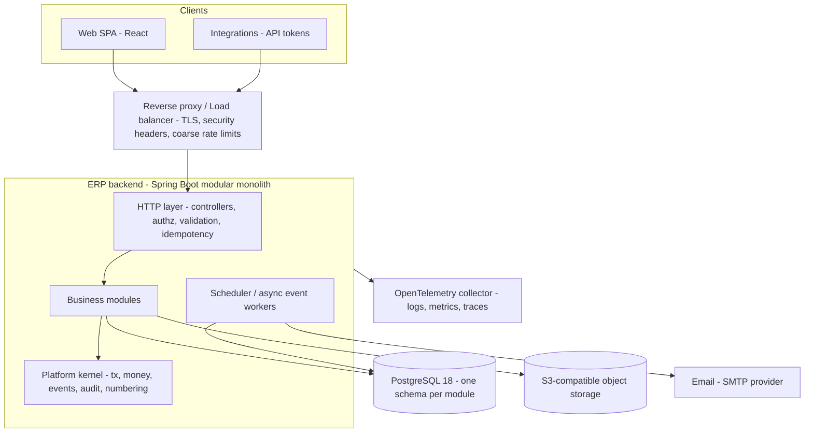
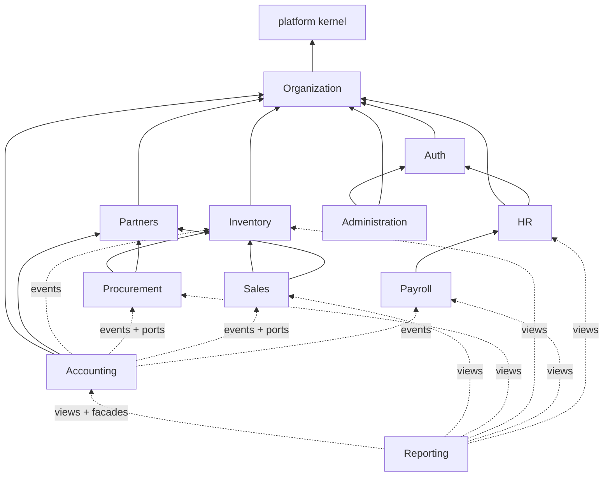

# ERP System — Architecture

Status: **Approved baseline (Phase 1)**. Changes to this document require an ADR entry in [DECISIONS.md](DECISIONS.md).

Related documents: [PRODUCT_SPEC.md](PRODUCT_SPEC.md) · [DATABASE.md](DATABASE.md) · [API.md](API.md) · [SECURITY.md](SECURITY.md) · [DEVELOPMENT_PLAN.md](DEVELOPMENT_PLAN.md) · [DECISIONS.md](DECISIONS.md)

---

## 1. Architectural summary

The ERP is a **modular monolith**: one deployable backend application, one PostgreSQL database, and a separately built single-page web frontend.

The backend is divided into **business modules** with strong boundaries:

- Each module owns its own **Java package**, its own **PostgreSQL schema** and its own **public API**.
- Modules talk to each other only through **public facades** (synchronous calls, inside the same transaction) or **domain events** (synchronous in-transaction listeners or reliable asynchronous listeners).
- The allowed dependency graph is **acyclic** and is **checked in the build** (Spring Modulith verification plus ArchUnit).

Boundaries are strict enough that a module could later move into its own service. To do that, you replace its facade with a remote client and its events with a message broker. No domain code has to change.



### 1.1 Guiding principles (ordered by priority)

1. **Correctness and integrity first.** Use database constraints, transactions and explicit state machines. Integrity never depends on application code alone when the database can enforce it.
2. **Immutability of financial and stock history.** Posted ledgers (general ledger and inventory) are append-only. To correct an error you post a reversal or an adjustment.
3. **Explicit boundaries.** A module never reads or writes another module's tables.
4. **Secure by default.** Every endpoint denies access by default. Tenant scoping applies both in the application and through PostgreSQL row-level security (RLS).
5. **Operational simplicity.** The only stateful dependencies are PostgreSQL and object storage. There is no Redis, no Kafka and no service mesh until measurements justify them.
6. **Observability built in.** Every request and job has structured logs, traces and metrics, all correlated by request ID.
7. **Testability.** The domain logic is plain Java. Integration tests run against real PostgreSQL through Testcontainers.

---

## 2. Technology stack

The repository was empty at Phase 1, so this stack was chosen from scratch. The rationale is in ADR-001 in [DECISIONS.md](DECISIONS.md).

| Concern | Choice | Notes |
|---|---|---|
| Language (backend) | **Java 25 (LTS)** | Records, sealed types, pattern matching, virtual threads. |
| Framework | **Spring Boot 4.1.x** (4.1.1 at Phase 2) | Pinned in `backend/gradle/libs.versions.toml`. Spring Framework 7, Spring Security 7, **Jackson 3** (`tools.jackson`). |
| Modularity | **Spring Modulith 2.1.x** | Module verification, the event publication registry (a transactional outbox) and module tests. At runtime only `spring-modulith-api` (annotations) is on the classpath until the event registry arrives (Phase 4); verification and documentation are test dependencies. |
| Persistence | **jOOQ (OSS edition)** over JDBC/HikariCP | SQL-first. Supports `SELECT … FOR UPDATE` explicitly. Code is generated from the migrated schema. **No JPA/Hibernate.** |
| Migrations | **Flyway** | Plain SQL migrations. One global ordered sequence, with file names namespaced by module. |
| Database | **PostgreSQL 18** | Native `uuidv7()`, RLS, exclusion constraints (`btree_gist`), partitioning. |
| Money/decimals | `java.math.BigDecimal` in a `Money` value object; `NUMERIC` in the database | Floating point is banned. ArchUnit rejects `double`/`float` in domain packages. |
| Security | **Spring Security 7** | Server-side sessions (`auth.sessions`, ADR-028), CSRF and security headers. |
| Password hashing | Argon2id (Spring Security `Argon2PasswordEncoder`, BouncyCastle) | See SECURITY.md. |
| Rate limiting | PostgreSQL counters for authentication; in-memory per-instance windows for API budgets (ADR-029) | Authentication limits work across instances; API budgets are per instance behind the load balancer limits. |
| Background jobs | **db-scheduler** (PostgreSQL-backed, cluster-safe) | Recurring and one-off jobs. |
| Async events | Spring Modulith Event Publication Registry (JDBC) | Reliable at-least-once delivery. |
| Validation | Jakarta Bean Validation for request shape; domain validation in domain code | |
| API docs | springdoc-openapi (OpenAPI 3.1) | The frontend client is generated from it. |
| Observability | Micrometer (Prometheus endpoint), structured ECS JSON logs (Spring Boot native), Actuator; OpenTelemetry trace export from Phase 12 (ADR-025) | |
| Object storage | S3-compatible API (AWS S3 in production; MinIO in development) | Attachments and generated documents. |
| Build | Gradle (Kotlin DSL) with a version catalog | |
| Backend testing | JUnit 5, AssertJ, Testcontainers (PostgreSQL), Spring Modulith `@ApplicationModuleTest`, ArchUnit, jqwik (property-based), REST Assured | |
| Frontend | **React 19 + TypeScript (strict) + Vite** | |
| Frontend libraries | TanStack Router, TanStack Query, TanStack Table, react-hook-form + zod, Tailwind CSS + shadcn/ui (Radix), `openapi-typescript` + `openapi-fetch`, decimal.js (display arithmetic only) | |
| Frontend testing | Vitest + Testing Library; Playwright (end-to-end) | |
| Packaging | OCI images (backend: Spring Boot layered jar on a distroless/temurin JRE; frontend: static assets served by nginx or a CDN) | |
| Local development | Docker Compose: postgres, minio, mailpit, otel-collector (optional) | |
| CI | GitHub Actions (assumed; see Open Questions) | Build, test, module verification, SAST, dependency scanning, image build. |

**Why not JPA/Hibernate?** ERP correctness depends on explicit control over SQL, locking order, batch updates and reporting queries. jOOQ gives type-safe SQL generated from the real schema, with no lazy loading, dirty checking or hidden flushes.

**Why not microservices?** A medium-sized organization does not have the operational capacity for them. They would also turn the core invariants into distributed transactions; for example, "stock issue and GL posting succeed or fail together" would have to span services. The modular monolith keeps that ACID guarantee and still allows extraction later (see §9).

---

## 3. Repository layout

```
/
├── backend/                         Gradle project (single deployable)
│   ├── build.gradle.kts
│   ├── gradle/libs.versions.toml
│   └── src/
│       ├── main/java/com/erp/
│       │   ├── ErpApplication.java          @Modulithic(sharedModules = "platform")
│       │   ├── platform/                    Shared kernel (see §4.3)
│       │   ├── auth/
│       │   ├── org/
│       │   ├── partners/
│       │   ├── inventory/
│       │   ├── procurement/
│       │   ├── sales/
│       │   ├── accounting/
│       │   ├── hr/
│       │   ├── payroll/
│       │   ├── reporting/
│       │   └── admin/
│       ├── main/resources/
│       │   ├── application.yml
│       │   └── db/migration/                Flyway SQL (see DATABASE.md §2.6)
│       └── test/java/com/erp/...
├── frontend/                        React SPA (Vite)
├── infra/
│   ├── db/bootstrap/00-roles.sql    Roles and database grants (run once per database, DATABASE.md §2.7)
│   ├── docker/                      Dockerfiles (backend.Dockerfile)
│   ├── compose/                     docker-compose.yml for local development (+ postgres-init)
│   └── deploy/                      Deployment manifests (Phase 12)
├── .github/workflows/ci.yml         CI pipeline
├── docs/                            This specification
├── CLAUDE.md                        Rules for AI coding agents (points here)
└── README.md
```

The base package `com.erp` is a placeholder (Q-14).

**Generated code.** jOOQ classes are generated at build time into `backend/build/generated-src/jooq` under `com.erp.db.<schema>` (for example `com.erp.db.org.Tables.BRANCHES`). The task `generateJooq` starts a throwaway PostgreSQL container, applies `infra/db/bootstrap/00-roles.sql` and all migrations as the migrator role, and then generates the classes. The generated root package is declared to Spring Modulith as an OPEN module `db`. Each business module lists `"db"` in `allowedDependencies`, and `ArchitectureTests` restricts it to its own schema package.

### 3.1 Internal structure of a module

Every business module uses the same layout:

```
com.erp.<module>/
├── package-info.java        @ApplicationModule(displayName=..., allowedDependencies={...})
├── api/                     PUBLIC. Facades (interfaces), command/query records, read DTOs, ports for others to implement.
│   └── package-info.java    @NamedInterface("api")
├── events/                  PUBLIC. Immutable event records this module publishes.
│   └── package-info.java    @NamedInterface("events")
├── domain/                  INTERNAL. Aggregates, value objects, state machines, domain services, policies. No Spring, no jOOQ.
├── application/             INTERNAL. Use-case services (@Transactional), facade implementations, event listeners.
├── persistence/             INTERNAL. jOOQ repositories. These touch ONLY this module's schema.
└── web/                     INTERNAL. REST controllers, request/response DTOs, mappers.
```

Rules:

- Other modules may import only `api` and `events`, and only when the dependency is allowed by §5.2.
- `domain` must not depend on Spring, jOOQ, servlets or Jackson annotations. ArchUnit enforces this.
- `web` must not call `persistence` directly. It always goes through `application`.
- Controllers never return domain objects. They map them to response DTOs.

---

## 4. Modules and ownership

### 4.1 Module catalogue

| Module | Package / schema | Owns (entities) | Responsibility |
|---|---|---|---|
| **Platform kernel** | `platform` / `platform` | document sequences, idempotency keys, event publication registry, scheduler tables, file metadata | Shared technical capabilities: transactions, request context, money, IDs, errors, numbering, idempotency, audit **port**, files, events infrastructure. **It contains no business logic.** |
| **Organization** | `org` / `org` | companies, branches, departments, currencies, exchange rates, countries, tax codes, payment terms, company settings | Legal-entity structure and shared reference data. |
| **Auth** | `auth` / `auth` | users, credentials, MFA factors, sessions and MFA challenges, API tokens, roles, role permissions, role assignments, login attempts, password reset tokens | Identity, authentication, RBAC and the authorization decision point. |
| **Partners** | `partners` / `partners` | partners, partner addresses, partner contacts, customer profiles, supplier profiles, partner groups | Master data for customers and suppliers. This is a supporting module that the scope list did not name; see ADR-007. |
| **Inventory** | `inventory` / `inventory` | UoM categories, units, UoM conversions, product categories, products, attributes, variants (SKUs), warehouses, locations, stock movements, stock movement lines, the inventory ledger, stock balances, warehouse stock, reservations, valuation (average cost), stock counts | Catalog and all physical stock. It is the **only** writer of stock quantities and stock value. |
| **Procurement** | `procurement` / `procurement` | purchase requisitions, purchase orders, goods receipts, purchase returns, supplier bills, supplier debit notes, supplier price lists | Procure-to-pay operational documents up to the posted supplier bill. |
| **Sales** | `sales` / `sales` | price lists, quotations, sales orders, deliveries, sales returns, sales invoices, credit notes | Order-to-cash operational documents up to the posted invoice or credit note. |
| **Accounting** | `accounting` / `accounting` | chart of accounts, account mappings, fiscal years, periods, journals, journal entries and lines, receivable/payable open items, payments, allocations, bank/cash accounts, expenses, tax account mapping, period balance snapshots | The general ledger and its double-entry invariants, AR/AP subledgers, payments, expenses, financial statements, and period and year close. |
| **HR** | `hr` / `hr` | employees, employment assignments, positions, job titles, department heads, leave types, leave balances, leave requests, employee documents, employee bank details (encrypted) | Workforce master data and HR processes. |
| **Payroll** | `payroll` / `payroll` | pay components, salary structures, employee compensation, pay schedules, payroll periods, payroll runs, payslips, payslip lines | Payroll calculation, approval and posting events. |
| **Reporting** | `reporting` / `reporting` | report definitions, saved report parameters, export jobs, reporting views (read-only) | Cross-module operational reports, dashboards and exports. It owns **no transactional data**. |
| **Administration** | `admin` / `admin` | audit log, system settings, data retention policies, feature flags | Audit storage and queries, global settings, admin tooling (user and role administration UI is backed by the Auth facade). |

Financial statements (trial balance, P&L, balance sheet, GL detail, AR/AP aging) are owned by **Accounting**, because it is the domain authority for them. Reporting may embed them through the Accounting facade, but never re-implements them.

### 4.2 Ownership rules for cross-cutting entities

| Concept | Owner | Consumers reference it by |
|---|---|---|
| Company / branch / department | Org | `company_id`, `branch_id`, `department_id` (with an FK; see DATABASE.md §2.5) |
| User | Auth | `user_id`, plus `created_by`/`updated_by` audit columns |
| Employee | HR | `employee_id` (Payroll; Auth links a user to an employee only through HR's `user_id` column) |
| Customer / supplier | Partners | `partner_id` |
| Product / variant (SKU) / UoM | Inventory | `variant_id`, `uom_id` |
| Tax code, currency, payment terms | Org | `tax_code_id`, `currency_code`, `payment_terms_id` |
| GL account | Accounting | Only Accounting stores `account_id`. Other modules supply **account determination keys** such as product category, partner group or tax code (see §6.4). |
| Invoice payment status | Accounting (open items) | Sales and Procurement query the Accounting facade. They do not keep their own copy. |
| Audit log | Admin (storage); written through the platform `AuditPort` | Every module writes through the port |

### 4.3 Platform kernel (shared module)

The kernel is a library-like shared module that every module may use. It must stay small and free of business logic.

| Package | Contents |
|---|---|
| `platform.money` | `Money` (BigDecimal amount + `CurrencyCode`), `Quantity`, `ExchangeRate`, `RoundingPolicy`, currency minor-unit table |
| `platform.id` | Typed ID records (`CompanyId`, `UserId`, …) wrapping UUIDv7; ID generator |
| `platform.context` | `RequestContext` (user, active company, branch scope, request ID, client IP, auth method), propagated through a scoped value or ThreadLocal on virtual threads |
| `platform.tx` | `CompanyScopedTransactionManager` (sets `app.company_id` / `app.user_id` with `SET LOCAL` at transaction start, for RLS); retry template for SQLSTATE 40001/40P01 |
| `platform.security` | `PermissionCheck` port, `@RequiresPermission` annotation, `AccessDeniedException`. The **implementation lives in Auth** and is wired at the composition root (dependency inversion, which avoids an Org→Auth cycle). |
| `platform.audit` | `AuditPort` with `record(AuditEvent)`. It is implemented by Admin and called inside the business transaction. |
| `platform.numbering` | `DocumentNumberService`: a gapless per-company/type/fiscal-year sequence, using `SELECT … FOR UPDATE` |
| `platform.idempotency` | `Idempotency-Key` handling (filter + store) |
| `platform.events` | Base `DomainEvent` interface, event metadata, publishing helper |
| `platform.files` | `FileStorage` port (S3), file metadata, virus-scan hook |
| `platform.web` | Error model (RFC 9457), pagination/filter/sort parsing, ETag/If-Match support, global exception handler |
| `platform.crypto` | Field-level encryption (AES-256-GCM, versioned keys) for sensitive columns |
| `platform.time` | `Clock` abstraction and the company "business date" from its timezone |
| `platform.config` | Typed `ErpProperties`; `RequiredConfigurationValidator` (fail fast on missing or unsafe configuration) |
| `platform.json` | Strict Jackson 3 configuration (decimals as strings, no coercion, no unknown properties, string sanitizing) |
| `platform.logging` | Log redaction for pattern and structured logs |
| `platform.web.paging`, `platform.jooq` | List contracts (`ListDefinition`), parameter parsing, signed keyset cursors, `KeysetPaginator` over jOOQ |

**Status:** Phase 2 implemented `config`, `context`, `tx`, `web` (incl. paging), `jooq`, `json`, `logging` and `security`. The other packages arrive with their first consumer; see the table at the end of DEVELOPMENT_PLAN.md Phase 2.

---

## 5. Module dependencies and communication

### 5.1 Communication mechanisms

| Mechanism | When to use | Transaction semantics | Example |
|---|---|---|---|
| **Synchronous facade call** (`<module>.api.*Facade`) | The caller needs an answer or a state change **as part of its own business transaction**. | Joins the caller's transaction (`Propagation.REQUIRED`). | Sales calls `InventoryFacade.reserve(...)` when it confirms an order. |
| **Synchronous in-transaction event listener** (`@EventListener`) | A downstream module must react **atomically** to a fact published by an upstream module, and the upstream module must not know about it. | Same transaction. A listener exception rolls back the publisher. | Accounting creates a journal entry when `SalesInvoicePosted` is published. |
| **Asynchronous reliable event listener** (`@ApplicationModuleListener`, backed by the Event Publication Registry) | Side effects that may happen **after** commit and must not block or roll back the business transaction. | New transaction after commit; at-least-once; retried; the consumer must be idempotent. | Email notifications, search/reporting projections, cache invalidation, webhooks. |
| **Port (dependency inversion)** | An upstream module needs data that a downstream module owns, and a direct dependency would create a cycle. | Same transaction. | Sales defines `CustomerCreditExposurePort`; Accounting implements it. |
| **Read-only reporting views** | Reporting needs cross-module joins. | Read-only; uses a reporting DB role. | `inventory.v_stock_on_hand` consumed by Reporting. |

**Hard rules**

1. No module reads or writes another module's tables. Reporting views are the only exception: they are published, versioned contracts owned by the source module.
2. No cycles in the module dependency graph. This includes dependencies through events: a listener on a module's events counts as a dependency on that module.
3. Facades are coarse-grained, use-case oriented, and take and return **records**. They never expose jOOQ records or domain entities.
4. Event payloads are **self-contained**. A listener must never call back into the publisher to complete its work. Payloads carry everything needed, including amounts in both document and base currency and account determination keys.
5. Events are **immutable facts in the past tense** and are versioned (`schemaVersion`). Breaking changes create a new event type or version.
6. Every asynchronous listener is idempotent. It deduplicates on `eventId` through `platform.processed_events` (consumer, event_id) unique.

### 5.2 Allowed dependency graph



Arrows point from the dependent module to its dependency. Every module also depends on `platform`, which is omitted for clarity.

Allowed dependencies in table form. This table is the source of truth for `allowedDependencies`:

| Module | May depend on (api/events) |
|---|---|
| org | — |
| auth | org |
| partners | org |
| inventory | org |
| hr | org, auth |
| procurement | org, partners, inventory |
| sales | org, partners, inventory |
| payroll | org, hr |
| accounting | org, partners, inventory::events, procurement::{api, events}, sales::{api, events}, payroll::events (`api` here is used only to **implement ports** defined by those modules) |
| reporting | org, accounting::api, plus reporting views of all modules |
| admin | org, auth |

Layers:

| Layer | Modules |
|---|---|
| L0 | platform |
| L1 | org |
| L2 | auth, partners, inventory |
| L3 | hr, procurement, sales |
| L4 | payroll |
| L5 | accounting |
| L6 | reporting, admin |

A module may depend only on modules in a lower layer.

**Notable consequences**

- **Accounting is downstream of operations.** Operational modules never call Accounting. They publish events, and Accounting posts journal entries **inside the same transaction** through synchronous listeners. The operational document and its GL entry commit together, or neither commits.
- **Data that operations need from Accounting goes through ports.** Examples are customer credit exposure and an invoice's or bill's open (unpaid) amount. Sales and Procurement define port interfaces in their `api` packages, such as `sales.api.CustomerCreditExposurePort` and `sales.api.InvoiceSettlementPort`; Accounting implements them. If no implementation is registered (before Phase 8), a documented default is used: zero exposure and "unknown" settlement status. There is no separate "period open" pre-check port: the Accounting listener rejects postings into closed periods inside the same transaction.
- **The Admin module does not depend on business modules.** Business modules write audit records through `platform.audit.AuditPort`, which Admin implements.
- **Authorization checks come from the kernel.** `platform.security.PermissionCheck` is implemented by Auth. This lets Org (L1) protect its endpoints without depending on Auth (L2).

### 5.3 Verification

- `ModularityTests`: `ApplicationModules.of(ErpApplication.class).verify()`. It fails on cycles and on access to non-exposed packages.
- ArchUnit rules:
  - `domain` packages have no framework imports.
  - There is no `double`/`float` in `domain` or `api` packages.
  - `persistence` packages reference only jOOQ tables of their own schema. jOOQ code generation produces one package per schema, so a rule can check that `com.erp.sales.persistence` imports only from `com.erp.db.sales`.
  - Controller methods must carry exactly one of `@PublicEndpoint`, `@AuthenticatedEndpoint` or `@RequiresPermission`.
  - Business modules use only the generated jOOQ classes of their own schema (`com.erp.<module>` → `com.erp.db.<module>`); jOOQ is used only in `persistence` packages and `platform.jooq`.
  - No `double`/`float` fields or return types outside generated code.
- Spring Modulith generates documentation (C4/PlantUML module canvases) in CI as an artifact.

---

## 6. Cross-cutting design

### 6.1 Request lifecycle

```mermaid
sequenceDiagram
  participant C as Client
  participant F as Filter chain
  participant Ctl as Controller
  participant App as Application service
  participant DB as PostgreSQL
  C->>F: HTTPS request (session cookie or Bearer token)
  F->>F: Request ID, rate limit, authentication, CSRF (cookie sessions), security headers
  F->>Ctl: Authenticated principal
  Ctl->>Ctl: Resolve company from path, check membership, @RequiresPermission
  Ctl->>Ctl: Bean Validation of request DTO
  Ctl->>App: Command (with RequestContext)
  App->>DB: BEGIN; SET LOCAL app.company_id, app.user_id
  App->>DB: Load aggregate (company-scoped), lock where needed
  App->>App: Domain logic, state transition, invariants
  App->>DB: Persist + audit record + publish events (sync listeners run here)
  App->>DB: COMMIT
  App-->>Ctl: Result
  Ctl-->>C: 2xx + ETag, or RFC 9457 problem
  Note over App,DB: After commit, async listeners run from the event publication registry
```

### 6.2 Transactions

- **One business command = one database transaction.** The transaction boundary is the application service method (`@Transactional`). Controllers are not transactional.
- Default isolation is **READ COMMITTED** plus **explicit row locks** where invariants depend on current values. These are listed in DATABASE.md §9. SERIALIZABLE isn't used globally because of its retry cost. A use case may opt in where documented.
- **Lock ordering** prevents deadlocks. When several rows of the same kind are locked, they are locked in ascending primary-key order. Across kinds, the global order is:
  1. The business document header being fulfilled, such as a sales order or PO (`FOR UPDATE`).
  2. `inventory.warehouse_stock`.
  3. `inventory.stock_balances`.
  4. `inventory.item_valuations`.
  5. `accounting.open_items`.
  6. `platform.document_sequences`. Numbers are taken **late**, and the lock is held until commit. When one transaction needs several numbers, they are taken in the natural flow order: stock movement → operational document → journal entry.

  `accounting.periods FOR SHARE` may be taken at any point. It conflicts only with period close (`FOR UPDATE`), and period close acquires no other locks, so it cannot take part in a deadlock cycle.
- A transaction retry decorator retries up to **3 times** with jitter on SQLSTATE `40001` (serialization failure) and `40P01` (deadlock). It applies only to methods marked `@RetryableTransaction`, all of which must be idempotent within the transaction.
- **Statement timeout** is 30 s for API transactions and configurable for jobs. **Lock timeout** is 5 s; when it is exceeded, the API returns `409 CONFLICT` with code `RESOURCE_BUSY`.
- **No remote calls inside a transaction**, whether HTTP, SMTP or S3. Those go to asynchronous listeners or happen before or after the transaction. File uploads are written to object storage first and then referenced in the transaction; a cleanup job removes orphans.
- Long-running batch operations (payroll calculation, period close, imports) run as db-scheduler jobs. They process in **chunks, one transaction per chunk**, and keep their progress in a job state table.

### 6.3 Multi-company context

- The **company** is the data isolation boundary. Every business row carries `company_id`.
- A request operates in **exactly one active company**, taken from the URL path (`/api/v1/companies/{companyId}/...`). See API.md §3.
- The authorization layer verifies that the user has a role assignment in that company before any handler runs.
- The transaction manager executes `SELECT set_config('app.company_id', :id, true)` (transaction-local). PostgreSQL RLS policies on every company-scoped table then restrict rows to that company. This is **defense in depth**: application queries also filter by `company_id` explicitly.
- Cross-company operations, such as a user listing the companies they can access or system jobs iterating over companies, use explicitly marked code paths. Jobs set the company context for each company they process. Only the migration owner role bypasses RLS.
- **Branch scoping** works inside a company. Role assignments may be limited to a set of branches. Branch-scoped resources (warehouses and the documents tied to them, employees by branch) are filtered by the user's branch scope in the application layer (see SECURITY.md §4.4).

### 6.4 Accounting integration (posting engine)

Accounting is the only module that creates journal entries. Operational modules publish **posting events** (catalogue in §7). Accounting's synchronous listeners:

1. Check that an **open period** exists for the event's `accountingDate` (`FOR SHARE` lock on the period row).
2. Resolve GL accounts through **account determination**: `accounting.account_mappings` keyed by a mapping key (for example `INVENTORY_ASSET`, `COGS`, `SALES_REVENUE`, `AR_CONTROL`, `AP_CONTROL`, `GRNI`, `TAX_OUTPUT`, `TAX_INPUT`, `INVENTORY_ADJUSTMENT`, `PURCHASE_PRICE_VARIANCE`, `SALARY_EXPENSE`, …) and an optional scope. Supported scopes are product category, warehouse, partner group, tax code, pay component, department or bank account. The most specific match wins; then the company default applies. A missing mapping raises `ACCOUNT_MAPPING_MISSING` (422) and rolls back the business document.
3. Build balanced journal lines in base currency, plus document-currency amounts. Rounding differences go to the `ROUNDING_DIFFERENCE` account; the maximum allowed is 0.01 × number of lines in minor units, otherwise the posting is rejected.
4. Insert the entry as `posted`, with a gapless number per journal and fiscal year.
5. For invoices, bills, credit notes and debit notes, create or update **open items** (AR/AP subledger).

The posting matrix is specified in [PRODUCT_SPEC.md §8.6](PRODUCT_SPEC.md).

Before Phase 8 no listener exists, so operational documents post without GL entries. This is acceptable because there is **no production use before Phase 12** (see DEVELOPMENT_PLAN.md). Phase 8 adds integration tests that assert GL entries for every operational flow.

### 6.5 State machines

Every document with a lifecycle has an explicit state machine in its `domain` package:

- An `enum` of states.
- A transition table `(from, action) → to`, with a guard and the required permission.
- A `transition(action, actor)` method. It is the **only** way to change state: there is no `setStatus`.

Allowed transitions are also enforced in the database where practical. Where it is cheap, a `CHECK` covers valid states and a trigger rejects edits of posted rows. Each transition writes an audit record. The state machines are listed in [PRODUCT_SPEC.md](PRODUCT_SPEC.md) for each module.

### 6.6 Concurrency control

- **Optimistic:** every mutable aggregate root has `version integer`. Updates use `WHERE id = ? AND version = ?`; 0 rows affected returns `409 VERSION_CONFLICT`. HTTP exposes the version as an `ETag`, and `If-Match` is **required** on PATCH, PUT, DELETE and state-transition actions (see API.md §9).
- **Pessimistic:** used for shared counters and balances (stock, valuation, sequences, open items, periods). See DATABASE.md §9.
- **Idempotency:** clients send `Idempotency-Key` on POST create and POST action requests that post financial or stock effects (see API.md §10).

### 6.7 Error handling

- Domain errors are typed exceptions carrying a stable **error code** (for example `INSUFFICIENT_STOCK`, `PERIOD_CLOSED`, `UNBALANCED_ENTRY`, `INVALID_STATE_TRANSITION`).
- The global handler maps them to RFC 9457 problem details (API.md §6). Unexpected exceptions return 500 with the request ID only, never stack traces or SQL.
- Constraint violations from PostgreSQL (`23505`, `23503`, `23514`, `23P01`) are translated into problem codes by constraint name. Constraint names follow the convention in DATABASE.md §2.3, so they map deterministically.

### 6.8 Observability

| Signal | Implementation |
|---|---|
| Logs | Structured JSON (Spring Boot's ECS format) on stdout in every profile except `local` and `test` (human-readable there). MDC fields: `request_id` (Phase 2), `user_id`, `company_id` (from Phase 3), `trace_id` (Phase 12). One access-log line per request (logger `com.erp.access`: method, path without query string, status, duration, client address). **There is no PII or secrets in logs**; a redaction filter applies to known sensitive keys. |
| Traces | OpenTelemetry (OTLP) covering HTTP server, JDBC and jobs. `traceparent` is propagated. A sampling ratio is configurable. *Deferred to Phase 12 (ADR-025): until then correlation is by `request_id`.* |
| Metrics | Micrometer → Prometheus/OTLP. Standard JVM/HTTP/Hikari metrics plus business metrics: `erp_journal_entries_posted_total`, `erp_stock_movements_posted_total`, `erp_event_publications_incomplete`, `erp_login_failures_total`, `erp_authz_denied_total`, `erp_job_duration_seconds`. |
| Health | `/actuator/health/liveness`, `/actuator/health/readiness` (DB and object storage), on a separate management port that is not publicly exposed. |
| Audit | Business audit trail in `admin.audit_log` (see SECURITY.md §8). This is separate from technical logs. |
| Alerts (Phase 12) | 5xx rate, p95 latency, DB connection saturation, incomplete event publications older than 15 minutes, failed jobs, login failure spikes, invariant-check job failures. |

**Invariant check jobs** run nightly and are also available on demand:

- The trial balance is balanced for each company and period.
- `stock_balances` equals the sum of the inventory ledger for each (variant, location).
- `warehouse_stock.on_hand` equals the sum of `stock_balances` over the warehouse's INTERNAL, RECEIVING and SHIPPING locations.
- `item_valuations` reconciles with the ledger value.
- The inventory GL account balance equals the stock valuation (once Accounting exists).
- AR/AP control accounts equal the sum of open items.

A failure raises an alert and an audit entry. These jobs are how silent drift would be detected.

### 6.9 Configuration

- Configuration follows twelve-factor practice: `application.yml` holds defaults, and environment variables override them. Profiles are `local`, `test` and `prod`.
- Typed `@ConfigurationProperties` are validated at startup (fail fast).
- Secrets (DB password, encryption keys, SMTP credentials, S3 keys) come only from the environment or a secret manager. They are never committed.

### 6.10 Time, dates and locale

- Store all timestamps as `timestamptz`, in UTC.
- Business dates (document date, accounting date, due date) use `date`.
- Each company has an IANA `timezone`. "Today" for a company is computed in that timezone through `platform.time.BusinessCalendar`.
- The API uses ISO 8601. Locale-specific number and date formatting happens only in the frontend.
- The UI is English in v1; all strings are externalized so the UI is ready for i18n.

### 6.11 Files and documents

- Attachments are stored in S3-compatible storage. The key is `company/{companyId}/{module}/{entity}/{uuid}`; it is never derived from user filenames.
- Metadata lives in `platform.files` (owner module, entity type and ID, content type, size, sha256, uploaded_by).
- Downloads are authorized through the owning entity's permission and served with short-lived pre-signed URLs (5 min) or streamed.
- The upload limit is 25 MB by default. The content type is checked against an allowlist (PDF, PNG, JPEG, XLSX, CSV, DOCX). An antivirus hook (ClamAV) is optional and configurable.
- Generated PDFs (invoices, POs, payslips) are rendered asynchronously, using an HTML template and OpenPDF/Flying Saucer, and stored as files.

---

## 7. Domain event catalogue (published contracts)

All events implement `platform.events.DomainEvent` and carry these fields:

- `eventId` (UUIDv7)
- `eventType`
- `schemaVersion`
- `occurredAt`
- `companyId`
- `actorUserId`
- `correlationId` (the request ID)

The "Sync consumers" column lists consumers that run in the publisher's transaction.

| Event (`module.aggregate.fact`) | Publisher | Key payload | Sync consumers | Async consumers |
|---|---|---|---|---|
| `org.company.created` | Org | companyId, baseCurrency, country | — | Accounting (seed default CoA template, if configured; idempotent), Admin (seed settings) |
| `auth.user.locked` | Auth | userId, reason | — | Notifications |
| `inventory.stock_movement.posted` | Inventory | movementId, number, movementType (`OPENING`, `PURCHASE_RECEIPT`, `PURCHASE_RETURN`, `SALES_ISSUE`, `SALES_RETURN`, `TRANSFER`, `TRANSFER_SHIP`, `TRANSFER_RECEIVE`, `ADJUSTMENT`, `SCRAP`, `COUNT_ADJUSTMENT`, `REVERSAL`), accountingDate, sourceRef {module, type, id, number}, partnerId?, lines[{variantId, categoryId, warehouseId, branchId, locationId, quantityBase, unitCostBase, valueBase, referenceValueBase? (PURCHASE_RETURN: original receipt value)}], reasonCodeId? | Accounting (stock valuation entries) | Reporting projections |
| `procurement.goods_receipt.posted` | Procurement | receiptId, poId, supplierId, lines[{poLineId, variantId, qty, poUnitPrice, currency}] | — | Notifications |
| `procurement.supplier_bill.posted` | Procurement | billId, number, supplierId, supplierGroupId, documentDate, accountingDate, dueDate, currency, exchangeRate, totals (doc + base), lines[{type: STOCK_RECEIVED/SERVICE/EXPENSE, variantId?, categoryId?, expenseAccountKey?, receiptValueBase?, netDoc, netBase, taxCodeId, branchId, departmentId}], taxLines[{taxCodeId, taxDoc, taxBase}] | Accounting (AP entry + AP open item) | Notifications |
| `procurement.debit_note.posted` | Procurement | Same shape as the bill, plus originalBillId | Accounting | — |
| `sales.invoice.posted` | Sales | invoiceId, number, customerId, customerGroupId, documentDate, accountingDate, dueDate, currency, exchangeRate, totals, lines[{variantId?, categoryId?, netDoc, netBase, taxCodeId, branchId, departmentId}], taxLines[] | Accounting (AR entry + AR open item) | PDF render, email |
| `sales.credit_note.posted` | Sales | Same shape, plus originalInvoiceId? | Accounting | PDF render |
| `sales.order.confirmed` / `sales.order.cancelled` | Sales | orderId, customerId, totals | — | Notifications, reporting |
| `procurement.purchase_order.approved` | Procurement | poId, supplierId, totals | — | Email PO to supplier (if configured) |
| `payroll.run.posted` | Payroll | runId, periodId, accountingDate, currency, lines aggregated by (payComponentId, departmentId, branchId, kind: EARNING/DEDUCTION/EMPLOYER_CONTRIBUTION), netPayTotal, liabilities[{componentId, amount}] | Accounting | Payslip PDF generation, email to employees |
| `payroll.run.paid` | Payroll | runId, bankAccountId, paymentDate, amount | Accounting (Dr Salaries payable / Cr Bank) | — |
| `accounting.period.closed` / `reopened` | Accounting | periodId, fiscalYearId, start, end | — | Reporting, Admin notifications |
| `accounting.payment.posted` | Accounting | paymentId, direction, partnerId, amount, allocations[{openItemId, sourceRef, amount}] | — | Notifications, reporting projections |
| `hr.employee.hired` / `terminated` | HR | employeeId, companyId, departmentId, branchId, effectiveDate | — | Payroll (flag compensation setup / final pay; idempotent) |

Deactivating a terminated employee's user account is **not** done by Auth listening to HR, because that would make Auth depend on HR and create a cycle. Instead, HR calls `AuthFacade.deactivateUser(userId)` synchronously in the termination transaction; HR→Auth is allowed.

`payroll.run.paid` carries a `bankAccountId`, which is an Accounting-owned ID. Payroll stores it as an opaque UUID with no FK. The UI picks it from the Accounting API, and the Accounting listener validates it, rolling back if it is invalid.

Event classes live in `<module>.events` as Java records. The JSON shape of each event is documented in the class Javadoc. Any change follows the versioning rule in §5.1.

---

## 8. Deployment architecture

### 8.1 Runtime topology (production)

| Component | Replicas | Notes |
|---|---|---|
| `erp-backend` (API mode) | 2+ (horizontal) | Stateless. Sessions live in PostgreSQL. Runs behind the load balancer. |
| `erp-backend` (worker mode, `ERP_JOBS_ENABLED=true`) | 1–2 | The same image. Runs db-scheduler jobs and resubmits event publications. It is kept out of the load balancer's API target group (the flag only enables the scheduler; the HTTP port still listens). db-scheduler's row locking makes concurrent workers safe. |
| `erp-frontend` | Static assets on a CDN or nginx | Same origin as the API (`/` → frontend, `/api` → backend) so that cookies can be `SameSite=Strict`/`Lax` and CORS is not needed. |
| PostgreSQL 18 | Managed (e.g. AWS RDS/Aurora, GCP Cloud SQL) with Multi-AZ | Point-in-time recovery: 35-day retention, daily snapshots, monthly restore drill. A read replica is optional for reporting (Phase 10+). |
| Object storage | S3 (versioning enabled, SSE-KMS) | |
| Email | SMTP relay (SES, Postmark, …) | |
| Telemetry | OTLP collector → the organization's observability backend | |

### 8.2 Environments

`local` (Docker Compose) → `ci` (Testcontainers) → `staging` (production-like, anonymized data) → `production`.

Migrations run as a **separate step** before the rollout, using the `erp_migrator` DB role (see DATABASE.md §2.7). Migrations must be backward compatible with the previous app version (expand/contract) so that rolling deployments work.

### 8.3 Scalability path (only when measured)

1. Tune indexes and queries, and size the connection pool. Hikari's pool size is a per-instance budget; the total must stay below PostgreSQL's `max_connections` minus headroom. Use PgBouncer in transaction mode if there are many instances. Note that `SET LOCAL` is compatible with transaction pooling.
2. A read replica for Reporting.
3. Partition large append-only tables: `inventory.inventory_transactions`, `accounting.journal_lines`, `admin.audit_log` (DATABASE.md §10).
4. Redis for rate limiting and caches, if PostgreSQL load from these becomes material.
5. Extract a module (see §9).

---

## 9. Path to service extraction

A module is extractable because:

1. **It has its own schema**, so `pg_dump -n <schema>` moves it. Cross-schema foreign keys exist only toward upstream reference tables (DATABASE.md §2.5); they would be replaced by reference validation through the upstream facade.
2. **Callers depend only on `api` interfaces.** These get an HTTP/gRPC client implementation.
3. **Events are already records with schema versions**, published through Spring Modulith. Spring Modulith's event externalization (Kafka, AMQP or SQS) publishes them to a broker without code changes in publishers.
4. **Synchronous in-transaction listeners** (the Accounting postings) are the hardest part to extract. Extracting Accounting would turn them into async consumers of externalized events, which makes the GL eventually consistent. This trade-off is intentional: it is the reason the monolith keeps them synchronous today.

Likely extraction candidates, in order: Reporting (read replica plus projections), Payroll, and an integration gateway. Accounting and Inventory should stay together with the operational modules as long as practical.

---

## 10. Quality attributes and targets (v1)

| Attribute | Target |
|---|---|
| Concurrent users | 200 active, 1,000 named |
| Data volume (5 years) | ~10 M journal lines, ~10 M inventory ledger entries, ~50 M audit rows |
| API latency | p95 < 300 ms for single-document reads and writes; p95 < 2 s for standard reports on one period; larger exports are async |
| Availability | 99.5% monthly (business hours prioritized); RPO ≤ 5 min (PITR), RTO ≤ 4 h |
| Correctness | Zero tolerance: unbalanced posted entries, negative stock (where disallowed), and ledger/balance drift are P1 incidents |
| Security | OWASP ASVS 4.0 Level 2 as the verification baseline |
| Accessibility | WCAG 2.2 AA for the web UI |

These targets are assumptions, confirmed or adjusted in Open Questions (DECISIONS.md §3).
