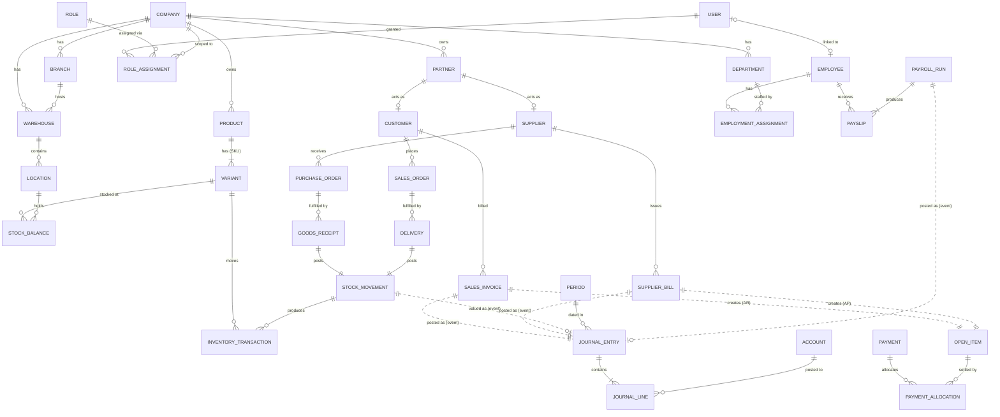
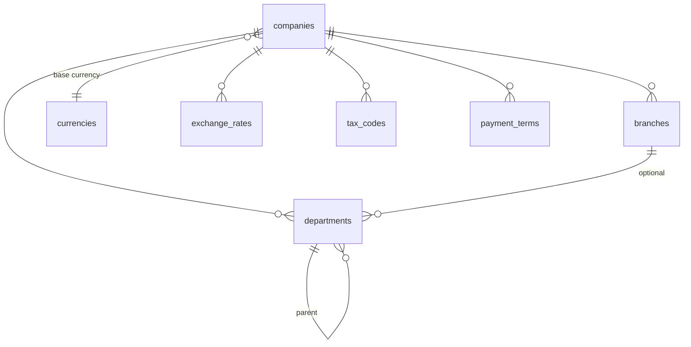
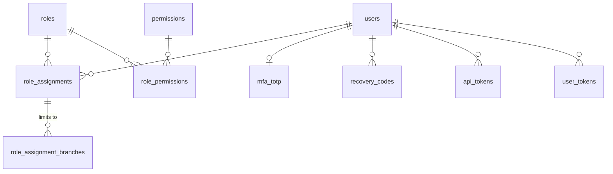
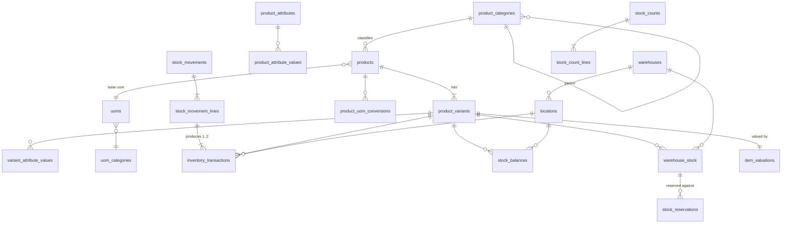
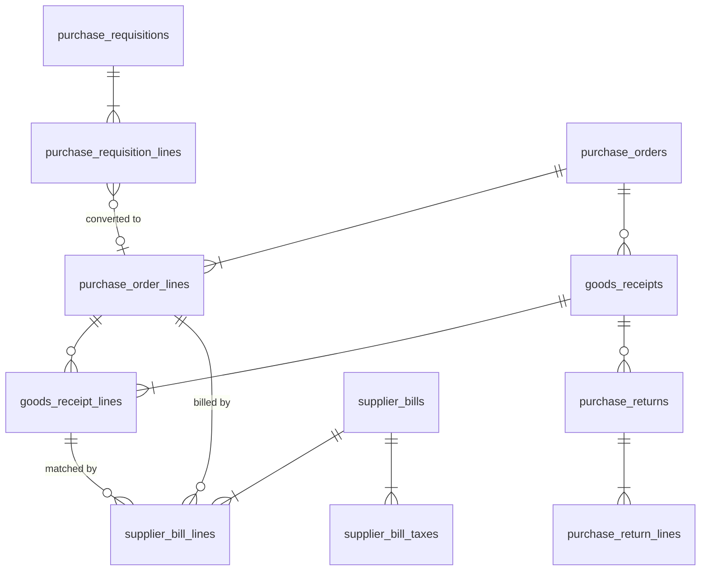
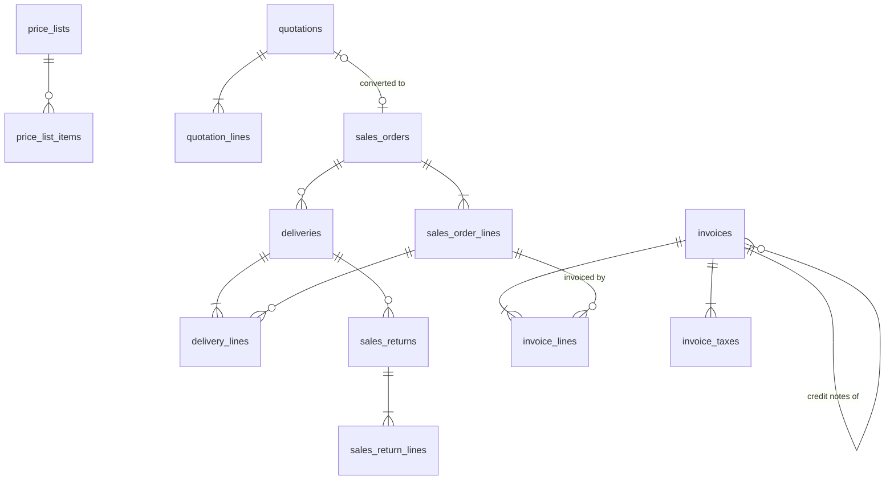
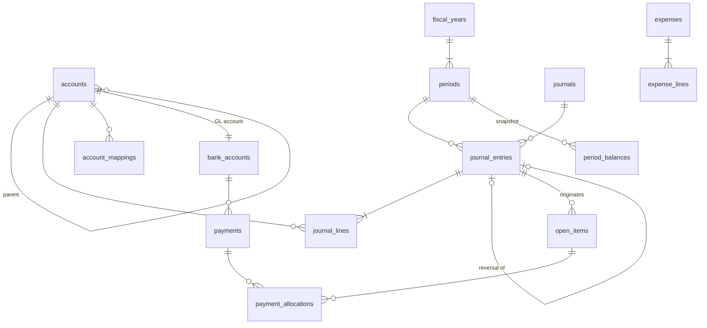
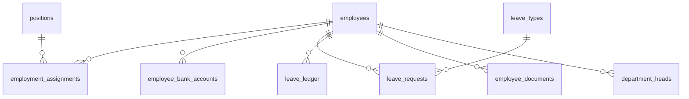

# ERP System — Database Design

Status: **Approved baseline (Phase 1)**.

Database: **PostgreSQL 18**. Every table, column, constraint and index named here is normative: migrations must implement them as written unless an ADR changes them.

Related: [ARCHITECTURE.md](ARCHITECTURE.md) · [PRODUCT_SPEC.md](PRODUCT_SPEC.md) · [SECURITY.md](SECURITY.md)

---

## 1. Overview

- There is one database, `erp`, with **one schema per module**: `platform`, `org`, `auth`, `partners`, `inventory`, `procurement`, `sales`, `accounting`, `hr`, `payroll`, `reporting`, `admin`.
- Each module's code (its jOOQ repositories) reads and writes **only its own schema**. The kernel's tables in `platform` are accessed only through kernel services.
- The **company** (legal entity) is the data isolation boundary. Every business table has `company_id`, protected by row-level security.
- **Ledgers are append-only**:
  - `accounting.journal_entries` / `journal_lines` (once posted)
  - `inventory.inventory_transactions`
  - `admin.audit_log`
- **Balances are derived and locked**: `inventory.stock_balances`, `inventory.warehouse_stock`, `inventory.item_valuations` and `accounting.open_items`. They are updated only in the same transaction as the ledger rows that change them, and are reconciled nightly (ARCHITECTURE.md §6.8).

Required extensions: `citext`, `btree_gist`, `pgcrypto` (for `digest()` in checks/tests only; application crypto is done in Java), `ltree`.

---

## 2. Conventions

### 2.1 Naming

- Tables are snake_case plurals (`sales_orders`); columns are snake_case. Primary key: `id`. Foreign keys: `<entity>_id`.
- Enumerated values are stored as `text` with a `CHECK (col IN (...))` constraint, in UPPER_SNAKE_CASE. PostgreSQL `ENUM` types are **not** used, because they are hard to evolve.
- Booleans are named `is_*` or `has_*`. Timestamps are `*_at`. Business dates are `*_date`.
- Views are `v_<name>`. Reporting-contract views are `v_rpt_<name>` (§11).

### 2.2 Data types

| Purpose | Type | Notes |
|---|---|---|
| Primary keys | `uuid DEFAULT uuidv7()` | Time-ordered, so B-tree locality is good. The application may also generate UUIDv7 (it is needed for idempotent creation). |
| Money amounts (document or base currency) | `numeric(19,4)` | Values are **rounded to the currency's minor units** (`org.currencies.minor_units`, 0–4) before they are stored. |
| Unit prices, unit costs | `numeric(19,6)` | Extra precision for per-unit values. They are never posted to the GL directly; extended amounts are rounded. |
| Quantities | `numeric(18,6)` | `quantity_base` is always in the product's base UoM. |
| Exchange rates | `numeric(19,10)` | Always expressed as **1 unit of document currency = rate × base currency**. `CHECK (rate > 0)`. |
| Percentages | `numeric(7,4)` | 0–100, e.g. a discount of `12.5000`. |
| Currency codes | `char(3)` FK `org.currencies(code)` | ISO 4217. |
| Country codes | `char(2)` FK `org.countries(code)` | ISO 3166-1 alpha-2. |
| Emails | `citext` | |
| Timestamps | `timestamptz` | Stored in UTC. |
| Business dates | `date` | |
| Free-form extension data | `jsonb` | Only for non-queryable metadata, such as integrations' external IDs. **Never for business-critical fields.** |
| Encrypted fields | `bytea` (+ `*_key_version smallint`) | AES-256-GCM, encrypted in the application (SECURITY.md §7). |

`real`, `double precision` and `money` are **forbidden**. A CI check greps migrations for them.

### 2.3 Standard columns

Every **mutable** table has:

```sql
id          uuid        PRIMARY KEY DEFAULT uuidv7(),
company_id  uuid        NOT NULL REFERENCES org.companies(id),   -- company-scoped tables only
created_at  timestamptz NOT NULL DEFAULT now(),
created_by  uuid        NULL,      -- auth.users.id; no FK (users are never hard-deleted; avoids layering FK)
updated_at  timestamptz NOT NULL DEFAULT now(),
updated_by  uuid        NULL,
version     integer     NOT NULL DEFAULT 0   -- optimistic locking; incremented by every UPDATE
```

The repository base class sets `updated_at`, `updated_by` and increments `version` (`WHERE version = :expected`). Append-only tables have `created_at` and `created_by` only.

These columns are written **"+ std"** in the table specs below.

### 2.4 Constraint and index naming

Constraint names are used to map database errors to API error codes deterministically:

| Kind | Pattern | Example |
|---|---|---|
| Primary key | `pk_<table>` | `pk_sales_orders` |
| Foreign key | `fk_<table>__<ref_table>` (suffix `_<col>` if ambiguous) | `fk_sales_order_lines__product_variants` |
| Unique | `uq_<table>__<cols>` | `uq_product_variants__company_id_sku` |
| Check | `ck_<table>__<rule>` | `ck_journal_lines__one_side` |
| Exclusion | `ex_<table>__<rule>` | `ex_periods__no_overlap` |
| Index | `ix_<table>__<cols>` | `ix_journal_lines__company_id_account_id_entry_date` |

`platform.web.ConstraintErrorMapper` holds a table that maps constraint names to problem codes, for example `uq_product_variants__company_id_sku → DUPLICATE_SKU`. Constraints with no mapping fall back to `CONFLICT` or `VALIDATION_FAILED`.

### 2.5 Foreign keys and company integrity

- **Same-company integrity is enforced in the database.** Every company-scoped table has `UNIQUE (company_id, id)` (named `uq_<table>__company_id_id`). Child and reference FKs are **composite**: `FOREIGN KEY (company_id, customer_id) REFERENCES partners.customers (company_id, partner_id)`. A row can therefore never reference another company's data, even if application code is wrong. This is the database-level IDOR backstop.
- **Cross-schema FKs are allowed only along the allowed module dependency direction** (ARCHITECTURE.md §5.2). For example, `sales → inventory` and `procurement → partners` are fine, but `inventory → sales` is not.
- **References against the dependency direction**, or to downstream modules, are stored as **plain UUIDs without an FK**, with the owning module named in a comment. They are validated by the consuming logic. Examples: `accounting.journal_entries.source_id`, `payroll.payroll_runs.payment_bank_account_id`.
- **Polymorphic source references** use `(source_module text, source_type text, source_id uuid, source_number text)`. They have no FK and are covered by an index.
- `ON DELETE` is `RESTRICT` by default. `CASCADE` is allowed **only** from a document header to its own lines while the header is in `DRAFT`; deletion of non-drafts is blocked by triggers (§8). There is never cascade across modules.

### 2.6 Migrations

- Flyway migrations live in `backend/src/main/resources/db/migration/`. Name them `V<yyyyMMddHHmm>__<module>__<description>.sql`, for example `V202611010900__inventory__create_stock_tables.sql`. This is one global ordered sequence.
- Migrations are **forward-only**. Production never uses down migrations. Fixes are new migrations.
- Migrations follow **expand/contract** for zero-downtime deploys:
  1. Add nullable columns or new tables.
  2. Deploy code that writes both the old and new shape.
  3. Backfill.
  4. Add constraints with `NOT VALID`, then `VALIDATE CONSTRAINT`.
  5. Remove the old shape in a later release.
- Create indexes on large tables with `CREATE INDEX CONCURRENTLY`, in separate non-transactional migrations.
- **Reference and seed data** (currencies, countries, permissions, system roles, UoMs) is loaded by repeatable migrations (`R__seed_<module>_<name>.sql`, e.g. `R__seed_org_currencies.sql`) that are idempotent (`INSERT … ON CONFLICT DO UPDATE`). The permission catalogue and system roles are seeded from SECURITY.md the same way, and a test keeps code, document and database in step (ADR-030).
- jOOQ code is generated from a Testcontainers PostgreSQL migrated by Flyway. This happens in the Gradle build, and the generated code is not committed.
- **How migrations run** (implemented in Phase 2):
  1. Once per database, an administrator applies `infra/db/bootstrap/00-roles.sql` (roles, database grants) and sets the login passwords from the secret manager.
  2. Flyway connects as `erp_migrator` and runs `SET ROLE erp_owner` on every connection (`spring.flyway.init-sqls`), so all objects are owned by `erp_owner`.
  3. The history table is `platform.flyway_schema_history`. The runtime roles have no privileges on it.
  4. Placeholder replacement is disabled, `clean` is disabled, and migration naming is validated.
  5. Production runs migrations as a separate one-shot job (`SPRING_PROFILES_ACTIVE=prod,migrate`). The API refuses to start in `prod` with migrations enabled. The `local` and `test` profiles migrate on startup.
- **Module schema helper.** A module's first migration calls `SELECT platform.setup_module_schema('<schema>')`. It creates the schema, grants `USAGE` to the runtime roles, and sets default privileges (DML on tables and sequence usage for `erp_app`; no function `EXECUTE` for `PUBLIC`). Append-only tables must then `REVOKE UPDATE, DELETE` explicitly, and reference tables maintained only by migrations revoke DML, as `org.currencies` does.
- Extensions are installed `WITH SCHEMA public`, so they are on every role's default `search_path`. Otherwise Flyway's `search_path` would place them in `platform`.

### 2.7 Database roles

| Role | Login | Privileges |
|---|---|---|
| `erp_owner` | no | Owns all schemas and objects. |
| `erp_migrator` | yes | Member of `erp_owner`. Used only by the migration step in CI/CD. |
| `erp_app` | yes | `USAGE` on schemas. `SELECT, INSERT, UPDATE, DELETE` on mutable tables. **`SELECT, INSERT` only** on append-only tables (`inventory.inventory_transactions`, `admin.audit_log`, `auth.login_attempts`). `UPDATE` on `accounting.journal_entries`/`journal_lines`, because drafts are mutable; posted rows are protected by triggers. **Not** an owner, so RLS applies. |
| `erp_reporting` | yes | `SELECT` on `v_rpt_*` views and on tables explicitly granted for reporting. RLS applies. Used by Reporting through a separate read-only DataSource, optionally pointing at a replica. |
| `erp_support` | yes | Break-glass read-only access for operations, with no access to `*_encrypted` columns (column-level grants). Every use is logged by the database (`log_statement = 'all'` for this role). |

### 2.8 Deletion and archival policy

| Data category | Policy |
|---|---|
| Master data (products, variants, partners, accounts, employees, warehouses, locations, tax codes, users, roles) | **Never hard-deleted once referenced.** It is deactivated with `status = 'INACTIVE'`/`'ARCHIVED'` (or `is_active = false`). Inactive records cannot be used on new documents, but they stay visible on historical ones. Hard delete is allowed only if no reference exists; the FK `RESTRICT` enforces this. |
| Draft documents | May be hard-deleted (audit-logged), and their lines cascade. |
| Submitted, approved or posted documents | Never deleted. They are cancelled through a state transition (if not yet posted) or corrected by reversal or credit/debit notes (if posted). |
| Ledgers (journal lines, inventory transactions, audit log) | Append-only. They are never deleted within the retention period (§10). |
| Sessions, tokens, idempotency keys, login attempts | TTL purge jobs. |

There is **no generic `deleted_at` soft-delete column**, because soft-deleted rows invisibly break uniqueness and queries. Status-based deactivation is explicit.

---

## 3. Multi-company isolation and row-level security

Every table that has a `company_id` column, except `org.companies` itself, gets:

```sql
ALTER TABLE <t> ENABLE ROW LEVEL SECURITY;
ALTER TABLE <t> FORCE ROW LEVEL SECURITY;
CREATE POLICY company_isolation ON <t>
  USING      (company_id = platform.current_company_id())
  WITH CHECK (company_id = platform.current_company_id());
```

Migrations apply this with `SELECT platform.enable_company_rls('<schema>.<table>')`. `platform.current_company_id()` is a `STABLE` SQL function returning `nullif(current_setting('app.company_id', true), '')::uuid`. `RowLevelSecurityIntegrationTest` scans the catalogue and fails for any table owned by `erp_owner` that has a `company_id` column but no forced `company_isolation` policy (documented exemptions only).

- `app.company_id` is set with `set_config(…, true)` (transaction-local) by `CompanyScopedTransactionManager` at the start of every transaction (ARCHITECTURE.md §6.3). If it is unset, the policy evaluates against NULL and **no rows are visible**: it fails closed.
- **Global-access code paths**, such as a system admin's cross-company audit search or company-iterating jobs, either iterate companies and set the context per company, or set `app.global_access = 'on'`. Only specific tables have a policy that honors that flag: `admin.audit_log` (Phase 3), and later `platform.files` and `reporting.export_jobs`. `platform.global_access()` reads the flag. The audit-log policy is `USING (company_id = current_company_id() OR global_access())` and `WITH CHECK (company_id IS NULL OR company_id = current_company_id() OR global_access())`, because global events such as logins have no company. The flag is set by the transaction manager only for handlers annotated `@GlobalAccess`, after their permission check; an ArchUnit rule and `EndpointSecurityMatrixTest` require every `@GlobalAccess` handler to carry `@RequiresPermission` (ADR-032). Company-scoped tables without such a policy stay invisible even with the flag.
- These tables are **not company-scoped** (no RLS): `org.companies`, `org.currencies`, `org.countries`, `auth.*` (except `role_assignments`, see below), `inventory.uom_categories`, `inventory.uoms`, and `admin.system_settings`. (`platform.document_sequences` and `platform.files` do have `company_id` and RLS).
- `auth.role_assignments`, `auth.role_assignment_branches` and `auth.api_tokens` have `company_id` but **no RLS**, because a user's assignments and tokens across companies must be readable during authentication, before any company context exists. Access goes only through the Auth module, whose queries always filter by user or by the company in the request context. `RowLevelSecurityIntegrationTest` lists these exemptions explicitly.
- Partitions of company-scoped partitioned tables (e.g. `admin.audit_log_202610`) have no privileges for `erp_app`; all access goes through the parent table and its policy.
- RLS integration tests (Phase 2) must prove that, for every company-scoped table, rows of company B cannot be read or written while the context is company A, including through an FK.

---

## 4. Conceptual model

### 4.1 Cross-module overview



Solid lines are FKs. Dotted lines are references by event or polymorphic source reference, with no FK.

### 4.2 Ownership summary

| Schema | Tables |
|---|---|
| platform | document_sequences, idempotency_keys, processed_events, files, job_runs, event_publication (Spring Modulith), scheduled_tasks (db-scheduler) |
| org | companies, branches, departments, currencies, countries, exchange_rates, tax_codes, payment_terms |
| auth | users, user_tokens, sessions, login_challenges, mfa_totp, recovery_codes, api_tokens, permissions, roles, role_permissions, role_assignments, role_assignment_branches, login_attempts, throttle_events |
| partners | partner_groups, partners, partner_addresses, partner_contacts, partner_bank_accounts, customers, suppliers |
| inventory | settings, uom_categories, uoms, product_uom_conversions, product_categories, products, product_attributes, product_attribute_values, product_variants, variant_attribute_values, warehouses, locations, reason_codes, stock_movements, stock_movement_lines, inventory_transactions, stock_balances, warehouse_stock, stock_reservations, item_valuations, stock_counts, stock_count_lines |
| procurement | settings, purchase_requisitions, purchase_requisition_lines, purchase_orders, purchase_order_lines, goods_receipts, goods_receipt_lines, purchase_returns, purchase_return_lines, supplier_bills, supplier_bill_lines, supplier_bill_taxes |
| sales | settings, price_lists, price_list_items, quotations, quotation_lines, sales_orders, sales_order_lines, deliveries, delivery_lines, sales_returns, sales_return_lines, invoices, invoice_lines, invoice_taxes |
| accounting | settings, accounts, account_mappings, fiscal_years, periods, journals, journal_entries, journal_lines, open_items, bank_accounts, payments, payment_allocations, expenses, expense_lines, bank_reconciliation_marks, period_balances |
| hr | employees, employee_bank_accounts, positions, employment_assignments, department_heads, leave_types, leave_ledger, leave_requests, public_holidays, employee_documents |
| payroll | pay_components, salary_structures, salary_structure_components, pay_schedules, employee_compensations, employee_component_overrides, payroll_periods, payroll_inputs, payroll_runs, payslips, payslip_lines |
| reporting | report_definitions, saved_reports, export_jobs |
| admin | audit_log (partitioned), system_settings, retention_policies, feature_flags |

---

## 5. Logical model by schema

The notation below is condensed DDL:

- `+ std` means the standard columns (§2.3).
- `C` means "plus `UNIQUE (company_id, id)`".
- Every `*_id` that names a company-scoped table is a composite FK with `company_id` (§2.5).
- `→` means FK.

Only important indexes are listed. Every FK column also gets an index unless it is already the leading column of another index.

### 5.1 `platform`

```sql
platform.document_sequences (
  company_id     uuid   NOT NULL → org.companies,
  document_type  text   NOT NULL,         -- e.g. 'SALES_INVOICE','PURCHASE_ORDER','JOURNAL:<journal_code>'
  scope_key      text   NOT NULL,         -- fiscal-year label, the calendar year the fiscal year starts in: '2026' (ADR-035)
  prefix         text   NOT NULL,         -- rendered prefix of the first number in the scope, e.g. 'INV-2026-'
  next_value     bigint NOT NULL DEFAULT 1 CHECK (next_value >= 1),
  padding        smallint NOT NULL DEFAULT 6 CHECK (padding BETWEEN 1 AND 12),
  PRIMARY KEY (company_id, document_type, scope_key)
)
-- Gapless: number taken with SELECT … FOR UPDATE inside the posting transaction; rollback returns it.
-- Company-scoped (RLS). Missing rows are inserted ON CONFLICT DO NOTHING, then locked.

platform.numbering_settings (            -- per-company number formats (API.md §17.3, ADR-035)
  company_id uuid PK → org.companies,
  formats    jsonb NOT NULL DEFAULT '{}' CHECK (jsonb_typeof(formats) = 'object'),
                                         -- {"STOCK_MOVEMENT": {"prefix": "SM-{FY}-", "padding": 6}}; absent types use defaults
  + std (version for If-Match))          -- RLS

platform.idempotency_keys (             -- not company-scoped: keyed by the principal (API.md §10)
  user_id        uuid NOT NULL,           -- or api token's service user
  idem_key       text NOT NULL CHECK (length BETWEEN 8 AND 128 AND idem_key ~ '^[A-Za-z0-9_.:-]+$'),
  request_hash   bytea NOT NULL CHECK (octet_length(request_hash) = 32),
                                          -- SHA-256 of method, path, query and canonical body (covers what
                                          -- separate method/path/company columns would)
  status         text NOT NULL CHECK (status IN ('IN_PROGRESS','COMPLETED')),
  response_status smallint NULL,          -- required when COMPLETED
  response_body  json NULL,               -- json, not jsonb: replayed byte for byte
  response_headers jsonb NULL,            -- ETag, Location
  created_at     timestamptz NOT NULL DEFAULT now(),
  expires_at     timestamptz NOT NULL,    -- created_at + 24h
  PRIMARY KEY (user_id, idem_key)
)  -- ix on expires_at for purge

platform.processed_events (consumer text, event_id uuid, processed_at timestamptz DEFAULT now(), PRIMARY KEY (consumer, event_id))

platform.files (
  id uuid PK, company_id uuid NOT NULL → org.companies C,
  owner_module text NOT NULL, entity_type text NOT NULL, entity_id uuid NULL,
  storage_key text NOT NULL UNIQUE, original_filename text NOT NULL,
  content_type text NOT NULL, size_bytes bigint NOT NULL CHECK (size_bytes > 0),
  sha256 bytea NOT NULL, status text NOT NULL CHECK (status IN ('PENDING','ACTIVE','DELETED')),
  created_at, created_by
)  -- ix (company_id, owner_module, entity_type, entity_id)

platform.job_runs (
  id uuid PK, job_name text NOT NULL, company_id uuid NULL, status text CHECK (IN 'QUEUED','RUNNING','SUCCEEDED','FAILED','CANCELLED'),
  progress jsonb, started_at, finished_at, error_code text, error_detail text, requested_by uuid, created_at
)
-- event_publication: Spring Modulith JDBC schema, placed in schema platform.
-- scheduled_tasks:   db-scheduler schema, placed in schema platform.
```

### 5.2 `org`



```sql
org.currencies (code char(3) PK, name text NOT NULL, minor_units smallint NOT NULL CHECK (minor_units BETWEEN 0 AND 4), is_active boolean NOT NULL DEFAULT true)
org.countries  (code char(2) PK, name text NOT NULL)

org.companies (
  id uuid PK, code text NOT NULL UNIQUE CHECK (code ~ '^[A-Z0-9_-]{2,20}$'),
  legal_name text NOT NULL, display_name text NOT NULL,
  tax_registration_no text NULL, registration_no text NULL,
  country_code char(2) NOT NULL → org.countries,
  base_currency char(3) NOT NULL → org.currencies,       -- immutable once any posted journal exists (trigger)
  timezone text NOT NULL,                                 -- IANA; validated in app
  fiscal_year_start_month smallint NOT NULL DEFAULT 1 CHECK (BETWEEN 1 AND 12),
  address_line1, address_line2, city, region, postal_code text NULL,
  rounding_mode text NOT NULL DEFAULT 'HALF_UP' CHECK (IN ('HALF_UP','HALF_EVEN')),
  tax_rounding  text NOT NULL DEFAULT 'PER_LINE' CHECK (IN ('PER_LINE','PER_DOCUMENT')),
  status text NOT NULL DEFAULT 'ACTIVE' CHECK (IN ('ACTIVE','INACTIVE')),
  + std (without company_id)
)

org.branches (id, company_id C, code text NOT NULL, name text NOT NULL, address…, is_active boolean, + std,
  UNIQUE (company_id, code))

org.departments (id, company_id C, code, name, parent_id uuid NULL → departments (company_id, parent_id),
  branch_id uuid NULL → branches (company_id, branch_id), is_active, + std,
  UNIQUE (company_id, code), CHECK (parent_id <> id))
  -- trg_departments__no_cycle (org.guard_department_cycle): walks the ancestors of the new parent and raises
  -- check_violation ck_departments__no_cycle; serialized per company with an advisory lock (§9).
  -- Rules in the service (PRODUCT_SPEC.md §4.2): parent and branch active for new or moved departments;
  -- deactivation needs no active sub-departments and no downstream use (OrganizationUsage port, ADR-034).

org.exchange_rates (
  id, company_id C, currency_code char(3) → currencies, rate_date date NOT NULL,
  rate numeric(19,10) NOT NULL CHECK (rate > 0),          -- 1 currency_code = rate × company base
  source text NOT NULL DEFAULT 'MANUAL' CHECK (IN ('MANUAL','IMPORT')),
  + std,
  UNIQUE (company_id, currency_code, rate_date))
-- Lookup rule: latest rate_date <= document date; missing → EXCHANGE_RATE_MISSING (422). Base currency → rate 1.

org.tax_codes (
  id, company_id C, code text NOT NULL, name text NOT NULL,
  scope text NOT NULL CHECK (IN ('SALES','PURCHASE','BOTH')),
  rate_percent numeric(7,4) NOT NULL CHECK (rate_percent BETWEEN 0 AND 100),
  is_exempt boolean NOT NULL DEFAULT false,               -- reporting distinction for 0%
  valid_from date NULL, valid_to date NULL, is_active boolean,
  + std, UNIQUE (company_id, code), CHECK (valid_to IS NULL OR valid_from IS NULL OR valid_to >= valid_from))

org.payment_terms (id, company_id C, code, name, due_days integer NOT NULL CHECK (due_days BETWEEN 0 AND 3650),
  due_basis text NOT NULL DEFAULT 'DOCUMENT_DATE' CHECK (IN ('DOCUMENT_DATE','END_OF_MONTH')),
  is_active, + std, UNIQUE (company_id, code))
```

### 5.3 `auth`



```sql
auth.users (
  id, email citext NOT NULL UNIQUE, display_name text NOT NULL,
  user_type text NOT NULL DEFAULT 'HUMAN' CHECK (IN ('HUMAN','SERVICE')),    -- SERVICE: API-token-only principal
  status text NOT NULL CHECK (IN ('INVITED','ACTIVE','LOCKED','DISABLED')),
  password_hash text NULL,                    -- Argon2id PHC string; NULL for INVITED / SERVICE
  password_changed_at timestamptz NULL,
  mfa_enabled boolean NOT NULL DEFAULT false,
  failed_login_count integer NOT NULL DEFAULT 0, locked_until timestamptz NULL,
  last_login_at timestamptz NULL,
  is_system_admin boolean NOT NULL DEFAULT false,   -- platform administration (SECURITY.md §4.5)
  locale text NOT NULL DEFAULT 'en', timezone text NULL,
  + std (without company_id),
  CHECK (user_type = 'HUMAN' OR password_hash IS NULL))

auth.user_tokens (id, user_id → users, purpose text CHECK (IN ('INVITE','PASSWORD_RESET','EMAIL_VERIFY')),
  token_hash bytea NOT NULL UNIQUE, expires_at timestamptz NOT NULL, used_at timestamptz NULL, created_at)

auth.sessions (   -- browser sessions (ADR-028); cookie carries the secret, only its SHA-256 is stored
  id, token_hash bytea NOT NULL UNIQUE, user_id → users,
  created_at, last_seen_at,                          -- idle timeout from last_seen_at (touched at most once a minute)
  authenticated_at, reauthenticated_at NULL,         -- step-up window (SECURITY.md §3.3)
  absolute_expires_at timestamptz NOT NULL,
  mfa_verified boolean, mfa_enrollment_required boolean,   -- restricted session until TOTP is enrolled
  ip inet NULL, user_agent text NULL)
  -- ix (user_id, created_at) for the concurrent-session cap; ix (absolute_expires_at)

auth.login_challenges (id, token_hash bytea NOT NULL UNIQUE, user_id → users,
  attempts integer CHECK (BETWEEN 0 AND 5), created_at, expires_at, ip inet NULL)   -- MFA step after the password

auth.mfa_totp (user_id uuid PK → users, secret_encrypted bytea NOT NULL, secret_key_version smallint NOT NULL,
  confirmed_at timestamptz NULL, last_used_step bigint NULL /* replay protection */, created_at)

auth.recovery_codes (id, user_id → users, code_hash bytea NOT NULL /* SHA-256 */, used_at timestamptz NULL, created_at,
  UNIQUE (user_id, code_hash))

auth.api_tokens (id, user_id → users, name text NOT NULL, token_prefix text NOT NULL UNIQUE CHECK (~ '^[A-Za-z0-9]{8}$'),
  token_hash bytea NOT NULL UNIQUE,                    -- SHA-256 of high-entropy token
  company_id uuid NULL → org.companies,                 -- NULL = all companies of the user (restricted by assignments); no RLS (§3)
  allowed_permissions text[] NULL,                      -- optional down-scoping; must be subset of user's permissions
  rate_limit_per_minute integer NULL CHECK (rate_limit_per_minute > 0),   -- NULL = default (SECURITY.md §9)
  expires_at timestamptz NOT NULL CHECK (expires_at <= created_at + interval '366 days'),
  last_used_at timestamptz NULL, revoked_at timestamptz NULL, created_at, created_by)

auth.permissions (code text PK CHECK (code ~ '^[a-z_]+\.[a-z_]+\.[a-z_]+$'), module text NOT NULL,
  description text NOT NULL, is_sensitive boolean NOT NULL DEFAULT false, deprecated_at timestamptz NULL)

auth.roles (id, code text NOT NULL UNIQUE, name text NOT NULL, description text,
  is_system boolean NOT NULL DEFAULT false,      -- seeded; permissions not editable via API
  requires_mfa boolean NOT NULL DEFAULT false,   -- users holding this role must enroll TOTP (SECURITY.md §3.5)
  + std (without company_id))

auth.role_permissions (role_id → roles, permission_code → permissions, PRIMARY KEY (role_id, permission_code))

auth.role_assignments (id, user_id → users, role_id → roles, company_id → org.companies,
  valid_from date NULL, valid_to date NULL, + std (without RLS),
  UNIQUE (user_id, role_id, company_id), UNIQUE (id, company_id) /* target of the branch FK */)
  -- ix (user_id, company_id)

auth.role_assignment_branches (role_assignment_id, company_id uuid NOT NULL, branch_id uuid NOT NULL,
  PRIMARY KEY (role_assignment_id, branch_id),
  FOREIGN KEY (role_assignment_id, company_id) → role_assignments (id, company_id) ON DELETE CASCADE,
  FOREIGN KEY (company_id, branch_id) → org.branches (company_id, id))
  -- no rows = all branches of the company

auth.login_attempts (id, user_id uuid NULL, email_hash bytea NOT NULL, ip inet NULL,
  succeeded boolean NOT NULL, failure_reason text NULL CHECK (IN ('INVALID_CREDENTIALS','UNKNOWN_USER',
  'ACCOUNT_NOT_ACTIVE','ACCOUNT_LOCKED','LOCKOUT','INVALID_MFA_CODE','RATE_LIMITED')), attempted_at timestamptz NOT NULL DEFAULT now())
  -- ix (email_hash, attempted_at DESC), ix (ip, attempted_at DESC), ix (user_id, attempted_at DESC)
  -- append-only for erp_app (no UPDATE/DELETE); purge > 90 days through auth.purge_security_records

auth.throttle_events (id, action text NOT NULL, subject_hash bytea NOT NULL, occurred_at)
  -- counters for password-reset requests, token redemptions and failed step-up confirmations (ADR-029)

-- auth.purge_security_records(retention interval): SECURITY DEFINER housekeeping (hourly job) that deletes
-- expired sessions, challenges, user tokens, throttle events and login attempts past the retention.
```

### 5.4 `partners`

```sql
partners.partner_groups (id, company_id C, code, name, applies_to text CHECK (IN ('CUSTOMER','SUPPLIER')), is_active, + std,
  UNIQUE (company_id, applies_to, code), UNIQUE (company_id, id, applies_to))   -- the latter is the target of typed FKs

partners.partners (id, company_id C, code text NOT NULL, name text NOT NULL, legal_name text NULL,
  partner_type text NOT NULL CHECK (IN ('ORGANIZATION','INDIVIDUAL')),
  tax_registration_no text NULL, email citext NULL, phone text NULL, website text NULL,
  status text NOT NULL DEFAULT 'ACTIVE' CHECK (IN ('ACTIVE','INACTIVE','BLOCKED')),
  notes text NULL, external_refs jsonb NULL, + std,
  UNIQUE (company_id, code))
  -- ix (company_id, lower(name) text_pattern_ops); ix gin (name gin_trgm_ops) for search (pg_trgm extension)

partners.partner_addresses (id, company_id, partner_id → partners, address_type CHECK (IN ('BILLING','SHIPPING','OTHER')),
  line1 NOT NULL, line2, city, region, postal_code, country_code → org.countries, is_default boolean, + std)
  -- partial unique: one default per (partner_id, address_type) WHERE is_default

partners.partner_contacts (id, company_id, partner_id, name, email, phone, role_title, is_primary, + std)

partners.partner_bank_accounts (id, company_id, partner_id, bank_name, account_holder,
  account_number_encrypted bytea, iban_encrypted bytea NULL, swift_bic text NULL, last4 char(4), key_version smallint,
  currency_code char(3) NULL, is_default boolean, + std)
  -- FieldEncryptor (AES-256-GCM), associated data 'partners.partner_bank_accounts.<column>:<id>'; partial unique default per partner.
  -- Accounts are added or removed, never edited (every change is visible in the audit log).

partners.customers (partner_id uuid PK, company_id NOT NULL, FK (company_id, partner_id) → partners,
  customer_group_id uuid NULL → partner_groups,           -- must be applies_to CUSTOMER (trigger/app)
  currency_code char(3) NOT NULL → org.currencies,
  payment_terms_id uuid NULL → org.payment_terms,
  default_tax_code_id uuid NULL → org.tax_codes,
  credit_limit numeric(19,4) NULL CHECK (credit_limit IS NULL OR credit_limit >= 0),   -- in company base currency
  is_on_hold boolean NOT NULL DEFAULT false,
  + std (id omitted), UNIQUE (company_id, partner_id))

partners.suppliers (partner_id uuid PK, company_id, FK → partners,
  supplier_group_id NULL → partner_groups,
  group_applies_to text GENERATED ALWAYS AS ('SUPPLIER') STORED,   -- FK (company_id, supplier_group_id, group_applies_to)
                                                                  -- → partner_groups (company_id, id, applies_to): supplier groups only
  currency_code NOT NULL, payment_terms_id NULL, default_tax_code_id NULL,
  lead_time_days integer NULL CHECK (BETWEEN 0 AND 3650), + std, UNIQUE (company_id, partner_id))
-- partners.customers (above) is created with Sales in Phase 7 (ADR-036).
```

### 5.5 `inventory`



```sql
inventory.settings (company_id uuid PK → org.companies,
  costing_method text NOT NULL DEFAULT 'MOVING_AVERAGE' CHECK (costing_method IN ('MOVING_AVERAGE')),  -- FIFO: future ADR
  allow_negative_stock boolean NOT NULL DEFAULT false CHECK (allow_negative_stock = false),            -- v1: not supported
  over_receipt_tolerance_percent numeric(7,4) NOT NULL DEFAULT 0,
  adjustment_approval_threshold numeric(19,4) NULL CHECK (>= 0),   -- INV-7: |value| above it needs inventory.adjustment.approve; NULL = none
  + std (id omitted))

inventory.uom_categories (id, code text UNIQUE, name)                        -- global, e.g. UNIT, WEIGHT, LENGTH, VOLUME, TIME
inventory.uoms (id, category_id → uom_categories, code text UNIQUE, name,
  factor_to_reference numeric(24,12) NOT NULL CHECK (> 0),                   -- e.g. kg=1, g=0.001
  rounding_scale smallint NOT NULL DEFAULT 6 CHECK (BETWEEN 0 AND 6), is_active)

inventory.product_categories (id, company_id C, code, name, parent_id NULL → product_categories,
  path ltree NOT NULL,          -- maintained by trigger; subtree queries
  is_active, + std, UNIQUE (company_id, code))  -- gist ix on path

inventory.products (id, company_id C, code text NOT NULL, name text NOT NULL, description text,
  category_id uuid NOT NULL → product_categories,
  product_type text NOT NULL CHECK (IN ('STOCKABLE','CONSUMABLE','SERVICE')),
  base_uom_id uuid NOT NULL → uoms,              -- immutable once any transaction exists (trigger)
  purchase_uom_id uuid NULL → uoms, sales_uom_id uuid NULL → uoms,
  is_purchasable boolean NOT NULL DEFAULT true, is_sellable boolean NOT NULL DEFAULT true,
  sales_tax_code_id uuid NULL → org.tax_codes, purchase_tax_code_id uuid NULL → org.tax_codes,
  has_variants boolean NOT NULL DEFAULT false,
  status text NOT NULL DEFAULT 'ACTIVE' CHECK (IN ('ACTIVE','ARCHIVED')),
  + std, UNIQUE (company_id, code))

inventory.product_uom_conversions (id, company_id, product_id → products, uom_id → uoms,
  factor_to_base numeric(24,12) NOT NULL CHECK (> 0),    -- 1 uom = factor × base uom (e.g. BOX = 12 EA)
  + std, UNIQUE (product_id, uom_id))
  -- Conversion rule: same category → via factor_to_reference; different category → must exist here; else UOM_NOT_CONVERTIBLE

inventory.product_attributes (id, company_id C, code, name, + std, UNIQUE (company_id, code))
inventory.product_attribute_values (id, company_id, attribute_id → product_attributes, code, name, sort_order, + std,
  UNIQUE (attribute_id, code))

inventory.product_variants (id, company_id C, product_id → products,
  sku text NOT NULL, barcode text NULL, name text NOT NULL,            -- display name (product name + attribute values)
  is_default boolean NOT NULL DEFAULT false,                          -- products without variants have exactly one default variant
  status text NOT NULL DEFAULT 'ACTIVE' CHECK (IN ('ACTIVE','ARCHIVED')),
  weight_kg numeric(12,4) NULL, + std,
  UNIQUE (company_id, sku), UNIQUE NULLS DISTINCT (company_id, barcode))
  -- partial unique (product_id) WHERE is_default

inventory.variant_attribute_values (variant_id → product_variants, attribute_id → product_attributes,
  value_id → product_attribute_values, company_id, PRIMARY KEY (variant_id, attribute_id))
  -- uniqueness of attribute combination per product enforced in app + unique index on (product_id, attribute signature) via generated column on variants: attribute_signature text

inventory.warehouses (id, company_id C, branch_id uuid NOT NULL → org.branches, code, name,
  address…, is_active, + std, UNIQUE (company_id, code))

inventory.locations (id, company_id C, warehouse_id → warehouses, code text NOT NULL, name,
  parent_id NULL → locations,
  location_type text NOT NULL CHECK (IN ('INTERNAL','RECEIVING','SHIPPING','QUARANTINE','TRANSIT')),
  is_active, + std, UNIQUE (warehouse_id, code))
  -- each warehouse gets seeded RECEIVING, SHIPPING, and one INTERNAL 'STOCK' location; transfers between warehouses use the
  -- destination warehouse's TRANSIT location for two-step transfers

inventory.reason_codes (id, company_id C, code, name, applies_to text CHECK (IN ('ADJUSTMENT','SCRAP','COUNT')), is_active, + std,
  UNIQUE (company_id, code))

inventory.stock_movements (id, company_id C, number text NULL,      -- assigned at posting
  movement_type text NOT NULL CHECK (IN ('OPENING','PURCHASE_RECEIPT','PURCHASE_RETURN','SALES_ISSUE','SALES_RETURN',
                                         'TRANSFER','TRANSFER_SHIP','TRANSFER_RECEIVE','ADJUSTMENT','SCRAP','COUNT_ADJUSTMENT','REVERSAL')),
  status text NOT NULL CHECK (IN ('DRAFT','POSTED','CANCELLED')),
  movement_date date NOT NULL,                                       -- accounting date for valuation
  warehouse_id uuid NOT NULL → warehouses, dest_warehouse_id uuid NULL → warehouses,
  partner_id uuid NULL,                     -- owned by Partners; no FK (both modules are L2, §6); validated by the calling module
  reason_code_id uuid NULL → reason_codes,
  source_module text NULL, source_type text NULL, source_id uuid NULL, source_number text NULL,
  reversal_of_id uuid NULL → stock_movements UNIQUE,
  related_movement_id uuid NULL → stock_movements,                  -- TRANSFER_SHIP ↔ TRANSFER_RECEIVE
  posted_at timestamptz NULL, posted_by uuid NULL, notes text NULL, + std,
  UNIQUE (company_id, number),
  CHECK ((status = 'POSTED') = (number IS NOT NULL AND posted_at IS NOT NULL)),
  CHECK (source_module, source_type, source_id all NULL or all NOT NULL),
  CHECK (dest_warehouse_id only for TRANSFER, TRANSFER_SHIP, TRANSFER_RECEIVE and REVERSAL),
  CHECK (movement_type NOT IN ('ADJUSTMENT','SCRAP','COUNT_ADJUSTMENT') OR reason_code_id IS NOT NULL))
  -- partial unique (company_id, source_module, source_type, source_id) WHERE source_id IS NOT NULL
  --   AND status <> 'CANCELLED' AND movement_type <> 'REVERSAL'      (a source document moves stock once)
  -- partial unique (related_movement_id) WHERE movement_type = 'TRANSFER_RECEIVE' AND status <> 'CANCELLED'
  -- ix (company_id, movement_date)

inventory.stock_movement_lines (id, company_id, movement_id → stock_movements ON DELETE CASCADE (draft only),
  line_no integer NOT NULL, variant_id → product_variants,
  from_location_id uuid NULL → locations, to_location_id uuid NULL → locations,
  quantity numeric(18,6) NOT NULL CHECK (quantity > 0), uom_id → uoms,
  quantity_base numeric(18,6) NOT NULL CHECK (quantity_base > 0),
  unit_cost_base numeric(19,6) NULL CHECK (unit_cost_base IS NULL OR unit_cost_base >= 0),  -- required for inbound from outside (receipts, opening, positive adjustments); computed for outbound
  reference_unit_cost_base numeric(19,6) NULL,   -- caller-supplied cost of the originating document (PURCHASE_RETURN: original receipt unit cost) for GRNI clearing
  source_line_id uuid NULL,
  reservation_id uuid NULL → stock_reservations,   -- SALES_ISSUE: the line's own reservation, consumed at posting (INV-2)
  reversal_of_line_id uuid NULL → stock_movement_lines,
  + std, UNIQUE (movement_id, line_no),
  CHECK (from_location_id IS NOT NULL OR to_location_id IS NOT NULL),
  CHECK (from_location_id IS DISTINCT FROM to_location_id))

inventory.inventory_transactions (   -- APPEND-ONLY LEDGER
  id uuid PK, company_id uuid NOT NULL,
  movement_id → stock_movements, movement_line_id → stock_movement_lines,
  movement_type text NOT NULL, transaction_date date NOT NULL,
  variant_id → product_variants, warehouse_id → warehouses, location_id → locations,
  quantity_base numeric(18,6) NOT NULL CHECK (quantity_base <> 0),   -- + in, − out
  unit_cost_base numeric(19,6) NOT NULL CHECK (unit_cost_base >= 0),
  value_base numeric(19,4) NOT NULL,                                  -- signed, rounded to base currency minor units
  created_at, created_by,
  CHECK (sign(quantity_base) = sign(value_base) OR value_base = 0))
  -- ix (company_id, variant_id, location_id, created_at); ix (company_id, transaction_date); ix (movement_id)

inventory.stock_balances (company_id, variant_id → product_variants, location_id → locations,
  warehouse_id uuid NOT NULL → warehouses,                           -- denormalized from location
  on_hand numeric(18,6) NOT NULL DEFAULT 0 CHECK (on_hand >= 0),
  updated_at timestamptz NOT NULL,
  PRIMARY KEY (company_id, variant_id, location_id))
  -- ix (company_id, warehouse_id, variant_id)

inventory.warehouse_stock (company_id, variant_id, warehouse_id,
  on_hand  numeric(18,6) NOT NULL DEFAULT 0 CHECK (on_hand >= 0),
  reserved numeric(18,6) NOT NULL DEFAULT 0 CHECK (reserved >= 0),
  updated_at,
  PRIMARY KEY (company_id, variant_id, warehouse_id),
  CHECK (reserved <= on_hand))                                       -- available = on_hand − reserved ≥ 0

inventory.stock_reservations (id, company_id C, variant_id, warehouse_id,
  quantity_base numeric(18,6) NOT NULL CHECK (quantity_base >= 0),   -- currently reserved (open) quantity
  source_module text NOT NULL, source_type text NOT NULL, source_id uuid NOT NULL, source_line_id uuid NOT NULL,
  status text NOT NULL CHECK (IN ('ACTIVE','RELEASED','CONSUMED')), + std,
  CHECK (status = 'ACTIVE' OR quantity_base = 0))
  -- partial unique (company_id, source_module, source_line_id, warehouse_id) WHERE status = 'ACTIVE'
  -- Invariant: warehouse_stock.reserved = Σ ACTIVE reservations.quantity_base for (variant, warehouse)

inventory.item_valuations (company_id, variant_id → product_variants,
  quantity_base numeric(18,6) NOT NULL DEFAULT 0 CHECK (quantity_base >= 0),
  total_value_base numeric(19,4) NOT NULL DEFAULT 0 CHECK (total_value_base >= 0),
  updated_at,
  PRIMARY KEY (company_id, variant_id),
  CHECK (quantity_base > 0 OR total_value_base = 0))
  -- avg cost = total_value_base / quantity_base (computed, never stored)

inventory.stock_counts (id, company_id C, number,     -- numbered at start (STOCK_COUNT sequence)
  warehouse_id, count_date date,
  status text CHECK (IN ('DRAFT','IN_PROGRESS','COMPLETED','POSTED','CANCELLED')),
  reason_code_id uuid NULL → reason_codes,           -- COUNT reason, required at posting (INV-7)
  notes text NULL,
  adjustment_movement_id uuid NULL → stock_movements,  -- NULL when the count found no differences
  CHECK (status = 'POSTED' OR adjustment_movement_id IS NULL), + std)
inventory.stock_count_lines (id, company_id, stock_count_id, variant_id, location_id,
  system_quantity_base numeric(18,6) NOT NULL,     -- snapshot at count start
  counted_quantity_base numeric(18,6) NULL CHECK (counted_quantity_base >= 0), + std,
  UNIQUE (stock_count_id, variant_id, location_id))
```

### 5.6 `procurement`



```sql
procurement.settings (company_id PK, po_approval_threshold_base numeric(19,4) NULL,   -- POs above require procurement.purchase_order.approve_high
  price_match_tolerance_percent numeric(7,4) NOT NULL DEFAULT 0,
  qty_match_tolerance_percent   numeric(7,4) NOT NULL DEFAULT 0,
  require_receipt_before_bill boolean NOT NULL DEFAULT true CHECK (= true),   -- v1: stockable goods are billed from receipts (ADR-036)
  + std)

procurement.purchase_requisitions (id, company_id C, number NULL, branch_id → org.branches, department_id NULL → org.departments,
  requested_by uuid NOT NULL, needed_by date NULL,
  status CHECK (IN ('DRAFT','SUBMITTED','APPROVED','REJECTED','PARTIALLY_ORDERED','ORDERED','CANCELLED')),
  submitted_by, submitted_at, approved_by uuid NULL, approved_at timestamptz NULL, rejection_reason, cancel_reason, notes, + std,
  UNIQUE (company_id, number))                          -- numbered on submit
procurement.purchase_requisition_lines (id, company_id, requisition_id, line_no, variant_id → inventory.product_variants,
  description, quantity numeric(18,6) CHECK (> 0), uom_id, quantity_base numeric(18,6) CHECK (> 0),
  estimated_unit_price numeric(19,6) NULL, suggested_supplier_id NULL → partners.suppliers,
  ordered_quantity_base numeric(18,6) NOT NULL DEFAULT 0 CHECK (BETWEEN 0 AND quantity_base), + std)
  -- ordered_quantity_base = Σ quantity_base of the lines of live (not cancelled) POs linked to it, recomputed by the service

procurement.purchase_orders (id, company_id C, number text NULL,   -- assigned on submit
  supplier_id NOT NULL → partners.suppliers, branch_id → org.branches, warehouse_id → inventory.warehouses,
  order_date date NOT NULL, expected_date date NULL,
  currency_code char(3) NOT NULL, payment_terms_id NULL → org.payment_terms,
  prices_include_tax boolean NOT NULL DEFAULT false,
  status text NOT NULL CHECK (IN ('DRAFT','PENDING_APPROVAL','APPROVED','PARTIALLY_RECEIVED','RECEIVED','CLOSED','CANCELLED')),
  billing_status text NOT NULL DEFAULT 'NOT_BILLED' CHECK (IN ('NOT_BILLED','PARTIALLY_BILLED','BILLED')),
  subtotal numeric(19,4) NOT NULL DEFAULT 0, tax_total numeric(19,4) NOT NULL DEFAULT 0, total numeric(19,4) NOT NULL DEFAULT 0,
  department_id NULL → org.departments,
  submitted_by, submitted_at, approved_by, approved_at, rejection_reason, cancel_reason, close_reason, notes, + std,
  UNIQUE (company_id, number), CHECK (total = subtotal + tax_total))
  -- ix (company_id, supplier_id, order_date DESC); ix (company_id, status)

procurement.purchase_order_lines (id, company_id, purchase_order_id ON DELETE CASCADE (draft), line_no,
  variant_id NOT NULL → inventory.product_variants, description text NOT NULL,
  is_stockable boolean NOT NULL,                 -- product type snapshot (G-10): only stockable lines are received
  quantity numeric(18,6) CHECK (> 0), uom_id → inventory.uoms, quantity_base numeric(18,6) CHECK (> 0),
  unit_price numeric(19,6) CHECK (>= 0), discount_percent numeric(7,4) NOT NULL DEFAULT 0 CHECK (BETWEEN 0 AND 100),
  tax_code_id NULL → org.tax_codes,
  net_amount numeric(19,4) NOT NULL, tax_amount numeric(19,4) NOT NULL, total_amount numeric(19,4) NOT NULL,
  received_quantity_base numeric(18,6) NOT NULL DEFAULT 0 CHECK (>= 0),
  returned_quantity_base numeric(18,6) NOT NULL DEFAULT 0 CHECK (>= 0),
  billed_quantity_base   numeric(18,6) NOT NULL DEFAULT 0 CHECK (>= 0),
  requisition_line_id NULL → purchase_requisition_lines, + std,
  UNIQUE (purchase_order_id, line_no), CHECK (total_amount = net_amount + tax_amount),
  CHECK (returned_quantity_base <= received_quantity_base))

procurement.goods_receipts (id, company_id C, number NULL, purchase_order_id → purchase_orders, supplier_id,
  branch_id, warehouse_id, receipt_date date NOT NULL, status CHECK (IN ('DRAFT','POSTED','CANCELLED')),
  currency_code char(3) NOT NULL,                                     -- the PO's
  exchange_rate numeric(19,10) NULL CHECK (> 0),                      -- PO currency → base at receipt_date, fixed at posting
  -- CHECK (status = 'POSTED') = (number, stock_movement_id, exchange_rate, posted_at all NOT NULL)
  stock_movement_id uuid NULL → inventory.stock_movements UNIQUE,
  supplier_delivery_note text NULL, posted_at, posted_by, + std, UNIQUE (company_id, number))
procurement.goods_receipt_lines (id, company_id, goods_receipt_id, line_no, purchase_order_line_id → purchase_order_lines,
  variant_id, location_id NULL → inventory.locations,                -- NULL in a draft: the warehouse's default stock location
  quantity CHECK (> 0), uom_id, quantity_base CHECK (> 0),
  unit_cost_doc numeric(19,6) NOT NULL,                               -- PO net unit price per base unit (PRC-2)
  unit_cost_base numeric(19,6) NULL, value_base numeric(19,4) NULL,   -- set at posting (the ledger's value)
  billed_quantity_base, billed_value_base, returned_quantity_base, returned_value_base,
  credited_quantity_base, credited_value_base NOT NULL DEFAULT 0, + std,
  CHECK (returned ≤ quantity, credited ≤ returned, credited ≤ billed, credited value ≤ billed value))
  -- billed may exceed the receipt within the quantity tolerance (PRC-3); the receipt value cleared never does

procurement.purchase_returns (id, company_id C, number, supplier_id, purchase_order_id, goods_receipt_id → goods_receipts,
  branch_id, warehouse_id, return_date, status CHECK (IN ('DRAFT','POSTED','CANCELLED')), reason text NOT NULL,
  stock_movement_id NULL UNIQUE → inventory.stock_movements, posted_at, posted_by, + std)
procurement.purchase_return_lines (id, company_id, purchase_return_id, line_no, goods_receipt_line_id, variant_id, location_id NULL,
  quantity, uom_id, quantity_base CHECK (> 0),
  unit_cost_base numeric(19,6) NOT NULL,     -- the receipt's unit cost (GRNI reference value)
  value_base numeric(19,4) NULL, + std)      -- round(quantity_base × unit_cost_base), set at posting

procurement.supplier_bills (id, company_id C,
  document_type text NOT NULL CHECK (IN ('BILL','DEBIT_NOTE')),
  number text NULL,                                           -- internal number at posting
  supplier_invoice_number citext NOT NULL,                    -- supplier's reference
  supplier_id → partners.suppliers, purchase_order_id NULL → purchase_orders,
  original_bill_id NULL → supplier_bills,                     -- DEBIT_NOTE → BILL
  bill_date date NOT NULL, accounting_date date NOT NULL, due_date date NOT NULL,
  currency_code char(3) NOT NULL, exchange_rate numeric(19,10) NOT NULL CHECK (> 0),
  prices_include_tax boolean NOT NULL DEFAULT false,
  payment_terms_id NULL,
  status text NOT NULL CHECK (IN ('DRAFT','POSTED','CANCELLED')),       -- CANCELLED only from DRAFT
  match_status text NOT NULL DEFAULT 'NOT_CHECKED' CHECK (IN ('NOT_CHECKED','MATCHED','EXCEPTION','OVERRIDDEN')),
  match_override_by uuid NULL, match_override_reason text NULL,
  subtotal, tax_total, total numeric(19,4) NOT NULL,
  subtotal_base, tax_total_base, total_base numeric(19,4) NOT NULL,
  posted_at, posted_by, + std,
  UNIQUE (company_id, number),
  -- partial unique (company_id, supplier_id, document_type, supplier_invoice_number) WHERE status <> 'CANCELLED' (PRC-5)
  CHECK ((document_type = 'DEBIT_NOTE') = (original_bill_id IS NOT NULL)),
  CHECK (status <> 'POSTED' OR match_status IN ('MATCHED','OVERRIDDEN')),
  CHECK (total = subtotal + tax_total), CHECK (due_date >= bill_date))
procurement.supplier_bill_lines (id, company_id, supplier_bill_id, line_no,
  line_kind text CHECK (IN ('RECEIVED_STOCK','SERVICE','NON_STOCK_GOODS')),
  purchase_order_line_id NULL, goods_receipt_line_id NULL,
  variant_id NOT NULL, description, quantity CHECK (> 0), uom_id, quantity_base CHECK (> 0),
  unit_price numeric(19,6) CHECK (>= 0), discount_percent, tax_code_id NULL,
  net_amount, tax_amount, total_amount numeric(19,4), net_amount_base numeric(19,4), tax_amount_base numeric(19,4),
  receipt_value_base numeric(19,4) NULL,    -- value at receipt for RECEIVED_STOCK (GRNI clearing)
  branch_id NULL, department_id NULL, + std,
  CHECK (line_kind <> 'RECEIVED_STOCK' OR (goods_receipt_line_id IS NOT NULL AND receipt_value_base IS NOT NULL)))
procurement.supplier_bill_taxes (supplier_bill_id, tax_code_id, company_id, rate_percent, taxable_amount, tax_amount, taxable_amount_base, tax_amount_base,
  PRIMARY KEY (supplier_bill_id, tax_code_id))
```

### 5.7 `sales`



```sql
sales.settings (company_id PK,
  default_invoice_policy text NOT NULL DEFAULT 'DELIVERED' CHECK (IN ('ORDERED','DELIVERED')),
  credit_check_mode text NOT NULL DEFAULT 'WARN' CHECK (IN ('NONE','WARN','BLOCK')),
  quotation_validity_days integer NOT NULL DEFAULT 30,
  reserve_on_confirm boolean NOT NULL DEFAULT true, + std)

sales.price_lists (id, company_id C, code, name, currency_code, prices_include_tax boolean,
  customer_group_id NULL → partners.partner_groups, is_default boolean, valid_from, valid_to, is_active, + std,
  UNIQUE (company_id, code))   -- partial unique (company_id, currency_code) WHERE is_default
sales.price_list_items (id, company_id, price_list_id, variant_id, uom_id,
  min_quantity numeric(18,6) NOT NULL DEFAULT 0, unit_price numeric(19,6) CHECK (>= 0),
  valid_from date NULL, valid_to date NULL, + std,
  UNIQUE NULLS NOT DISTINCT (price_list_id, variant_id, uom_id, min_quantity, valid_from))

sales.quotations (id, company_id C, number, customer_id → partners.customers, branch_id, quotation_date, valid_until,
  currency_code, price_list_id NULL, prices_include_tax,
  status CHECK (IN ('DRAFT','SENT','ACCEPTED','REJECTED','EXPIRED','CANCELLED')),
  subtotal, tax_total, total, sales_order_id NULL UNIQUE, + std)
sales.quotation_lines (same shape as sales_order_lines without fulfilment columns)

sales.sales_orders (id, company_id C, number NULL,
  customer_id → partners.customers, quotation_id NULL → quotations,
  branch_id → org.branches, warehouse_id → inventory.warehouses,
  order_date date, requested_date date NULL, customer_reference text NULL,
  currency_code, price_list_id NULL, prices_include_tax, payment_terms_id NULL,
  invoice_policy text NOT NULL CHECK (IN ('ORDERED','DELIVERED')),
  shipping_address jsonb NOT NULL,      -- snapshot (immutable copy of address at order time)
  billing_address  jsonb NOT NULL,
  status text NOT NULL CHECK (IN ('DRAFT','CONFIRMED','PARTIALLY_DELIVERED','DELIVERED','CLOSED','CANCELLED')),
  invoice_status text NOT NULL DEFAULT 'NOT_INVOICED' CHECK (IN ('NOT_INVOICED','PARTIALLY_INVOICED','INVOICED')),
  credit_check_result text NULL CHECK (IN ('PASSED','WARNED','OVERRIDDEN')), credit_override_by uuid NULL,
  subtotal, tax_total, total numeric(19,4), confirmed_at, confirmed_by, cancelled_reason, + std,
  UNIQUE (company_id, number))
  -- ix (company_id, customer_id, order_date DESC); ix (company_id, status)

sales.sales_order_lines (id, company_id, sales_order_id, line_no, variant_id, description,
  quantity CHECK (> 0), uom_id, quantity_base CHECK (> 0),
  unit_price numeric(19,6) CHECK (>= 0), discount_percent numeric(7,4) DEFAULT 0, tax_code_id NULL,
  net_amount, tax_amount, total_amount numeric(19,4),
  reserved_quantity_base  numeric(18,6) NOT NULL DEFAULT 0,      -- mirror for display; authority = inventory.stock_reservations
  delivered_quantity_base numeric(18,6) NOT NULL DEFAULT 0 CHECK (>= 0),
  returned_quantity_base  numeric(18,6) NOT NULL DEFAULT 0 CHECK (>= 0),
  invoiced_quantity_base  numeric(18,6) NOT NULL DEFAULT 0 CHECK (>= 0),
  + std, UNIQUE (sales_order_id, line_no),
  CHECK (delivered_quantity_base <= quantity_base), CHECK (returned_quantity_base <= delivered_quantity_base))

sales.deliveries (id, company_id C, number NULL, sales_order_id, customer_id, warehouse_id, delivery_date,
  status CHECK (IN ('DRAFT','POSTED','CANCELLED')), shipping_address jsonb, carrier text NULL, tracking_number text NULL,
  stock_movement_id NULL UNIQUE → inventory.stock_movements, posted_at, posted_by, + std)
sales.delivery_lines (id, company_id, delivery_id, line_no, sales_order_line_id, variant_id, location_id,
  quantity, uom_id, quantity_base CHECK (> 0),
  unit_cost_base numeric(19,6) NULL,            -- filled from inventory at posting (for returns at original cost)
  returned_quantity_base numeric(18,6) NOT NULL DEFAULT 0, + std)

sales.sales_returns (id, company_id C, number, customer_id, sales_order_id, delivery_id → deliveries, warehouse_id,
  return_date, reason text NOT NULL, status CHECK (IN ('DRAFT','RECEIVED','CANCELLED')),
  stock_movement_id NULL UNIQUE, credit_note_id NULL → invoices, + std)
sales.sales_return_lines (id, company_id, sales_return_id, line_no, delivery_line_id, variant_id, location_id,
  quantity, uom_id, quantity_base CHECK (> 0), unit_cost_base numeric(19,6) NOT NULL, + std)

sales.invoices (id, company_id C,
  document_type text NOT NULL CHECK (IN ('INVOICE','CREDIT_NOTE')),
  number text NULL,                                       -- gapless, assigned at posting
  customer_id → partners.customers, sales_order_id NULL → sales_orders,
  original_invoice_id NULL → invoices, sales_return_id NULL → sales_returns,
  invoice_date date NOT NULL, accounting_date date NOT NULL, due_date date NOT NULL,
  currency_code, exchange_rate numeric(19,10) CHECK (> 0), prices_include_tax, payment_terms_id NULL,
  billing_address jsonb NOT NULL, customer_tax_registration_no text NULL,   -- snapshot
  status text NOT NULL CHECK (IN ('DRAFT','POSTED','CANCELLED')),           -- CANCELLED only from DRAFT
  subtotal, tax_total, total, subtotal_base, tax_total_base, total_base numeric(19,4),
  posted_at, posted_by, + std,
  UNIQUE (company_id, number),
  CHECK (total = subtotal + tax_total), CHECK (total >= 0),
  CHECK (document_type = 'INVOICE' OR original_invoice_id IS NOT NULL OR sales_return_id IS NOT NULL))
  -- ix (company_id, customer_id, invoice_date DESC); ix (company_id, status, invoice_date)
sales.invoice_lines (id, company_id, invoice_id, line_no, sales_order_line_id NULL, delivery_line_id NULL, variant_id NULL,
  description NOT NULL, quantity CHECK (> 0), uom_id NULL, quantity_base NULL, unit_price numeric(19,6) CHECK (>= 0),
  discount_percent, tax_code_id NULL, net_amount, tax_amount, total_amount, net_amount_base numeric(19,4),
  branch_id NULL, department_id NULL, + std)
sales.invoice_taxes (invoice_id, tax_code_id, company_id, taxable_amount, tax_amount, taxable_amount_base, tax_amount_base,
  PRIMARY KEY (invoice_id, tax_code_id))
```

Amounts on credit notes are stored **positive**. The document type determines the sign when the document posts to the GL.

### 5.8 `accounting`



```sql
accounting.settings (company_id PK, retained_earnings_account_id NOT NULL → accounts,
  allow_manual_entries_in_soft_closed boolean NOT NULL DEFAULT true,
  max_rounding_difference_minor_units integer NOT NULL DEFAULT 1, + std)

accounting.accounts (id, company_id C, code text NOT NULL CHECK (code ~ '^[0-9A-Z.\-]{1,20}$'), name text NOT NULL,
  account_type text NOT NULL CHECK (IN ('ASSET','LIABILITY','EQUITY','REVENUE','EXPENSE')),
  account_subtype text NOT NULL CHECK (IN (
     'CASH','BANK','RECEIVABLE','INVENTORY','PREPAYMENT','FIXED_ASSET','ACCUMULATED_DEPRECIATION','TAX_RECEIVABLE','OTHER_CURRENT_ASSET','OTHER_ASSET',
     'PAYABLE','GRNI','TAX_PAYABLE','PAYROLL_LIABILITY','ACCRUED_LIABILITY','CUSTOMER_ADVANCE','OTHER_CURRENT_LIABILITY','LONG_TERM_LIABILITY',
     'EQUITY','RETAINED_EARNINGS','OPENING_BALANCE_EQUITY',
     'OPERATING_REVENUE','OTHER_INCOME',
     'COST_OF_GOODS_SOLD','OPERATING_EXPENSE','PAYROLL_EXPENSE','DEPRECIATION','FX_GAIN_LOSS','OTHER_EXPENSE')),
  parent_id uuid NULL → accounts,
  is_postable boolean NOT NULL DEFAULT true,        -- false = header/group account
  is_control boolean NOT NULL DEFAULT false,        -- AR/AP/inventory/GRNI/tax control: system postings only (no manual lines)
  currency_code char(3) NULL,                       -- if set, only postings in this currency (bank accounts in FX)
  status text NOT NULL DEFAULT 'ACTIVE' CHECK (IN ('ACTIVE','INACTIVE')),
  + std, UNIQUE (company_id, code),
  CHECK (subtype ↔ type consistency)                -- implemented as CHECK with explicit mapping
)

accounting.account_mappings (id, company_id C,
  mapping_key text NOT NULL CHECK (IN ('AR_CONTROL','AP_CONTROL','INVENTORY_ASSET','GRNI','COGS','SALES_REVENUE','SALES_RETURNS',
     'PURCHASE_EXPENSE','PURCHASE_PRICE_VARIANCE','INVENTORY_ADJUSTMENT','INVENTORY_OPENING','TAX_OUTPUT','TAX_INPUT',
     'FX_REALIZED_GAIN','FX_REALIZED_LOSS','ROUNDING_DIFFERENCE','CUSTOMER_ADVANCE','SUPPLIER_ADVANCE',
     'SALARY_EXPENSE','PAYROLL_DEDUCTION_LIABILITY','EMPLOYER_CONTRIBUTION_EXPENSE','EMPLOYER_CONTRIBUTION_LIABILITY','SALARIES_PAYABLE')),
  scope_type text NOT NULL CHECK (IN ('DEFAULT','PRODUCT_CATEGORY','WAREHOUSE','PARTNER_GROUP','TAX_CODE','PAY_COMPONENT','DEPARTMENT','REASON_CODE')),
  scope_id uuid NULL, account_id NOT NULL → accounts, + std,
  CHECK ((scope_type = 'DEFAULT') = (scope_id IS NULL)),
  UNIQUE NULLS NOT DISTINCT (company_id, mapping_key, scope_type, scope_id))
  -- scope_id is an opaque id of an upstream entity (category, warehouse, …); validated in app (no FK by design: multiple target tables)

accounting.fiscal_years (id, company_id C, code text NOT NULL, start_date date, end_date date,
  status text NOT NULL CHECK (IN ('OPEN','CLOSED')), closing_entry_id NULL → journal_entries, closed_at, closed_by, + std,
  UNIQUE (company_id, code), CHECK (end_date > start_date),
  EXCLUDE USING gist (company_id WITH =, daterange(start_date, end_date, '[]') WITH &&))

accounting.periods (id, company_id C, fiscal_year_id → fiscal_years, period_no smallint CHECK (BETWEEN 1 AND 12),
  start_date date, end_date date,
  status text NOT NULL CHECK (IN ('OPEN','SOFT_CLOSED','CLOSED')),
  closed_at, closed_by, + std,
  UNIQUE (fiscal_year_id, period_no),
  EXCLUDE USING gist (company_id WITH =, daterange(start_date, end_date, '[]') WITH &&))
  -- ix (company_id, start_date, end_date)

accounting.journals (id, company_id C, code text NOT NULL, name text NOT NULL,
  journal_type text NOT NULL CHECK (IN ('GENERAL','SALES','PURCHASE','CASH','BANK','INVENTORY','PAYROLL','CLOSING','OPENING')),
  is_active, + std, UNIQUE (company_id, code))

accounting.journal_entries (id, company_id C, journal_id → journals,
  number text NULL,                                          -- gapless per (journal, fiscal year), at posting
  entry_date date NOT NULL, period_id NOT NULL → periods,
  entry_type text NOT NULL CHECK (IN ('MANUAL','SYSTEM','REVERSAL','OPENING','CLOSING','ADJUSTMENT')),
  status text NOT NULL CHECK (IN ('DRAFT','POSTED')),
  description text NOT NULL,
  currency_code char(3) NOT NULL, exchange_rate numeric(19,10) NOT NULL CHECK (> 0),
  source_module text NULL, source_type text NULL, source_id uuid NULL, source_number text NULL, source_event_id uuid NULL,
  reversal_of_id uuid NULL UNIQUE → journal_entries,
  reversed_by_id uuid NULL UNIQUE → journal_entries,
  total_debit numeric(19,4) NOT NULL DEFAULT 0, total_credit numeric(19,4) NOT NULL DEFAULT 0,  -- base currency
  posted_at timestamptz NULL, posted_by uuid NULL, + std,
  UNIQUE (company_id, journal_id, number),
  UNIQUE NULLS DISTINCT (company_id, source_event_id),                  -- idempotent event posting
  CHECK ((status = 'POSTED') = (number IS NOT NULL AND posted_at IS NOT NULL)),
  CHECK (status = 'DRAFT' OR total_debit = total_credit),
  CHECK (entry_type <> 'REVERSAL' OR reversal_of_id IS NOT NULL))
  -- ix (company_id, entry_date); ix (company_id, source_module, source_type, source_id); ix (company_id, status) WHERE status='DRAFT'

accounting.journal_lines (id, company_id, journal_entry_id → journal_entries ON DELETE CASCADE (draft only, trigger-guarded),
  line_no integer NOT NULL, account_id NOT NULL → accounts,
  debit  numeric(19,4) NOT NULL DEFAULT 0 CHECK (debit  >= 0),
  credit numeric(19,4) NOT NULL DEFAULT 0 CHECK (credit >= 0),
  currency_code char(3) NOT NULL, amount_currency numeric(19,4) NOT NULL,   -- signed: + debit, − credit, in currency_code
  partner_id uuid NULL → partners.partners,
  branch_id uuid NULL → org.branches, department_id uuid NULL → org.departments,
  tax_code_id uuid NULL → org.tax_codes, open_item_id uuid NULL → open_items,
  description text NULL,
  entry_date date NOT NULL, period_id uuid NOT NULL, is_posted boolean NOT NULL DEFAULT false,  -- denormalized from header for indexing/immutability
  created_at, created_by,
  UNIQUE (journal_entry_id, line_no),
  CONSTRAINT ck_journal_lines__one_side CHECK ((debit > 0 AND credit = 0) OR (credit > 0 AND debit = 0)),
  CHECK (sign(amount_currency) = sign(debit - credit)))
  -- ix (company_id, account_id, entry_date) WHERE is_posted; ix (company_id, partner_id, account_id) WHERE partner_id IS NOT NULL;
  -- ix (journal_entry_id)

accounting.open_items (id, company_id C,
  kind text NOT NULL CHECK (IN ('RECEIVABLE','PAYABLE')),
  partner_id NOT NULL → partners.partners, account_id NOT NULL → accounts,
  source_module text NOT NULL, source_type text NOT NULL,          -- e.g. sales/INVOICE, sales/CREDIT_NOTE, procurement/BILL, accounting/PAYMENT (on-account)
  source_id uuid NOT NULL, document_number text NOT NULL,
  document_date date NOT NULL, due_date date NOT NULL,
  currency_code char(3) NOT NULL,
  original_amount numeric(19,4) NOT NULL CHECK (original_amount <> 0),     -- signed from company's perspective of the control account: + increases balance (invoice/bill), − decreases (credit note/debit note/unapplied payment)
  open_amount     numeric(19,4) NOT NULL,
  original_amount_base numeric(19,4) NOT NULL, open_amount_base numeric(19,4) NOT NULL,
  exchange_rate numeric(19,10) NOT NULL,
  journal_entry_id NOT NULL → journal_entries,
  status text NOT NULL CHECK (IN ('OPEN','PARTIALLY_SETTLED','SETTLED')),
  settled_at timestamptz NULL, + std,
  UNIQUE (company_id, source_module, source_type, source_id),
  CHECK (open_amount = 0 OR sign(open_amount) = sign(original_amount)),
  CHECK (abs(open_amount) <= abs(original_amount)),
  CHECK ((status = 'SETTLED') = (open_amount = 0)))
  -- ix (company_id, kind, partner_id, status) WHERE status <> 'SETTLED'; ix (company_id, kind, due_date) WHERE status <> 'SETTLED'

accounting.bank_accounts (id, company_id C, name text NOT NULL, account_id NOT NULL UNIQUE → accounts,  -- subtype BANK or CASH
  currency_code char(3) NOT NULL, bank_name text NULL,
  account_number_encrypted bytea NULL, iban_encrypted bytea NULL, key_version smallint NULL, account_number_last4 char(4) NULL,
  is_active, + std, UNIQUE (company_id, name))

accounting.payments (id, company_id C, number text NULL,
  direction text NOT NULL CHECK (IN ('INBOUND','OUTBOUND')),
  partner_id uuid NULL → partners.partners,          -- NULL only for payment_kind = 'OTHER' (e.g. payroll disbursement)
  payment_kind text NOT NULL CHECK (IN ('CUSTOMER','SUPPLIER','OTHER')),
  bank_account_id NOT NULL → bank_accounts,
  payment_date date NOT NULL,
  currency_code char(3) NOT NULL, amount numeric(19,4) NOT NULL CHECK (amount > 0),
  exchange_rate numeric(19,10) NOT NULL CHECK (> 0), amount_base numeric(19,4) NOT NULL CHECK (amount_base > 0),
  method text NOT NULL CHECK (IN ('CASH','BANK_TRANSFER','CHEQUE','CARD','OTHER')),
  reference text NULL,
  status text NOT NULL CHECK (IN ('DRAFT','POSTED','VOIDED')),
  journal_entry_id NULL → journal_entries, void_journal_entry_id NULL → journal_entries, voided_reason text NULL,
  source_module text NULL, source_type text NULL, source_id uuid NULL,     -- e.g. payroll/RUN
  posted_at, posted_by, + std,
  UNIQUE (company_id, number),
  CHECK (payment_kind = 'OTHER' OR partner_id IS NOT NULL))

accounting.payment_allocations (id, company_id C,
  payment_id uuid NULL → payments,                  -- NULL when netting credit note against invoice
  open_item_id NOT NULL → open_items,               -- the item being settled
  counter_open_item_id uuid NULL → open_items,      -- netting partner (credit note / on-account payment)
  allocation_date date NOT NULL,
  amount numeric(19,4) NOT NULL CHECK (amount > 0),  -- in open item currency, reduces |open_amount|
  amount_base numeric(19,4) NOT NULL,
  fx_difference_base numeric(19,4) NOT NULL DEFAULT 0,  -- realized FX gain(−)/loss(+) booked via journal_entry_id
  journal_entry_id NULL → journal_entries,
  reversed_at timestamptz NULL, reversal_journal_entry_id NULL, + std,
  CHECK (payment_id IS NOT NULL OR counter_open_item_id IS NOT NULL))

accounting.expenses (id, company_id C, number NULL, expense_date date, accounting_date date,
  payee_name text NOT NULL, partner_id NULL → partners.partners, bank_account_id NOT NULL → bank_accounts,
  currency_code, exchange_rate, prices_include_tax boolean,
  subtotal, tax_total, total, total_base numeric(19,4),
  status CHECK (IN ('DRAFT','POSTED','REVERSED')), journal_entry_id NULL, reversal_entry_id NULL, + std)
accounting.expense_lines (id, company_id, expense_id, line_no, account_id → accounts (subtype in expense family),
  description, net_amount, tax_code_id NULL, tax_amount, total_amount, branch_id NULL, department_id NULL, + std)

accounting.bank_reconciliation_marks (journal_line_id uuid PK → journal_lines, company_id, bank_account_id → bank_accounts,
  statement_reference text NOT NULL, statement_date date NOT NULL, reconciled_at timestamptz NOT NULL, reconciled_by uuid NOT NULL)
  -- deleting a mark = un-reconcile (audit-logged); the line itself is never modified

accounting.period_balances (company_id, period_id → periods, account_id → accounts,
  opening_balance numeric(19,4) NOT NULL, debit_total numeric(19,4) NOT NULL, credit_total numeric(19,4) NOT NULL,
  closing_balance numeric(19,4) NOT NULL, computed_at timestamptz NOT NULL,
  PRIMARY KEY (company_id, period_id, account_id))
  -- written at period CLOSE; deleted on reopen. Reports use snapshots for closed periods + live lines for open ones.
```

### 5.9 `hr`



```sql
-- Phase 4 (ADR-033) created positions, employees (core columns only), employment_assignments and
-- department_heads. user_id, the personal and encrypted columns, bank accounts, documents and leave
-- follow in Phase 9. Phase 4 additions: UNIQUE (company_id, work_email) WHERE work_email IS NOT NULL
-- (uq_employees__company_id_work_email); employment_type NOT NULL DEFAULT 'FULL_TIME';
-- CHECK (manager_employee_id <> employee_id); employee_number ~ '^[A-Z0-9_-]{1,30}$'.
hr.employees (id, company_id C, employee_number text NOT NULL,
  user_id uuid NULL UNIQUE → auth.users,
  first_name, last_name text NOT NULL, preferred_name text NULL,
  work_email citext NULL, personal_email citext NULL, phone text NULL,
  date_of_birth_encrypted bytea NULL, national_id_encrypted bytea NULL, national_id_last4 char(4) NULL, key_version smallint NULL,
  address jsonb NULL,
  hire_date date NOT NULL, termination_date date NULL, termination_reason text NULL,
  status text NOT NULL CHECK (IN ('ONBOARDING','ACTIVE','ON_LEAVE','TERMINATED')),
  + std, UNIQUE (company_id, employee_number),
  CHECK (termination_date IS NULL OR termination_date >= hire_date),
  CHECK ((status = 'TERMINATED') = (termination_date IS NOT NULL)))

hr.employee_bank_accounts (id, company_id, employee_id, bank_name, account_holder,
  account_number_encrypted bytea NOT NULL, iban_encrypted bytea NULL, swift_bic NULL, last4 char(4), key_version smallint,
  is_primary boolean, + std)   -- partial unique (employee_id) WHERE is_primary

hr.positions (id, company_id C, code, title, department_id NULL → org.departments, grade text NULL, is_active, + std,
  UNIQUE (company_id, code))

hr.employment_assignments (id, company_id C, employee_id → employees,
  branch_id NOT NULL → org.branches, department_id NOT NULL → org.departments, position_id NULL → positions,
  manager_employee_id uuid NULL → employees,
  employment_type text CHECK (IN ('FULL_TIME','PART_TIME','CONTRACT','INTERN','TEMPORARY')),
  fte numeric(5,4) NOT NULL DEFAULT 1 CHECK (fte > 0 AND fte <= 1),
  effective_from date NOT NULL, effective_to date NULL, + std,
  CHECK (effective_to IS NULL OR effective_to >= effective_from),
  EXCLUDE USING gist (employee_id WITH =, daterange(effective_from, effective_to, '[]') WITH &&))

hr.department_heads (id, company_id, department_id → org.departments, employee_id → employees, effective_from, effective_to, + std,
  EXCLUDE USING gist (department_id WITH =, daterange(effective_from, effective_to, '[]') WITH &&))

hr.leave_types (id, company_id C, code, name, is_paid boolean, annual_entitlement_days numeric(6,2), max_carry_forward_days numeric(6,2), is_active, + std)
hr.leave_ledger (id, company_id, employee_id, leave_type_id, leave_year smallint,
  entry_type text CHECK (IN ('ACCRUAL','TAKEN','ADJUSTMENT','CARRY_FORWARD','EXPIRY')),
  days numeric(6,2) NOT NULL CHECK (days <> 0), leave_request_id NULL, note text, created_at, created_by)   -- append-only
hr.leave_requests (id, company_id C, employee_id, leave_type_id, start_date, end_date,
  days numeric(6,2) NOT NULL CHECK (days > 0),
  status CHECK (IN ('DRAFT','SUBMITTED','APPROVED','REJECTED','CANCELLED')),
  approver_employee_id NULL, decided_at, decision_note, + std, CHECK (end_date >= start_date))
hr.public_holidays (id, company_id, branch_id NULL, holiday_date date, name, + std, UNIQUE NULLS NOT DISTINCT (company_id, branch_id, holiday_date))
hr.employee_documents (id, company_id, employee_id, document_type, file_id → platform.files, valid_until date NULL, + std)
```

### 5.10 `payroll`

```sql
payroll.pay_components (id, company_id C, code, name,
  kind text NOT NULL CHECK (IN ('EARNING','DEDUCTION','EMPLOYER_CONTRIBUTION')),
  calculation text NOT NULL CHECK (IN ('FIXED','PERCENT_OF_BASE','PERCENT_OF_GROSS','INPUT','STATUTORY')),
  default_rate numeric(9,6) NULL, default_amount numeric(19,4) NULL,
  is_taxable boolean NOT NULL DEFAULT true, statutory_rule_code text NULL,    -- binds to a pluggable StatutoryRule implementation
  sequence integer NOT NULL, is_active, + std, UNIQUE (company_id, code),
  CHECK (calculation <> 'STATUTORY' OR statutory_rule_code IS NOT NULL))

payroll.salary_structures (id, company_id C, code, name, is_active, + std)
payroll.salary_structure_components (structure_id, component_id, company_id, rate numeric(9,6) NULL, amount numeric(19,4) NULL,
  PRIMARY KEY (structure_id, component_id))

payroll.pay_schedules (id, company_id C, code, name, frequency CHECK (IN ('MONTHLY','SEMI_MONTHLY','BIWEEKLY','WEEKLY')),
  currency_code char(3) NOT NULL, is_active, + std)

payroll.employee_compensations (id, company_id C, employee_id → hr.employees, pay_schedule_id, salary_structure_id,
  base_amount numeric(19,4) NOT NULL CHECK (base_amount >= 0), currency_code,
  effective_from date NOT NULL, effective_to date NULL, + std,
  EXCLUDE USING gist (employee_id WITH =, daterange(effective_from, effective_to, '[]') WITH &&))
payroll.employee_component_overrides (id, company_id, employee_compensation_id, component_id, rate NULL, amount NULL, + std,
  UNIQUE (employee_compensation_id, component_id))

payroll.payroll_periods (id, company_id C, pay_schedule_id, start_date, end_date, pay_date,
  status CHECK (IN ('OPEN','PROCESSED','CLOSED')), + std,
  EXCLUDE USING gist (pay_schedule_id WITH =, daterange(start_date, end_date, '[]') WITH &&))

payroll.payroll_inputs (id, company_id, payroll_period_id, employee_id, component_id, quantity numeric(18,6) NULL, amount numeric(19,4) NULL, note, + std)

payroll.payroll_runs (id, company_id C, number NULL, payroll_period_id, run_type CHECK (IN ('REGULAR','OFF_CYCLE','FINAL_SETTLEMENT')),
  status text NOT NULL CHECK (IN ('DRAFT','CALCULATING','CALCULATED','APPROVED','POSTED','PAID','CANCELLED')),
  accounting_date date NOT NULL, currency_code char(3) NOT NULL,
  gross_total, deduction_total, employer_contribution_total, net_total numeric(19,4) NOT NULL DEFAULT 0,
  calculated_at, approved_by, approved_at, posted_at, posted_by,
  paid_at, payment_bank_account_id uuid NULL,     -- accounting.bank_accounts.id (no FK: downstream module)
  + std,
  CHECK (net_total = gross_total - deduction_total))
  -- partial unique (payroll_period_id) WHERE run_type = 'REGULAR' AND status <> 'CANCELLED'

payroll.payslips (id, company_id C, payroll_run_id, employee_id → hr.employees,
  branch_id, department_id, position_title text,       -- snapshot at calculation
  gross_amount, deduction_amount, employer_contribution_amount, net_amount numeric(19,4),
  currency_code, file_id NULL → platform.files, + std,
  UNIQUE (payroll_run_id, employee_id), CHECK (net_amount = gross_amount - deduction_amount), CHECK (net_amount >= 0))
payroll.payslip_lines (id, company_id, payslip_id ON DELETE CASCADE (while run not APPROVED), component_id,
  kind text, quantity numeric(18,6) NULL, rate numeric(19,6) NULL, amount numeric(19,4) NOT NULL CHECK (amount >= 0),
  sequence integer, + std)
```

### 5.11 `reporting` and `admin`

```sql
reporting.report_definitions (code text PK, name, owner_module, permission_code text NOT NULL /* auth permission code, by value; validated at startup */, parameters_schema jsonb, is_async boolean)
reporting.saved_reports (id, company_id C, user_id, report_code, name, parameters jsonb, is_shared boolean, + std)
reporting.export_jobs (id, company_id C, user_id, report_code, parameters jsonb, format CHECK (IN ('CSV','XLSX','PDF')),
  status CHECK (IN ('QUEUED','RUNNING','SUCCEEDED','FAILED','EXPIRED')), file_id NULL, row_count bigint NULL,
  error_code NULL, requested_at, started_at, completed_at, expires_at)

admin.audit_log (   -- PARTITION BY RANGE (occurred_at); monthly UTC partitions, 12 months ahead, created by
                    -- admin.ensure_audit_partitions(months) (SECURITY DEFINER; migration + 6-hourly job)
  id uuid NOT NULL, occurred_at timestamptz NOT NULL,
  company_id uuid NULL, actor_user_id uuid NULL,
  actor_type text NOT NULL CHECK (IN ('USER','API_TOKEN','SYSTEM')), api_token_id uuid NULL,
  action text NOT NULL,         -- CREATE, UPDATE, DELETE, STATE_CHANGE, POST, REVERSE, LOGIN, LOGIN_FAILED, LOGOUT, PASSWORD_CHANGE,
                                -- MFA_CHANGE, PERMISSION_DENIED, ROLE_CHANGE, EXPORT, VIEW_SENSITIVE, CONFIG_CHANGE, PERIOD_CLOSE ...
  module text NOT NULL, entity_type text NULL, entity_id uuid NULL, entity_label text NULL,
  from_state text NULL, to_state text NULL,
  changes jsonb NULL,           -- {"field": {"old": …, "new": …}}, sensitive fields redacted as "***"
  request_id text NULL, ip inet NULL, user_agent text NULL,
  PRIMARY KEY (id, occurred_at))
  -- ix (company_id, entity_type, entity_id, occurred_at DESC); ix (company_id, actor_user_id, occurred_at DESC); ix (occurred_at) BRIN

admin.system_settings (key text PK, value jsonb NOT NULL, description text, updated_at, updated_by)
admin.retention_policies (data_class text PK, retain_days integer NOT NULL CHECK (> 0), updated_at, updated_by)
admin.feature_flags (key text PK, is_enabled boolean, company_id uuid NULL, updated_at, updated_by)
```

---

## 6. Cross-module relationships (FK map)

| From (column) | To | FK? | Reason |
|---|---|---|---|
| All `company_id` | `org.companies` | yes | Upstream |
| `*.branch_id`, `*.department_id` | `org.branches`, `org.departments` | yes (composite) | Upstream |
| `*.currency_code`, `*.tax_code_id`, `*.payment_terms_id` | `org.*` | yes | Upstream |
| `auth.role_assignments.company_id` | `org.companies` | yes | auth → org |
| `hr.employees.user_id` | `auth.users` | yes | hr → auth |
| `procurement.*.supplier_id`, `sales.*.customer_id` | `partners.suppliers` / `partners.customers` | yes (composite) | → partners |
| `procurement.*` / `sales.*` `.variant_id`, `.uom_id`, `.warehouse_id`, `.location_id` | `inventory.*` | yes (composite) | → inventory |
| `procurement.goods_receipts.stock_movement_id`, `sales.deliveries.stock_movement_id`, returns | `inventory.stock_movements` | yes | → inventory |
| `inventory.stock_movements.partner_id` | `partners.partners` | **no** | inventory does not depend on partners (both are L2); plain UUID for display/audit |
| `payroll.*.employee_id` | `hr.employees` | yes | payroll → hr |
| `accounting.*.partner_id` | `partners.partners` | yes | accounting → partners |
| `accounting.journal_lines.branch_id/department_id/tax_code_id` | `org.*` | yes | accounting → org |
| `accounting.journal_entries.source_*`, `open_items.source_*` | sales/procurement/inventory/payroll docs | **no** | Polymorphic; event-sourced |
| `accounting.account_mappings.scope_id` | categories, warehouses, partner groups, tax codes, pay components, departments, reason codes | **no** | Polymorphic; validated in app against facades |
| `payroll.payroll_runs.payment_bank_account_id` | `accounting.bank_accounts` | **no** | payroll is upstream of accounting |
| `platform.files` ← `hr.employee_documents.file_id`, `payroll.payslips.file_id` | | yes | kernel is upstream of all |
| `inventory.inventory_transactions.created_by` etc. | `auth.users` | **no** | Audit columns are never FKs |

---

## 7. Key business invariants and where they are enforced

| # | Invariant | Database | Application |
|---|---|---|---|
| A1 | Posted journal entry: Σdebit = Σcredit (base currency), ≥ 2 lines | Deferred constraint trigger `ck_journal_balanced` (§8.1) and the header `CHECK` | `JournalEntry.post()` validates first |
| A2 | Each line is debit XOR credit, non-negative | `ck_journal_lines__one_side` | Builder |
| A3 | Posted entries and lines are immutable (only `reversed_by_id` may be set once) | Trigger `trg_journal_immutable` | No update API |
| A4 | Entries are posted only into an OPEN period (or SOFT_CLOSED with permission) that contains `entry_date`, of the same company | Trigger `trg_journal_period_check` (§8.1) | `PeriodGuard` with a `FOR SHARE` lock |
| A5 | Only postable, active accounts are posted to. Control accounts are not used in MANUAL entries. Currency-restricted accounts receive only that currency. | Trigger `trg_journal_line_account_check` | Validation |
| A6 | One system entry per source event | `UNIQUE (company_id, source_event_id)` | The listener checks first and returns the existing entry (idempotent) |
| A7 | A reversal mirrors the original exactly, with lines swapped | — | `ReversalService`; a test asserts that the sum of original and reversal is zero for each account |
| A8 | Open item `open_amount` is within [0, original] (sign-aware) | CHECKs | `FOR UPDATE` lock during allocation |
| I1 | Stock on hand ≥ 0 per location and per warehouse | CHECKs on `stock_balances`, `warehouse_stock` | The service locks rows first and returns `INSUFFICIENT_STOCK` (409/422) before the DB check fires |
| I2 | Reserved ≤ on hand per warehouse | CHECK | Reservation service |
| I3 | Ledger is append-only; balances = Σ ledger | REVOKE UPDATE/DELETE, trigger | Nightly reconciliation |
| I4 | Valuation qty = Σ `stock_balances.on_hand` over **all** of the company's locations for the variant (including QUARANTINE and TRANSIT); value ≥ 0; value = 0 when qty = 0. Also, `warehouse_stock.on_hand` = Σ `stock_balances.on_hand` over the warehouse's INTERNAL, RECEIVING and SHIPPING locations only (PRODUCT_SPEC.md §6.2) | CHECKs | Costing service; reconciliation job |
| I5 | Posted movements are immutable; corrections are REVERSAL movements | Trigger `trg_posted_immutable` | No update API |
| D1 | Document numbers are gapless and unique per company/type/scope | UNIQUE plus a sequence table lock | Assigned only at posting or submission |
| D2 | Draft-only deletion / cancellation | Trigger `trg_draft_only_delete` on document headers | State machine |
| D3 | Fulfilment quantities never exceed ordered (sales); receipts allow the over-receipt tolerance | CHECK (sales); application (procurement tolerance) | Services lock the order line `FOR UPDATE` |
| O1 | No cross-company references | Composite FKs + RLS | Context filter |

---

## 8. Triggers and database functions

All triggers are written in PL/pgSQL, live in their module's schema, and are covered by integration tests.

### 8.1 Accounting

```sql
-- A1: deferred balance check (fires at COMMIT, after all lines are inserted)
CREATE CONSTRAINT TRIGGER ck_journal_balanced
  AFTER INSERT OR UPDATE ON accounting.journal_entries
  DEFERRABLE INITIALLY DEFERRED FOR EACH ROW
  WHEN (NEW.status = 'POSTED')
  EXECUTE FUNCTION accounting.assert_entry_balanced();
-- assert_entry_balanced(): SELECT count(*), sum(debit), sum(credit) FROM journal_lines WHERE journal_entry_id = NEW.id;
--   RAISE EXCEPTION USING ERRCODE = '23514', CONSTRAINT = 'ck_journal_balanced' if count < 2 or sums differ
--   or sums ≠ NEW.total_debit/total_credit.

-- A3: immutability
CREATE TRIGGER trg_journal_immutable BEFORE UPDATE OR DELETE ON accounting.journal_entries
  FOR EACH ROW EXECUTE FUNCTION accounting.guard_posted_entry();
--   DELETE of POSTED → error; UPDATE of POSTED → allowed only if every column is unchanged except reversed_by_id (NULL → value)
CREATE TRIGGER trg_journal_lines_immutable BEFORE UPDATE OR DELETE OR INSERT ON accounting.journal_lines
  FOR EACH ROW EXECUTE FUNCTION accounting.guard_posted_lines();
--   blocks INSERT/UPDATE/DELETE of lines whose header is POSTED (posting flips header status after lines are complete;
--   is_posted on lines is set in the same statement batch by the posting function)

-- A4: period check
CREATE TRIGGER trg_journal_period_check BEFORE INSERT OR UPDATE OF status, entry_date, period_id ON accounting.journal_entries
  FOR EACH ROW WHEN (NEW.status = 'POSTED') EXECUTE FUNCTION accounting.assert_period_open();
--   period.company_id = NEW.company_id AND NEW.entry_date BETWEEN start_date AND end_date
--   AND (status = 'OPEN' OR (status = 'SOFT_CLOSED' AND current_setting('app.allow_soft_closed', true) = 'on'))
--   app.allow_soft_closed is set (SET LOCAL) only by PostingService after checking permission accounting.period.post_soft_closed.

-- A5: account check (per line)
CREATE TRIGGER trg_journal_line_account_check BEFORE INSERT ON accounting.journal_lines
  FOR EACH ROW EXECUTE FUNCTION accounting.assert_account_postable();
```

Posting sequence inside `PostingService.post(entry)`, all in one transaction:

1. Validate the entry in memory: balanced, accounts valid, ≥ 2 lines.
2. Lock the period (`FOR SHARE`) and check that it is open.
3. Take the number from `platform.document_sequences`.
4. Insert the header as `DRAFT`.
5. Insert the lines.
6. `UPDATE lines SET is_posted = true` while the header is still `DRAFT`, so the line guard allows it.
7. `UPDATE header SET status = 'POSTED', number, posted_at, totals`. From this point on, the line and header guards block any further change.

The deferred trigger then validates the balance at commit.

System postings (event listeners) use exactly the same sequence inside the publisher's transaction. There is no path that inserts a header directly as `POSTED`.

### 8.2 Inventory

- `trg_inventory_transactions_append_only`: BEFORE UPDATE OR DELETE → raise. (Belt-and-braces with the REVOKE.)
- `trg_stock_movement_posted_immutable` / `trg_stock_movement_lines_posted_immutable`: block changes to POSTED (and CANCELLED) movements and their lines, raising `check_violation` with constraint `ck_stock_movements__immutable` / `ck_stock_movement_lines__immutable` (→ `409 INVALID_STATE`). Posting itself is the one allowed DRAFT → POSTED update.
- `trg_product_base_uom_locked`: blocks changing `products.base_uom_id` when inventory transactions exist for any of the product's variants.
- `trg_category_path`: maintains `product_categories.path` (ltree) and prevents cycles.
- `trg_location_tree`: prevents cycles and ensures `parent.warehouse_id = child.warehouse_id`.

### 8.3 Generic

- `platform.guard_draft_only_delete()`: attached to every document header. It rejects `DELETE` unless `OLD.status = 'DRAFT'`.
- `platform.guard_posted_document()`: attached to `sales.invoices`, `accounting.payments`, `accounting.expenses` and `payroll.payroll_runs`. (Procurement's documents, `supplier_bills` included, use the stricter guards of §8.4.) It rejects changes to financial columns once `status` is in the module's "posted" set. The allowed transitions are `payments POSTED→VOIDED`, `expenses POSTED→REVERSED` and `payroll_runs POSTED→PAID`.
- `admin.guard_audit_append_only()` on `admin.audit_log`.
- `org.guard_company_base_currency()`: blocks a change of `base_currency` once the company has a posted journal entry. Because org must not read accounting tables, this is **checked in the application** through `AccountingFacade.hasPostings(companyId)`, exposed to org through a port that Accounting implements. The trigger version is intentionally not used, to respect boundaries.
- Tree cycle guards (`org.departments` since Phase 4; `accounting.accounts`, `inventory.product_categories`, `inventory.locations` later). Each walks the ancestors of the new parent after taking a per-company advisory lock, and raises `check_violation` with the constraint name `ck_<table>__no_cycle`.

### 8.4 Procurement

- `procurement.guard_frozen_document(<columns>)` on every document header (requisitions, orders, receipts, returns, bills): a DRAFT changes freely and may be deleted; any other header changes only the listed state columns (orders: `status`, `billing_status`, approval and reason columns; requisitions: `status`, approval and reasons; receipts, returns and bills: none) and is never deleted. Constraint `ck_<table>__frozen` → `409 INVALID_STATE`.
- `procurement.guard_frozen_lines(<parent>, <fk>, <columns>)` on every line table (and `supplier_bill_taxes`): while the parent is a DRAFT lines change freely; afterwards no line is added or removed and only the fulfilment counters change (order lines: received/returned/billed quantities; receipt lines: billed, returned and credited quantities and values; requisition lines: ordered quantity).

---

## 9. Concurrency and locking catalogue

| Operation | Locks (in this order) | Notes |
|---|---|---|
| Assign document number | `platform.document_sequences` row `FOR UPDATE`, held until commit | Taken **late**, after stock and open-item locks (ARCHITECTURE.md §6.2). This serializes postings of the same document type for each company, which is the inherent cost of gapless numbering (see DECISIONS.md, ADR-012). |
| Post journal entry | (sequence) + period `FOR SHARE` | Period close takes the period `FOR UPDATE`, so posting and closing serialize. Period close takes no other locks, so there is no deadlock cycle. |
| Close period | period `FOR UPDATE`; checks for no drafts in the period | |
| Stock out (issue/transfer/return to supplier) | `warehouse_stock` rows `FOR UPDATE` (ordered by variant_id) → `stock_balances` rows `FOR UPDATE` (ordered by variant_id, location_id) → `item_valuations` rows `FOR UPDATE` (ordered by variant_id) | Check availability (on_hand − reserved, unless consuming own reservation) after locking. Rows that are missing are created with `INSERT … ON CONFLICT DO NOTHING` and then locked. |
| Stock in (receipt/return from customer/positive adjustment) | Same order. The valuation row is locked to update the average cost. | |
| Post a stock movement (every type, including reversals and count adjustments) | movement header `FOR UPDATE` → variants, locations and warehouses `FOR SHARE` → `warehouse_stock` → `stock_reservations` → `stock_balances` → `item_valuations` (each `FOR UPDATE`, in key order) → `document_sequences` | ARCHITECTURE.md §6.2. The whole movement is checked on the locked state before anything is written, so a failing line leaves no partial effect and consumes no number. |
| Post a stock count | count header `FOR UPDATE` → `warehouse_stock` → `stock_balances` (read the current quantities) → then the movement posting above | The differences are computed from locked rows, so no movement can slip in between. |
| Reserve stock | `warehouse_stock` `FOR UPDATE` → insert reservation | |
| Release/consume reservation | `warehouse_stock` `FOR UPDATE` → reservation `FOR UPDATE` | |
| Allocate payment | `open_items` `FOR UPDATE` (ordered by id) → payment `FOR UPDATE` | |
| Edit draft document | Optimistic version check | Concurrent edits get 409. |
| Fulfil order line (delivery / receipt / invoice) | Order header `FOR UPDATE` (serializes fulfilment per order) → lines | Prevents two deliveries from over-delivering the same line. |
| Post a goods receipt / purchase return (Phase 6) | Receipt or return header `FOR UPDATE` → purchase order header `FOR UPDATE` → (Inventory's posting locks, §9 above) → order and receipt line counters → `document_sequences` (stock movement, then receipt or return number) | The order lock serializes all receipts, returns and bills of one order, so open quantities are read and written by one transaction at a time. |
| Post a supplier bill / debit note | Bill header `FOR UPDATE` → its purchase order headers `FOR UPDATE` (ID order) → (debit note: original bill `FOR UPDATE`) → counters → `document_sequences` | The match is re-run under these locks; a second bill of the same receipt sees the first's billed quantity. |
| Convert a requisition / change a linked order | Requisition `FOR UPDATE` (convert), or order `FOR UPDATE` → linked requisitions `FOR UPDATE` (ID order) | Ordered quantities are recomputed from the live orders; over-ordering a line is refused. |
| Use a supplier on a new document | Partner row `FOR SHARE` (`PartnersFacade.supplierForUse`) | A concurrent block or deactivation waits, and the document sees the new status. |
| Payroll run calculate/approve | Run row `FOR UPDATE`; status `CALCULATING` acts as a mutex | |
| Deactivate a branch, department, position, tax code or payment terms | The row `FOR NO KEY UPDATE` → usage checks (own tables, then the `OrganizationUsage` ports, ADR-034) → update | A new use takes the row `FOR SHARE` first (`OrgFacade.branchForUse` / `departmentForUse`, HR's position lock), so the two serialize and neither sees stale state. |
| Create or move a department | Department `FOR NO KEY UPDATE` → new parent and branch `FOR SHARE` → trigger: `pg_advisory_xact_lock(hashtext('org.departments'), hashtext(company_id))` | Two crossing moves may deadlock; one is aborted (`409 RESOURCE_BUSY`). Neither order leaves a cycle. |
| Create or change an employment assignment | Employee `FOR NO KEY UPDATE` → branch, department, position, manager `FOR SHARE` → for reporting lines `pg_advisory_xact_lock(hashtext('hr.reporting_lines'), hashtext(company_id))` → overlap check → insert/update | The exclusion constraint `ex_employment_assignments__no_overlap` backs the overlap check (`409 ASSIGNMENT_OVERLAP`). |
| Terminate an employee | Employee `FOR NO KEY UPDATE` → end assignments and headships → status | Refused while later assignments or headships, or reports after the date, exist. |
| Disable or demote a system administrator | Target `auth.users` row `FOR UPDATE` → `pg_advisory_xact_lock(UserRepository.SYSTEM_ADMIN_SET_LOCK)` → count active administrators | The advisory lock serializes changes to the administrator set, so two administrators disabling each other cannot leave none (`409 LAST_SYSTEM_ADMIN`). Locking all administrator rows instead would deadlock against the already-locked targets. |
| Log in, change password | `auth.users` row `FOR UPDATE` | Serializes failure counters and lockout per user. |
| Complete MFA / redeem invitation or reset token | `auth.login_challenges` or `auth.user_tokens` row `FOR UPDATE` → `auth.users` row `FOR UPDATE` | A challenge or token is used at most once; attempts are counted exactly. |

Deadlock handling: the retry policy in ARCHITECTURE.md §6.2. `lock_timeout = '5s'` is set per transaction.

**Concurrency tests (required):**

- N parallel issues of the same SKU never produce negative stock, and the sum of successful issues is ≤ the initial stock.
- Parallel postings never duplicate a document number and never leave a gap. Gaps can arise only from rollbacks, which return the number because it is taken inside the same transaction.
- Parallel payment allocations never over-settle an open item.
- Posting during a period close either completes before the close or fails with `PERIOD_CLOSED`.
- Two system administrators disabling each other concurrently leave exactly one (`UserAdministrationIntegrationTest`, Phase 3).
- Crossing department moves never form a cycle; concurrent overlapping assignments of one employee leave exactly one (Phase 4).
- Procurement (Phase 6, `ProcurementConcurrencyIntegrationTest`): concurrent receipts of one order never over-receive, a receipt is posted once, two bills of one receipt never both post, an order is approved once and a requisition converted once.
- Inventory (Phase 5, `InventoryConcurrencyIntegrationTest`): parallel issues, reserve against issue, crossing transfers, double posting of one draft, concurrent requests with one idempotency key, and gapless numbering under load. After each, the invariant check is clean.

---

## 10. Indexing, partitioning and retention

- **Indexing rules:** index every FK. Composite indexes start with `company_id` for company-scoped list queries. Use partial indexes for "open" working sets (`WHERE status <> 'SETTLED'`, `WHERE status = 'DRAFT'`). Use `pg_trgm` GIN indexes for name, code and SKU search (`partners.partners.name`, `inventory.product_variants.sku/name`, `inventory.products.name`). Use BRIN on `audit_log.occurred_at`.
- **Partitioning:**
  - `admin.audit_log` is partitioned monthly from day one. Retention drops old partitions.
  - `accounting.journal_lines` and `inventory.inventory_transactions` are **not** partitioned in v1 (target ≤ 10 M rows). Re-evaluate at 50 M rows (ADR required).
- **Retention defaults** (configurable in `admin.retention_policies`, subject to legal confirmation; see DECISIONS.md):

| Data | Retention |
|---|---|
| Accounting records, invoices, bills, payments, inventory ledger | 10 years minimum (never auto-purged in v1) |
| Payroll records | 10 years |
| Audit log | 7 years (partitions older than that are archived to object storage as compressed CSV and then dropped) |
| Login attempts | 90 days |
| Expired sessions, tokens, idempotency keys | 7 days after expiry |
| Export files | 7 days |

---

## 11. Reporting views (published contracts)

Each module publishes read-only views prefixed `v_rpt_` in its own schema. They are granted to `erp_reporting`. Changing a view's columns is a breaking change, handled with a new view name and a deprecation period. The views are created together with their consumer, the reporting module, in Phase 10 (ADR-035), so their columns are fixed against real reports.

| View | Owner | Grain / columns |
|---|---|---|
| `inventory.v_rpt_stock_on_hand` | Inventory | company, warehouse, location, variant, sku, product, category, on_hand, reserved, available, uom |
| `inventory.v_rpt_stock_valuation` | Inventory | company, variant, qty, total_value_base, avg_cost |
| `inventory.v_rpt_stock_movements` | Inventory | ledger rows with movement type, document refs, qty, value |
| `procurement.v_rpt_purchase_lines` | Procurement | PO lines with supplier, dates, qty ordered/received/billed, amounts |
| `procurement.v_rpt_supplier_bills` | Procurement | posted bills/debit notes |
| `sales.v_rpt_sales_lines` | Sales | posted invoice/credit note lines with customer, product, category, branch, net base (signed) |
| `sales.v_rpt_order_backlog` | Sales | open order lines with undelivered/uninvoiced qty |
| `accounting.v_rpt_gl_lines` | Accounting | posted lines with account, type, period, dimensions |
| `accounting.v_rpt_open_items` | Accounting | open AR/AP with ageing bucket inputs |
| `hr.v_rpt_headcount` | HR | active assignments by date range, branch, department, position |
| `payroll.v_rpt_payroll_summary` | Payroll | posted runs by period, component, department (amounts; no per-employee detail unless permitted) |

All views respect RLS, because they are `security_invoker = true` views.

---

## 12. Seed data

- **Global:** currencies (ISO 4217 with minor units), countries, UoM categories and units (`R__seed_inventory_uoms.sql`: UNIT EA, PAIR, DOZ; WEIGHT KG, G, T, LB; LENGTH M, CM, MM, KM, FT; VOLUME L, ML, M3; TIME H, DAY. A box is product-specific, so it is a product conversion, not a global unit), the permission catalogue and system roles (SECURITY.md §4.3).
- **On company creation** (`org.company.created`, async and idempotent):
  - default branch `MAIN`
  - `inventory.settings`, `procurement.settings` and `sales.settings` with their defaults (Inventory needs no row: absent settings mean the defaults, ADR-035)
  - a default warehouse with RECEIVING, STOCK and SHIPPING locations
  - accounting: journals (GEN, SAL, PUR, BNK, CSH, INV, PAY, CLS, OPN), a **chart of accounts template** chosen at company creation (`STANDARD_SME`; see the template in PRODUCT_SPEC.md §8.2), default account mappings, and the current fiscal year with 12 monthly periods (OPEN)
- Seeding is idempotent, so re-running it is safe.
- Because the Accounting part depends on Phase 8, companies created earlier get accounting seeded by a one-off backfill job in Phase 8.
