# ERP System — Development Plan

Status: **Approved baseline (Phase 1)**.

This plan is dependency-aware. Each phase lists its prerequisites, deliverables, exit criteria and risks. **A phase starts only when the previous phase's exit criteria are met.** Phases run in order and must not be started automatically. Each phase begins with an explicit instruction.

Related: [ARCHITECTURE.md](ARCHITECTURE.md) · [DATABASE.md](DATABASE.md) · [API.md](API.md) · [SECURITY.md](SECURITY.md) · [PRODUCT_SPEC.md](PRODUCT_SPEC.md) · [DECISIONS.md](DECISIONS.md)

---

## 1. Phase overview

```mermaid
flowchart LR
  P1[1 Architecture & spec] --> P2[2 Foundation + Org core]
  P2 --> P3[3 Auth & RBAC]
  P3 --> P4[4 Organization]
  P4 --> P5[5 Inventory]
  P5 --> P6[6 Procurement]
  P6 --> P7[7 Sales]
  P7 --> P8[8 Accounting]
  P8 --> P9[9 HR & Payroll]
  P9 --> P10[10 Reporting]
  P10 --> P11[11 Frontend]
  P11 --> P12[12 Production readiness]
```

| Phase | Name | Depends on | Relative size |
|---|---|---|---|
| 1 | Architecture and specification | — | M (done) |
| 2 | Foundation (platform kernel, tooling, org core) | 1 | L (done) |
| 3 | Authentication and RBAC | 2 | L (done) |
| 4 | Organization management (incl. HR organizational slice) | 3 | M (done) |
| 5 | Inventory | 4 | XL (done) |
| 6 | Procurement | 5 | L |
| 7 | Sales | 5, 6 (patterns) | L |
| 8 | Accounting | 4–7 (events) | XL |
| 9 | HR and Payroll | 3, 4, 8 | L |
| 10 | Reporting and analytics | 5–9 | M |
| 11 | Frontend (web SPA) | 3–10 (stable APIs) | XL |
| 12 | Production-readiness audit | all | L |

## 2. Why this order

1. **The foundation comes first.** It provides the transaction manager with RLS context, the error model, idempotency, audit, numbering, events and test infrastructure. Every module relies on these. Building them later would mean retrofitting dozens of endpoints.
2. **Auth before any business module.** Every endpoint must be deny-by-default and permission-annotated from day one. The authz matrix and IDOR test suites are created once in Phase 3, and every later phase adds its endpoints to them automatically.
3. **A small org core is pulled into Phase 2.** Auth's role assignments are scoped to companies (an `auth → org` dependency), so `org.companies`, `org.branches`, `org.currencies` and `org.countries` must exist before Phase 3. Phase 4 completes Org (departments, tax codes, payment terms, exchange rates, settings) and, per ADR-033, HR's organizational slice; Partners, which every transactional module needs, arrive with their first consumer in Phase 6.
4. **Inventory before Procurement and Sales.** Inventory owns the catalog, UoMs, warehouses and the only path to change stock. Procurement (receipts, returns) and Sales (reservations, deliveries, returns) call its facade.
5. **Procurement before Sales.** Stock must come in before it can go out, so realistic Sales tests need receipts. Procurement also sets the document patterns (lines, state machines, three-way quantity tracking) that Sales reuses.
6. **Accounting after the operational modules.** This is deliberate and safe because of the event-driven downstream design (ARCHITECTURE.md §5.2, §6.4):
   - Operational modules **never call Accounting**. They publish posting events with **self-contained payloads**, whose contracts were fixed in Phase 1 (ARCHITECTURE.md §7).
   - Phase 8 adds **synchronous in-transaction listeners**. From then on, each operational document and its GL entry commit atomically.
   - There is **no production data before Phase 12**, so no historical backfill is needed. Phase 8 does include a dev/test re-seeding tool.
   - The risk is that the event payloads turn out to be insufficient for posting. This is mitigated by **event contract snapshot tests** from Phases 5–7, and by Phase 8 being allowed to extend payloads additively.
   - The alternative was to build the Accounting core first. It was considered and rejected because the agreed sequence puts Accounting at Phase 8, and because the GL kernel is most valuable once real posting sources exist to validate it end-to-end.
7. **HR and Payroll after Accounting.** HR does not depend on Accounting, but Payroll's main output is a GL posting, and payroll is only verifiable end-to-end with Accounting present. HR is placed in the same phase because Payroll is its only heavy consumer. HR could be pulled earlier if the business needs it (see §4).
8. **Reporting after all data producers.** It consumes the reporting views published by all modules.
9. **Frontend after the APIs are stable.** Building the UI against a moving API wastes effort. Phases 2–10 deliver complete, tested APIs with OpenAPI. Phase 11 builds the SPA against a stable contract. A thin UI shell can optionally start after Phase 4 in parallel (§4).
10. **Production readiness last.** It audits the integrated system: security, performance, DR, operations and data migration.

---

## 3. Global definition of done (applies to every phase from 2 onwards)

A phase is done only when **all** of the following hold:

- [ ] Migrations follow DATABASE.md: naming, constraints, composite company FKs, RLS on every company-scoped table, and `CHECK`s for enumerations.
- [ ] Domain logic is in `domain` (framework-free), use cases are in `application`, and SQL is in `persistence`. Module boundaries hold: `ModularityTests` and ArchUnit are green.
- [ ] Every endpoint:
  - has exactly one of `@PublicEndpoint`, `@AuthenticatedEndpoint` or `@RequiresPermission`
  - follows API.md: errors, pagination, ETag/If-Match, Idempotency-Key where required, decimal strings
  - is in OpenAPI with `x-permission` and its error codes
- [ ] New permissions are added to SECURITY.md §4.2, the module's `Permissions` class and the system role seeds.
- [ ] Every mutation writes an audit record, and every state transition goes through the state machine.
- [ ] Tests:
  - Unit tests for domain rules and state machines (property-based tests for money, rounding, costing and balancing).
  - Integration tests on PostgreSQL through Testcontainers, covering migrations, triggers, RLS and locking.
  - `@ApplicationModuleTest` for module wiring.
  - API tests for happy paths and every documented error code.
  - The authz matrix and IDOR suites include the new endpoints.
  - Concurrency tests wherever DATABASE.md §9 lists locks.
- [ ] Coverage is ≥ 80% line coverage on `domain` and `application` packages of the phase's modules. Coverage is a floor, not a goal.
- [ ] Published events have contract snapshot tests (JSON shape).
- [ ] CI is green: build, tests, SAST, dependency scan, secret scan.
- [ ] Docs are updated. Any deviation from the specification has an ADR in DECISIONS.md, and API.md, DATABASE.md and PRODUCT_SPEC.md are corrected.
- [ ] The phase summary lists what was delivered, deviations, known gaps and the next phase's prerequisites.

---

## 4. Phases in detail

### Phase 1 — Architecture and specification ✅

**Deliverables:**

- `docs/PRODUCT_SPEC.md`, `ARCHITECTURE.md`, `DATABASE.md`, `API.md`, `SECURITY.md`, `DEVELOPMENT_PLAN.md` and `DECISIONS.md`
- root `README.md` and `CLAUDE.md`

**Exit:** the documents are reviewed, and the open questions in DECISIONS.md §3 are acknowledged. Defaults apply unless they are overridden.

### Phase 2 — Foundation (platform kernel, tooling, org core) ✅

**Goal:** a running, deployable modular monolith with the cross-cutting machinery proven by tests.

**Delivered:**

1. **Repository scaffold:**
   - `backend/`: Gradle 9.8 (Kotlin DSL, wrapper with a pinned checksum), version catalog, Java 25 toolchain, Spring Boot 4.1.1, Spring Modulith 2.1.1, dependency lockfiles, Spotless (palantir-java-format), `-Xlint:all -Werror`.
   - jOOQ code generation (`generateJooq`): starts a throwaway PostgreSQL 18.6 container, applies the role bootstrap and all Flyway migrations exactly as production does, and generates `com.erp.db.<schema>` into `build/` (not committed).
   - `frontend/` placeholder.
   - `infra/compose/docker-compose.yml` (PostgreSQL 18.6, plus an optional migrate job and API in the `app` profile).
   - `infra/docker/backend.Dockerfile` (layered, non-root, read-only-root-filesystem capable).
   - `.editorconfig`, `.gitignore`, `.gitattributes`, `.dockerignore`, `.env.example`.
   - The git repository is initialized.
2. **CI pipeline** (`.github/workflows/ci.yml`; actions pinned by SHA):
   - dependency resolution against the lockfiles
   - lint (`spotlessCheck`)
   - type check (`compileJava compileTestJava`)
   - tests
   - `bootJar`
   - image build and Trivy image scan (fail on fixable CRITICAL)
   - gitleaks over the full history
3. **DB roles and bootstrap:**
   - `infra/db/bootstrap/00-roles.sql` (roles and database grants; idempotent).
   - Migration `V202610021000__platform__bootstrap.sql`: extensions in `public`; the helpers `platform.setup_module_schema`, `platform.enable_company_rls`, `platform.current_company_id()` and `platform.current_user_id()`; grants.
4. **Platform kernel:**
   - `config`: typed `ErpProperties`, plus `RequiredConfigurationValidator`, which fails fast with the names of missing environment variables and refuses migrations on production API startup.
   - `context`: `RequestContext`, `CurrentContext`.
   - `tx`: `CompanyScopedTransactionManager`, which sets `app.company_id` and `app.user_id` per transaction and enforces read-only transactions. Statement, lock and idle-in-transaction timeouts are set through the JDBC options.
   - `web`:
     - RFC 9457 problems (`ApiProblem`, `ErrorCode`, `PlatformErrorCode`, `ApiException`, `GlobalExceptionHandler`, `/error` controller)
     - the database error translator with constraint-name mappings
     - request-ID and access-log filter
     - request body size limit
     - `EntityTags` (ETag/If-Match)
   - `web.paging` + `jooq`: list definitions, a strict parser (filters, sort, `q`, limit), HMAC-signed keyset cursors, and the keyset paginator.
   - `json`: strict Jackson 3 configuration, with decimals only as strings, string sanitizing, and no unknown properties or coercion.
   - `logging`: redaction for pattern logs (`%m`) and for structured ECS JSON logs.
   - `security`: deny-by-default filter chain, `@PublicEndpoint` / `@AuthenticatedEndpoint` / `@RequiresPermission`, `PermissionCheck` port (fail closed while no implementation exists), problem-JSON 401/403, CSRF (cookie + `X-CSRF-Token`), API security headers, actuator restricted to the management port.
5. **Org core:**
   - `org.currencies` (154, ISO 4217 in current use) and `org.countries` (249), seeded by repeatable migrations.
   - `org.companies`, and `org.branches` with RLS.
   - `GET /api/v1/reference/currencies` and `/countries` (authenticated; full list conventions).
6. **Observability:** structured ECS JSON logs (non-local profiles) with `request_id`, redaction and an access log; actuator liveness, readiness (including the DB) and Prometheus metrics on the management port; graceful shutdown.
7. **Tests:** 118 at the end of Phase 2:
   - unit tests
   - Testcontainers integration tests: clean-database migration, role privileges, RLS catalogue plus behaviour, transaction context, the API conventions end to end, permission enforcement, reference data paging, actuator over real HTTP, and the `prod,migrate` one-shot job
   - `ModularityTests` (plus generated module documentation)
   - `ArchitectureTests`

**Exit criteria (met):**

- `docker compose up postgres` plus `./gradlew bootRun --args='--spring.profiles.active=local'` migrates a clean database and serves health, readiness and the reference endpoints.
- Tests prove that RLS hides company B's rows in company A's context, rejects cross-company inserts, and shows nothing without a context, even when the application "forgets" its filter.
- The error format, validation, CSRF, ETag/If-Match and database error translation are demonstrated by API tests.
- CI runs lint, type check, tests, build and the security scans.

**Scope moved to the phase that first uses it** (ADR-025). The user's Phase 2 brief ruled out premature abstractions and fake implementations; these items have no consumer before the listed phase:

| Item (planned for Phase 2) | Moved to | First consumer |
|---|---|---|
| `POST /api/v1/companies`, company and branch CRUD endpoints, `OrgFacade` | Phase 3 | Company creation by system admins needs authentication |
| `audit`: `AuditPort` + `admin.audit_log` (partitioned) | Phase 3 | User/role administration (the first business mutations) |
| db-scheduler, worker mode (`ERP_ROLE=worker`) | Phase 3 | Purge jobs for sessions, tokens and login attempts |
| Mailpit in compose | Phase 3 | Invitation and password-reset emails |
| `idempotency`: filter, store and purge | Phase 4 | First business create endpoints |
| `events`: Event Publication Registry, `processed_events` | Phase 4 | `org.company.created` seeding pipeline |
| `crypto`: field encryption | Phase 3 (pulled forward, ADR-031) | TOTP secrets |
| `files`: S3 port, MinIO | Phase 4 | Partner/company attachments |
| `numbering`: gapless sequences (with the 50-way concurrency test) | Phase 5 | Stock movement numbers |
| Transaction retry decorator (40001/40P01) | Phase 5 | Stock locking |
| `money`, typed IDs, `time` (`BusinessCalendar`) | Phases 4–5 | Tax codes, stock values, business dates |
| OpenTelemetry tracing export | Phase 12 | Production observability backend (Q-9) |
| CodeQL/Semgrep in CI | Phase 12 or when repository hosting is decided | Requires the hosting decision (CodeQL on private repositories needs GitHub Advanced Security) |

### Phase 3 — Authentication and RBAC ✅

**Prerequisites:** Phase 2.

**Goal:** every request is authenticated, authorized server-side and confined to the caller's companies and branches, with the security controls of SECURITY.md §3–§5 and §8–§10 proven by tests.

**Delivered:**

1. **Carried over from Phase 2** (ADR-025):
   - company and branch administration endpoints (API.md §17.2–§17.3) and the `OrgFacade`
   - `AuditPort` with the partitioned `admin.audit_log`: append-only trigger, monthly UTC partitions 12 months ahead, RLS with a global-access branch, company and global audit search
   - db-scheduler (`platform.scheduled_tasks`, enabled with `ERP_JOBS_ENABLED`): audit partition upkeep and hourly purges of expired security records
   - Mailpit in compose, and an SMTP notifier (only when `ERP_MAIL_HOST` is set)
   - `@RawText` (no trimming for password fields)
   - the `Origin`/`Referer` check, `GET /auth/csrf` and the bearer-token CSRF exemption
   - field encryption, pulled forward from Phase 4 for TOTP secrets (ADR-031)
2. **Users and credentials:**
   - users (human and service), invitations and password reset by single-use hashed email tokens (link token in the URL fragment)
   - Argon2id (OWASP parameters, rehash on login), NIST-style policy with NFKC, a breached-password list, and email/name checks
   - password change with session rotation
   - a one-shot `bootstrap-admin` command for the first system administrator (ADR-032)
3. **Sessions** (ADR-028): `auth.sessions`, with:
   - a hashed 256-bit cookie secret
   - idle and absolute timeouts
   - rotation on password change and step-up
   - a cap of 5 concurrent sessions
   - listing and revocation
   - termination when a user is disabled, when their last assignment is removed, or when they gain an MFA obligation
4. **Login protection:**
   - a generic `INVALID_CREDENTIALS` with equal timing (a dummy hash)
   - per-account and per-IP limits
   - a 15-minute lock after 5 failures, and an administrator unlock after 3 locks in 24 hours
   - emails on lock
   - `auth.login_attempts` (append-only)
   - throttles for reset requests, token redemption and step-up (ADR-029)
5. **MFA:**
   - TOTP (RFC 6238, ±1 step, replay protection) with secrets encrypted by AES-256-GCM
   - 10 hashed recovery codes
   - mandatory MFA for system administrators, `requires_mfa` roles and sensitive permissions, with enrollment-restricted sessions
   - a challenge cookie between the password and TOTP steps
   - step-up re-authentication (5 minutes)
6. **API tokens:**
   - personal and service-account tokens (`erp_pat_…`, SHA-256)
   - mandatory expiry of at most 365 days
   - company restriction and permission down-scoping
   - a per-token rate limit
   - revocation, including all tokens when the owner is disabled
7. **Authorization:**
   - the permission catalogue and 18 system roles seeded from SECURITY.md (ADR-030); custom roles
   - role assignments with branch scope and validity dates
   - `PermissionResolver`, a per-(user, company) cache with 60-second TTL that is invalidated on change
   - `CompanyContextInterceptor` (404 masking)
   - `EndpointAccessInterceptor` (403, denials audited)
   - `@GlobalAccess` for cross-company administration
   - privilege-escalation and self-assignment guards for company administrators
   - the last-administrator guard, serialized with an advisory lock
8. **Rate limiting:** IETF `RateLimit-*` headers and `Retry-After`; per-instance budgets for sessions, tokens and anonymous callers (ADR-029).
9. **Coverage tooling:** JaCoCo with the 80% line floor on `domain` and `application` packages, enforced by `check` and CI.
10. **Tests:** 249 in 41 classes at the end of Phase 3. New in this phase:
    - authentication, sessions, password reset and invitations, MFA, API tokens
    - authorization: 401/403/404, IDOR, branch scope, privilege escalation, sensitive-permission MFA obligations
    - user, role and org administration
    - the endpoint security matrix (every handler: anonymous 401, foreign company 404, missing permission 403)
    - permission catalogue consistency, rate limits, bootstrap admin
    - unit tests for TOTP, Base32, password policy, token format, Argon2 parameters, field encryption, the SMTP notifier and security primitives

    Coverage: org.application 98%, auth.application 93%, admin.application 92%, auth.domain 96%.

**Exit criteria (met):**

- Every SECURITY.md §13 test tagged "Phase 3" passes:
  - hashing, lockout, reset tokens, session rotation and timeouts, concurrent session cap
  - CSRF for cookies but not for bearer tokens
  - TOTP enrollment, replay and recovery codes
  - the authorization matrix, the IDOR suite and rate limits
- A user without an assignment cannot see any company resources (404), and that includes system administrators.
- Permission removal takes effect immediately on the instance that made the change, and within the 60-second cache TTL elsewhere.
- Disabling a user kills their sessions and API tokens immediately.

**Deviations from the plan** (all with ADRs):

| Plan | Delivered | ADR |
|---|---|---|
| Spring Session JDBC | Application-owned `auth.sessions` | ADR-028 |
| Bucket4j/PostgreSQL rate limits | PostgreSQL counters for authentication; per-instance windows for API budgets | ADR-029 |
| "Permission catalogue sync from code" | Repeatable seed migration from SECURITY.md, plus a consistency test | ADR-030 |
| Field encryption in Phase 4, KMS envelope keys | Phase 3, keys from the secret manager; KMS unwrap deferred | ADR-031 |
| Worker mode `ERP_ROLE=worker` | `ERP_JOBS_ENABLED=true` turns on the scheduler | ARCHITECTURE.md §8 |
| `SegregationOfDutiesPolicy` framework | `SegregationOfDuties` helper (self-assignment rule); business SoD rules arrive with their modules | — |
| IDOR suite via OpenAPI introspection | Handler-method introspection (`EndpointSecurityMatrixTest`) plus fixture-based IDOR cases | SECURITY.md §4.5 |

**Known gaps (carried forward):**

- **OpenAPI** with `x-permission` (definition of done §3) is not generated yet. It is planned with Phase 4, the first phase with business endpoints, and the IDOR suite will then switch to OpenAPI introspection for body references.
- **HIBP k-anonymity check** (`erp.security.password.hibp-check`, off by default) is not implemented → Phase 12.
- **KMS envelope encryption and the re-encryption job** → Q-9, Phase 12.
- **Admin settings, retention policies, system health endpoints** (API.md §17.2) → with their first consumers (Phases 4 and 12).
- **Future-dated assignments of MFA-requiring roles:** login enforces MFA enrollment from the day the assignment becomes valid. A session that is already open when it becomes valid keeps running until it expires (at most 12 hours) before the obligation applies.
- **API rate budgets are per instance** (ADR-029).
- **Email address changes** (self-service with step-up, or by an administrator, both with verification of the new address) are not implemented; a wrong address is fixed by creating a new invitation.
- **`@ApplicationModuleTest` per module:** module wiring is verified by `ModularityTests` and full-context integration tests instead.

**Next phase prerequisites:**

- Phase 4 relies on `OrgFacade`, `AuditPort`, `FieldEncryptor`, the permission catalogue and `EndpointSecurityMatrixTest`.
- New Phase 4 endpoints must declare permissions from SECURITY.md §4.2 (already seeded).
- Phase 4 adds the idempotency store, the event publication registry and OpenAPI generation.

### Phase 4 — Organization management ✅

**Prerequisites:** Phase 3.

**Scope** (ADR-033): the Phase 4 brief, which is the organizational structure, designations and employee relationships, plus the rest of the Org module. The plan's Partners and platform items moved to their first consumers (table at the end of this section).

**Delivered:**

1. **Org (complete):**
   - **Departments:**
     - a company tree with an optional branch
     - a cycle guard in the service and a trigger, serialized per company
     - CRUD, activate and deactivate, list (filters `parentId`, `branchId`, `isActive`, `code`; search; sort; cursor paging) and `GET …/departments/tree`
   - **Exchange rates:**
     - CRUD (the rate is the only editable field) and hard delete, because documents snapshot rates
     - lookup of the latest rate on or before a date (`GET …/exchange-rates/lookup`; base currency = 1; `422 EXCHANGE_RATE_MISSING`)
   - **Tax codes:** validity dates, exempt ⇒ 0 %, activate and deactivate, rate/scope/exemption frozen once used (`TaxCodeUsage` port).
   - **Payment terms:** `DOCUMENT_DATE` and `END_OF_MONTH` bases, `GET …/payment-terms/{id}/due-date`, activate and deactivate.
   - **Company settings:** `roundingMode` and `taxRounding` in the company PATCH.
   - **Activation rules:**
     - Branches and departments cannot be deactivated while active departments, sub-departments or downstream uses exist (`OrganizationUsage` port, ADR-034).
     - Reactivation needs active parents.
     - New uses need active units.
   - `OrgFacade` gains `branchForUse` and `departmentForUse` (share locks), and `CompanySummary` carries the timezone (the business date).
2. **HR, organizational slice** (new `hr` module, depending only on `org :: api`):
   - **Positions** (designations / job titles), optionally tied to one department:
     - CRUD, activate and deactivate
     - not deactivatable while held
     - not re-tied to a department other than the one its holders are in
   - **Core employees:**
     - number, names, work email, hire and termination dates
     - status machine `ONBOARDING → ACTIVE ⇄ ON_LEAVE → TERMINATED`
     - termination ends assignments and headships, and is refused while assignments or headships start later or reports remain
     - terminated records are read-only
   - **Employment assignments** (the employee's branch, department, position and manager, effective-dated):
     - no overlap (HR-1: service check plus exclusion constraint)
     - start on or after the hire date
     - units active and consistent: a department tied to a branch is used only in that branch, and a position tied to a department only in that department
     - the manager is employed for the whole period, and there is no reporting cycle at any date of the period (`ReportingLines`, advisory lock)
     - only future assignments can be deleted
     - company-wide list with `asOf`
   - **Department heads:** effective-dated, one per department at a time (exclusion constraint), ended at termination.
   - **Branch scope:**
     - employees are visible through their current assignment's branch, and assignments through their branch
     - branch-restricted users create employees only together with an initial assignment in their branches
3. **RBAC:**
   - every endpoint uses the catalogued permissions (`org.department.*`, `org.exchange_rate.*`, `org.tax_code.*`, `org.payment_terms.*`, `hr.employee.read/manage/terminate`, `hr.position.manage`)
   - HR roles gain `org.branch.read` and `org.department.read`
   - every mutation writes an audit record (`CREATE`, `UPDATE`, `STATE_CHANGE`, `DELETE`) with field diffs
4. **Data integrity:** for all new tables:
   - composite same-company FKs, RLS, unique codes per company
   - CHECK constraints for enumerations, ranges and date order
   - exclusion constraints for effective-dated rows
   - indexes on every FK
   - the locks catalogued in DATABASE.md §9
5. **Tests:** 292 in 51 classes. New in this phase:
   - department, reference-data, employee, assignment, and position/department-head API suites: CRUD, permissions, company and branch isolation, invalid relationships, duplicates, pagination, filtering, search, sorting, audit
   - concurrency tests: crossing department moves, overlapping assignments
   - unit tests for `ReportingLines`, `EffectivePeriod`, `EmployeeStatus`, `DueDateBasis` and `MergePatch`

   `EndpointSecurityMatrixTest` and `RowLevelSecurityIntegrationTest` cover the new endpoints and tables automatically. Coverage: org.application 97%, hr.application 94%, hr.domain 98%, org.domain 100%.

**Exit criteria (met):**

- API tests for §17.3 and the HR organizational endpoints of §17.9 pass.
- Another company's records are invisible (404), both through paths and through body references (422), and RLS backs this up.
- Organizational relationships cannot become inconsistent, including under concurrent changes.

**Moved to later phases** (ADR-033):

| Item (planned for Phase 4) | Moved to | First consumer |
|---|---|---|
| Idempotency filter, store and purge | Phase 5 | Posting stock movements (`[I]` endpoints) |
| Event Publication Registry, `processed_events`, the `org.company.created` seeding pipeline | Phase 5 | Inventory seeders and the first published events |
| `platform.money` | Phase 5 | Stock values |
| Numbering prefixes (`GET/PUT {c}/settings/numbering`) | Phase 5 | Document numbers (with `platform.numbering`) |
| OpenAPI with `x-permission`; IDOR suite via OpenAPI | Phase 5 | Definition of done |
| Partners (addresses, contacts, encrypted bank accounts, customer and supplier profiles, groups, search) | Phase 6 | Suppliers on purchase orders |
| CSV import framework | Phase 6 | Partner import (opening stock CSV in Phase 5 uses a simple importer, later moved onto the framework) |
| S3 file port and MinIO | Phase 6 | Supplier bill attachments |

### Phase 5 — Inventory ✅

**Prerequisites:** Phase 4.

**Scope** (ADR-035): the Phase 5 brief (product master, warehouses, the stock engine) and the platform carry-overs, except those whose first consumer comes later (table at the end of this section).

**Delivered:**

1. **Platform:**
   - gapless numbering (`platform.document_sequences`, fiscal-year scopes) with company formats (`GET/PUT {c}/settings/numbering`, `platform.numbering_settings`)
   - idempotency (`platform.idempotency_keys`, executor with replay, purge job), applied to every `[I]` endpoint of Inventory
   - `TransactionRetry` (40001/40P01, three attempts)
   - `platform.money.RoundingPolicy`
   - domain event metadata
   - the OpenAPI document with `x-permission` and problem responses, generated and checked by `OpenApiContractTest`
2. **Catalog:**
   - global UoM categories and units (repeatable seed)
   - product categories (ltree tree, cycle guard)
   - products (types, units, tax codes, archive rules, base unit locked once stock moved)
   - attributes and values
   - variants (default variant automation, unique attribute combinations, SKU and barcode uniqueness)
   - product UoM conversions with the conversion rules of ADR-035
3. **Warehouses:** branch-owned warehouses with seeded RECEIVING, SHIPPING, STOCK and TRANSIT locations, location trees within one warehouse, activation rules (no deactivation with stock or drafts), reason codes, inventory settings (approval threshold, over-receipt tolerance).
4. **Stock engine:**
   - movements DRAFT → POSTED, cancel, delete, reversal by mirror
   - all twelve movement types: OPENING, TRANSFER, TRANSFER_SHIP and TRANSFER_RECEIVE through TRANSIT, ADJUSTMENT, SCRAP, COUNT_ADJUSTMENT, REVERSAL, and the facade-only receipt, return and issue types
   - the append-only ledger, `stock_balances`, `warehouse_stock` and `item_valuations` under the lock order of ARCHITECTURE.md §6.2
   - moving-average valuation without residue (INV-4/INV-5)
   - reservations consumed by delivery lines
   - adjustment approval threshold (INV-7)
   - numbers taken last, so a failed posting consumes none
5. **Physical counts:** create, edit, start (snapshot), enter, complete, post (difference against the current quantity under lock), cancel.
6. **`InventoryFacade`:** `receive`, `returnFromCustomer`, `issue`, `returnToSupplier`, `reserve`, `release`, `availability`, `convertQuantity`, `variantInfo`. Duplicate source documents are refused.
7. **Event** `inventory.stock_movement.posted` v1, published synchronously in the posting transaction, with a contract snapshot test.
8. **Nightly invariant job** `inventory-invariants`: ledger = balances, balances = warehouse stock, ledger value = valuation, reservations = reserved. A mismatch writes an `INVARIANT_VIOLATION` audit record.
9. **Security:**
   - every endpoint uses the catalogued `inventory.*` permissions
   - adjustments additionally need `inventory.adjustment.manage`
   - branch-restricted users see their branches' warehouses only
   - every mutation is audited
   - RLS and composite company FKs on all new tables
   - the DB rejects ledger updates and deletes, changes to posted movements, negative stock and residual value
10. **Tests:** 574 in 65 classes (the property test counts its 200 repetitions). New in this phase:
    - movement, facade, catalog, warehouse/count, access, ledger-integrity and idempotency/numbering suites
    - `InventoryConcurrencyIntegrationTest`: parallel issues, reserve against issue, crossing transfers, double posting, one idempotency key, gapless numbering under load; invariant check after each
    - property-based valuation test (200 random sequences)
    - unit tests for units, movement types, state machines, number formats, fiscal years, rounding and retry
    - the OpenAPI contract test

    Coverage: inventory.domain 99%, inventory.application 83%, platform.numbering 95%, platform.idempotency 85%, platform.tx 90%, platform.money 100%.

**Exit criteria (met):**

- Parallel issues of one SKU never go negative, and parallel reserve and issue are consistent.
- For random sequences of receipts and issues, the ledger value equals the valuation, the value is never negative, and nothing remains once the quantity reaches 0. Transfers do not change the valuation, as the API tests show.
- Reversal correctness: mirrors restore balances and valuation, a reversal happens once, a reversal is not reversed, and consumed stock blocks a reversal.

**Moved to later phases** (ADR-035):

| Item (planned for Phase 5) | Moved to | First consumer |
|---|---|---|
| Event Publication Registry, `processed_events`, the `org.company.created` seeding pipeline | Phase 6 | The first asynchronous listener (notifications on `procurement.goods_receipt.posted`) |
| Opening-stock CSV import | Phase 6 | The CSV import framework |
| `stock_movements.partner_id` foreign key | Phase 6 | The Partners module |
| `v_rpt_*` inventory views | Phase 10 | Reporting |
| Location freeze during counts (optional part of INV-8) | Not planned | — (differences are computed at posting) |

### Phase 6 — Procurement

**Prerequisites:** Phase 5.

**Deliverables:**

- Carried over from Phase 5 (ADR-035): the Event Publication Registry with `processed_events` and the `org.company.created` seeding pipeline (with the first asynchronous listener), opening-stock CSV import on the CSV framework, and the foreign key from `inventory.stock_movements.partner_id` to partners.
- Carried over from Phase 4 (ADR-033): **Partners** (partners, addresses, contacts, encrypted bank accounts with masking, reveal and change notification, customer and supplier profiles, partner groups, `pg_trgm` search), the CSV import framework (dry-run, per-row errors) used for partners, and the S3 file port with MinIO in compose.
- Procurement settings.
- Requisitions (approval with SoD, conversion to POs).
- **POs:** pricing, tax computation through Org tax codes and the rounding rules (PRODUCT_SPEC.md G-14), approval thresholds, the state machine, PDF render (async), and optional email to the supplier.
- Goods receipts, through `InventoryFacade.receive`, with over-receipt tolerance and exchange rate at the receipt date.
- Purchase returns.
- **Supplier bills and debit notes:** from receipts or direct, three-way match with tolerances and override, duplicate supplier invoice detection, totals in document and base currency, `supplier_bill_taxes`.
- Publish `procurement.supplier_bill.posted` / `debit_note.posted` and `goods_receipt.posted` / `purchase_order.approved`, with contract tests.
- `InvoiceSettlementPort`-style port definitions for bill settlement, implemented in Phase 8 with a default of "unknown" until then.
- Reporting views.

**Exit criteria:**

- The full P2P flow works through the API: requisition → PO → approval → partial receipts → bill with match → debit note.
- Quantity tracking invariants hold under concurrent receipts against the same PO (the PO header lock).

### Phase 7 — Sales

**Prerequisites:** Phase 5. Phase 6 patterns are reused.

**Deliverables:**

- Sales settings.
- Price lists and the pricing engine (SAL-1), with a `POST /pricing/quote` endpoint.
- Quotations (with an expiry job).
- **Sales orders:**
  - confirmation with the credit check through `CustomerCreditExposurePort` (default zero exposure until Phase 8)
  - reservation through Inventory
  - backorders
  - cancel and close with reservation release
- Deliveries (issue consuming reservations, recording unit cost).
- Sales returns (back at the original cost).
- **Invoices and credit notes:** from orders or deliveries per invoice policy, direct invoices for services, gapless numbering, snapshots, PDF, email sending (async).
- Publish `sales.invoice.posted` / `credit_note.posted` / `order.confirmed` / `order.cancelled`, with contract tests.
- Reporting views.

**Exit criteria:**

- The full O2C flow works through the API, including partial deliveries, returns and credit notes.
- Over-delivery, over-invoicing and over-crediting are prevented under concurrency.

### Phase 8 — Accounting

**Prerequisites:** Phases 4–7.

**Deliverables:**

- Accounting settings, the CoA (template `STANDARD_SME` seeding through the company-created pipeline, plus a backfill job for existing companies), account mappings with resolution precedence, fiscal years and periods, and journals.
- **Posting engine:**
  - `PostingService` with all the database guards (DATABASE.md §8.1)
  - period checks
  - gapless journal numbering
  - rounding-difference handling
  - idempotency per source event
  - reversal service
- **Synchronous listeners** for every posting event in the PRODUCT_SPEC.md §8.6 matrix: inventory movements, supplier bills and debit notes, invoices and credit notes. Payroll events are added in Phase 9.
- **Integration tests** for every Phase 5–7 flow, now asserting the exact GL entries. They also cover rollback: a missing mapping or a closed period rolls back the operational document.
- AR/AP open items and the ports implemented for Sales and Procurement (credit exposure, settlement).
- Payments (post, void), allocations and netting, realized FX, and on-account remainders.
- Bank accounts.
- Expenses.
- Bank reconciliation marks.
- Manual journal entries with SoD.
- Period soft-close, close (snapshots), reopen, and year-end close (async job).
- **Financial reports** (PRODUCT_SPEC.md §8.10) with CSV, XLSX and PDF export.
- **Invariant jobs:** trial balance balanced, control accounts = subledgers, inventory GL = valuation.
- Optional: the batch supplier payment proposal.

**Exit criteria:**

- Property-based tests: random operational sequences always yield a balanced trial balance, AR = Σ open receivables, AP = Σ open payables, and inventory account = valuation.
- Posting during a concurrent period close is safe.
- Posted entries are provably immutable at the database level.

**Risks:** the event payloads may lack data. Mitigation: additive payload changes with the publisher's contract tests updated, and an ADR if any change is semantic.

### Phase 9 — HR and Payroll

**Prerequisites:** Phases 3, 4 and 8.

**Deliverables:**

- **HR** (on top of the organizational slice delivered in Phase 4, ADR-033: positions, core employees, effective-dated assignments and department heads):
  - employees: encrypted sensitive fields (date of birth, national ID), reveal with step-up and audit, personal contact data
  - user linking (`hr.employees.user_id`)
  - the `ON_LEAVE` transitions driven by leave
  - leave types, ledger, requests with manager or HR approval, accrual job, public holidays and working-day calculation
  - termination flow (deactivating the user through the Auth facade, and an event)
  - employee documents
  - self-service endpoints
- **Payroll:**
  - components, structures, schedules, periods
  - compensations (effective-dated) and inputs
  - the calculation engine (PAY-1 to PAY-3) as an async chunked job
  - the `StatutoryRule` SPI with a "none" rule and a flat-percentage rule
  - the run state machine with SoD
  - payslips with PDF
  - post and mark-paid events, and the Accounting listeners for `payroll.run.posted` and `payroll.run.paid`
  - bank file export
- Reporting views (headcount, payroll summary).

**Exit criteria:**

- A payroll for 1,000 employees calculates in under 2 minutes.
- Proration is correct for mid-period hires and terminations.
- The GL entries match the posting matrix.
- Sensitive data is masked and its reveal is audited.
- Employees can see only their own data.

### Phase 10 — Reporting and analytics

**Prerequisites:** Phases 5–9.

**Deliverables:**

- Carried over from Phase 5 (ADR-035): the inventory `v_rpt_*` views (DATABASE.md §11).
- `reporting` schema, the report catalogue and permission mapping, the reporting read-only DataSource (`erp_reporting` role, optional replica).
- All reports in PRODUCT_SPEC.md §13, including gross margin and the GRNI reconciliation.
- **The async export framework:** CSV, XLSX and PDF; CSV-injection-safe; size limits; file expiry.
- Saved reports, role dashboards and KPI endpoints.
- Report performance budgets are verified with seeded volume data at 1/5 of the target volume.

**Exit criteria:**

- Standard reports return in under 2 s at p95 on the volume dataset.
- Every report reconciles with its source: stock valuation = GL inventory, and GRNI report = GRNI account.

### Phase 11 — Frontend (web SPA)

**Prerequisites:** stable APIs from Phases 3–10.

**Deliverables:**

- **Foundation:**
  - Vite, React 19 and strict TypeScript
  - TanStack Router and Query
  - the client generated from OpenAPI
  - an auth flow covering login, MFA, CSRF bootstrap, session expiry handling and step-up dialogs
  - a company switcher
  - permission-aware navigation and actions (UX only)
  - the error-problem renderer, mapping field errors to forms
  - ETag/If-Match and Idempotency-Key handling built into the API client
  - i18n-ready strings
  - decimal handling with decimal.js and locale formatting
- **Design system:** Tailwind and shadcn/ui; data grid with server-side pagination, filters and sort; document editor pattern (header + lines + totals + state actions); master-data form pattern; audit history panel; attachments panel.
- Screens for every module, prioritized by persona workflows (PRODUCT_SPEC.md §1.3), including the warehouse screens optimized for tablets.
- Report centre and dashboards (follow the dataviz conventions).
- Accessibility to WCAG 2.2 AA, checked with axe.
- **Tests:** Vitest and Testing Library for components; Playwright end-to-end tests for the critical flows (P2P, O2C, payment allocation, period close, payroll run, leave request).

**Exit criteria:**

- The Playwright suite is green against a seeded environment.
- Axe reports no serious violations.
- The SPA security headers and CSP are verified.

**Optional parallelization:** an app shell (login, layout, company switcher) may start after Phase 4, if a separate frontend track is staffed.

### Phase 12 — Production-readiness audit

**Prerequisites:** all previous phases.

**Deliverables and audits:**

- **Security:** an ASVS L2 checklist review, OWASP ZAP baseline, an external penetration test with remediations, dependency, container and SBOM review, and a secrets audit. Revisit the CSP `unsafe-inline` styles.
- **Performance:** k6 or Gatling load tests against ARCHITECTURE.md §10 targets, including a hot-SKU contention scenario and month-end close with volume. Tune indexes and connection pools.
- **Reliability:** backup/PITR restore drill (RPO and RTO verified), failover test, and a chaos test of worker restart with incomplete event publications.
- **Operations:**
  - deployment manifests (`infra/deploy`)
  - migration step in CD
  - zero-downtime deploy rehearsal (expand/contract)
  - alert rules and dashboards (ARCHITECTURE.md §6.8)
  - runbooks: period-close failure, invariant-check failure, stuck event publications, account lockout storms, key rotation
- **Data migration toolkit:** imports for opening balances, open AR/AP, opening stock, partners, products and employees, with reconciliation reports.
- **Compliance:** confirm retention policies, the jurisdictional tax and payroll requirements, and the data-protection review (DECISIONS.md open questions resolved or risk-accepted).
- **Documentation:** a final pass on the docs, an operator guide and a user guides outline.

**Exit criteria:**

- Go/no-go checklist signed off.
- No open Critical or High findings.
- The restore drill succeeds.
- Load targets are met.

---

## 5. Working agreements for implementers (human or AI)

1. **Read before writing.** At the start of each phase, re-read `CLAUDE.md`, this plan's phase section, and the relevant sections of the other docs.
2. **The specification is normative.** If the implementation needs to differ, update the specification in the same change and add an ADR (DECISIONS.md §2). Do not let code and docs drift.
3. **Never weaken an invariant** (constraints, triggers, RLS, permissions) to make a test pass.
4. **Small, reviewable commits** per vertical slice (migration → domain → application → API → tests).
5. **Stop at the phase boundary** and report: what was delivered, deviations, known gaps and readiness of the next phase.
