# ERP System — Development Plan

Status: **Approved baseline (Phase 1)**.

This plan is dependency-aware. Each phase lists its prerequisites, deliverables, exit criteria and risks. **A phase starts only when the previous phase's exit criteria are met.** Phases run in order and must not be started automatically. Each phase begins with an explicit instruction.

Related: [ARCHITECTURE.md](ARCHITECTURE.md) · [DATABASE.md](DATABASE.md) · [API.md](API.md) · [SECURITY.md](SECURITY.md) · [PRODUCT_SPEC.md](PRODUCT_SPEC.md) · [DECISIONS.md](DECISIONS.md)

---

## 1. Phase overview

```mermaid
flowchart LR
  P1[1 Architecture & spec] --> P2[2 Foundation + Org core]
  P2 --> P3[3 Auth & RBAC]
  P3 --> P4[4 Organization]
  P4 --> P5[5 Inventory]
  P5 --> P6[6 Procurement]
  P6 --> P7[7 Sales]
  P7 --> P8[8 Accounting]
  P8 --> P9[9 HR & Payroll]
  P9 --> P10[10 Reporting]
  P10 --> P11[11 Frontend]
  P11 --> P12[12 Production readiness]
```

| Phase | Name | Depends on | Relative size |
|---|---|---|---|
| 1 | Architecture and specification | — | M (done) |
| 2 | Foundation (platform kernel, tooling, org core) | 1 | L (done) |
| 3 | Authentication and RBAC | 2 | L (done) |
| 4 | Organization management (incl. HR organizational slice) | 3 | M (done) |
| 5 | Inventory | 4 | XL (done) |
| 6 | Procurement (incl. Partners) | 5 | L (done) |
| 7 | Sales | 5, 6 (patterns) | L (done) |
| 8 | Accounting | 4–7 (events) | XL |
| 9 | HR and Payroll | 3, 4, 8 | L |
| 10 | Reporting and analytics | 5–9 | M (done) |
| 11 | Frontend (web SPA) | 3–10 (stable APIs) | XL (done) |
| 12 | Production-readiness audit | all | L |

## 2. Why this order

1. **The foundation comes first.** It provides the transaction manager with RLS context, the error model, idempotency, audit, numbering, events and test infrastructure. Every module relies on these. Building them later would mean retrofitting dozens of endpoints.
2. **Auth before any business module.** Every endpoint must be deny-by-default and permission-annotated from day one. The authz matrix and IDOR test suites are created once in Phase 3, and every later phase adds its endpoints to them automatically.
3. **A small org core is pulled into Phase 2.** Auth's role assignments are scoped to companies (an `auth → org` dependency), so `org.companies`, `org.branches`, `org.currencies` and `org.countries` must exist before Phase 3. Phase 4 completes Org (departments, tax codes, payment terms, exchange rates, settings) and, per ADR-033, HR's organizational slice; Partners, which every transactional module needs, arrive with their first consumer in Phase 6.
4. **Inventory before Procurement and Sales.** Inventory owns the catalog, UoMs, warehouses and the only path to change stock. Procurement (receipts, returns) and Sales (reservations, deliveries, returns) call its facade.
5. **Procurement before Sales.** Stock must come in before it can go out, so realistic Sales tests need receipts. Procurement also sets the document patterns (lines, state machines, three-way quantity tracking) that Sales reuses.
6. **Accounting after the operational modules.** This is deliberate and safe because of the event-driven downstream design (ARCHITECTURE.md §5.2, §6.4):
   - Operational modules **never call Accounting**. They publish posting events with **self-contained payloads**, whose contracts were fixed in Phase 1 (ARCHITECTURE.md §7).
   - Phase 8 adds **synchronous in-transaction listeners**. From then on, each operational document and its GL entry commit atomically.
   - There is **no production data before Phase 12**, so no historical backfill is needed. Phase 8 does include a dev/test re-seeding tool.
   - The risk is that the event payloads turn out to be insufficient for posting. This is mitigated by **event contract snapshot tests** from Phases 5–7, and by Phase 8 being allowed to extend payloads additively.
   - The alternative was to build the Accounting core first. It was considered and rejected because the agreed sequence puts Accounting at Phase 8, and because the GL kernel is most valuable once real posting sources exist to validate it end-to-end.
7. **HR and Payroll after Accounting.** HR does not depend on Accounting, but Payroll's main output is a GL posting, and payroll is only verifiable end-to-end with Accounting present. HR is placed in the same phase because Payroll is its only heavy consumer. HR could be pulled earlier if the business needs it (see §4).
8. **Reporting after all data producers.** It consumes the reporting views published by all modules.
9. **Frontend after the APIs are stable.** Building the UI against a moving API wastes effort. Phases 2–10 deliver complete, tested APIs with OpenAPI. Phase 11 builds the SPA against a stable contract. A thin UI shell can optionally start after Phase 4 in parallel (§4).
10. **Production readiness last.** It audits the integrated system: security, performance, DR, operations and data migration.

---

## 3. Global definition of done (applies to every phase from 2 onwards)

A phase is done only when **all** of the following hold:

- [ ] Migrations follow DATABASE.md: naming, constraints, composite company FKs, RLS on every company-scoped table, and `CHECK`s for enumerations.
- [ ] Domain logic is in `domain` (framework-free), use cases are in `application`, and SQL is in `persistence`. Module boundaries hold: `ModularityTests` and ArchUnit are green.
- [ ] Every endpoint:
  - has exactly one of `@PublicEndpoint`, `@AuthenticatedEndpoint` or `@RequiresPermission`
  - follows API.md: errors, pagination, ETag/If-Match, Idempotency-Key where required, decimal strings
  - is in OpenAPI with `x-permission` and its error codes
- [ ] New permissions are added to SECURITY.md §4.2, the module's `Permissions` class and the system role seeds.
- [ ] Every mutation writes an audit record, and every state transition goes through the state machine.
- [ ] Tests:
  - Unit tests for domain rules and state machines (property-based tests for money, rounding, costing and balancing).
  - Integration tests on PostgreSQL through Testcontainers, covering migrations, triggers, RLS and locking.
  - `@ApplicationModuleTest` for module wiring.
  - API tests for happy paths and every documented error code.
  - The authz matrix and IDOR suites include the new endpoints.
  - Concurrency tests wherever DATABASE.md §9 lists locks.
- [ ] Coverage is ≥ 80% line coverage on `domain` and `application` packages of the phase's modules. Coverage is a floor, not a goal.
- [ ] Published events have contract snapshot tests (JSON shape).
- [ ] CI is green: build, tests, SAST, dependency scan, secret scan.
- [ ] Docs are updated. Any deviation from the specification has an ADR in DECISIONS.md, and API.md, DATABASE.md and PRODUCT_SPEC.md are corrected.
- [ ] The phase summary lists what was delivered, deviations, known gaps and the next phase's prerequisites.

---

## 4. Phases in detail

### Phase 1 — Architecture and specification ✅

**Deliverables:**

- `docs/PRODUCT_SPEC.md`, `ARCHITECTURE.md`, `DATABASE.md`, `API.md`, `SECURITY.md`, `DEVELOPMENT_PLAN.md` and `DECISIONS.md`
- root `README.md` and `CLAUDE.md`

**Exit:** the documents are reviewed, and the open questions in DECISIONS.md §3 are acknowledged. Defaults apply unless they are overridden.

### Phase 2 — Foundation (platform kernel, tooling, org core) ✅

**Goal:** a running, deployable modular monolith with the cross-cutting machinery proven by tests.

**Delivered:**

1. **Repository scaffold:**
   - `backend/`: Gradle 9.8 (Kotlin DSL, wrapper with a pinned checksum), version catalog, Java 25 toolchain, Spring Boot 4.1.1, Spring Modulith 2.1.1, dependency lockfiles, Spotless (palantir-java-format), `-Xlint:all -Werror`.
   - jOOQ code generation (`generateJooq`): starts a throwaway PostgreSQL 18.6 container, applies the role bootstrap and all Flyway migrations exactly as production does, and generates `com.erp.db.<schema>` into `build/` (not committed).
   - `frontend/` placeholder.
   - `infra/compose/docker-compose.yml` (PostgreSQL 18.6, plus an optional migrate job and API in the `app` profile).
   - `infra/docker/backend.Dockerfile` (layered, non-root, read-only-root-filesystem capable).
   - `.editorconfig`, `.gitignore`, `.gitattributes`, `.dockerignore`, `.env.example`.
   - The git repository is initialized.
2. **CI pipeline** (`.github/workflows/ci.yml`; actions pinned by SHA):
   - dependency resolution against the lockfiles
   - lint (`spotlessCheck`)
   - type check (`compileJava compileTestJava`)
   - tests
   - `bootJar`
   - image build and Trivy image scan (fail on fixable CRITICAL)
   - gitleaks over the full history
3. **DB roles and bootstrap:**
   - `infra/db/bootstrap/00-roles.sql` (roles and database grants; idempotent).
   - Migration `V202610021000__platform__bootstrap.sql`: extensions in `public`; the helpers `platform.setup_module_schema`, `platform.enable_company_rls`, `platform.current_company_id()` and `platform.current_user_id()`; grants.
4. **Platform kernel:**
   - `config`: typed `ErpProperties`, plus `RequiredConfigurationValidator`, which fails fast with the names of missing environment variables and refuses migrations on production API startup.
   - `context`: `RequestContext`, `CurrentContext`.
   - `tx`: `CompanyScopedTransactionManager`, which sets `app.company_id` and `app.user_id` per transaction and enforces read-only transactions. Statement, lock and idle-in-transaction timeouts are set through the JDBC options.
   - `web`:
     - RFC 9457 problems (`ApiProblem`, `ErrorCode`, `PlatformErrorCode`, `ApiException`, `GlobalExceptionHandler`, `/error` controller)
     - the database error translator with constraint-name mappings
     - request-ID and access-log filter
     - request body size limit
     - `EntityTags` (ETag/If-Match)
   - `web.paging` + `jooq`: list definitions, a strict parser (filters, sort, `q`, limit), HMAC-signed keyset cursors, and the keyset paginator.
   - `json`: strict Jackson 3 configuration, with decimals only as strings, string sanitizing, and no unknown properties or coercion.
   - `logging`: redaction for pattern logs (`%m`) and for structured ECS JSON logs.
   - `security`: deny-by-default filter chain, `@PublicEndpoint` / `@AuthenticatedEndpoint` / `@RequiresPermission`, `PermissionCheck` port (fail closed while no implementation exists), problem-JSON 401/403, CSRF (cookie + `X-CSRF-Token`), API security headers, actuator restricted to the management port.
5. **Org core:**
   - `org.currencies` (154, ISO 4217 in current use) and `org.countries` (249), seeded by repeatable migrations.
   - `org.companies`, and `org.branches` with RLS.
   - `GET /api/v1/reference/currencies` and `/countries` (authenticated; full list conventions).
6. **Observability:** structured ECS JSON logs (non-local profiles) with `request_id`, redaction and an access log; actuator liveness, readiness (including the DB) and Prometheus metrics on the management port; graceful shutdown.
7. **Tests:** 118 at the end of Phase 2:
   - unit tests
   - Testcontainers integration tests: clean-database migration, role privileges, RLS catalogue plus behaviour, transaction context, the API conventions end to end, permission enforcement, reference data paging, actuator over real HTTP, and the `prod,migrate` one-shot job
   - `ModularityTests` (plus generated module documentation)
   - `ArchitectureTests`

**Exit criteria (met):**

- `docker compose up postgres` plus `./gradlew bootRun --args='--spring.profiles.active=local'` migrates a clean database and serves health, readiness and the reference endpoints.
- Tests prove that RLS hides company B's rows in company A's context, rejects cross-company inserts, and shows nothing without a context, even when the application "forgets" its filter.
- The error format, validation, CSRF, ETag/If-Match and database error translation are demonstrated by API tests.
- CI runs lint, type check, tests, build and the security scans.

**Scope moved to the phase that first uses it** (ADR-025). The user's Phase 2 brief ruled out premature abstractions and fake implementations; these items have no consumer before the listed phase:

| Item (planned for Phase 2) | Moved to | First consumer |
|---|---|---|
| `POST /api/v1/companies`, company and branch CRUD endpoints, `OrgFacade` | Phase 3 | Company creation by system admins needs authentication |
| `audit`: `AuditPort` + `admin.audit_log` (partitioned) | Phase 3 | User/role administration (the first business mutations) |
| db-scheduler, worker mode (`ERP_ROLE=worker`) | Phase 3 | Purge jobs for sessions, tokens and login attempts |
| Mailpit in compose | Phase 3 | Invitation and password-reset emails |
| `idempotency`: filter, store and purge | Phase 4 | First business create endpoints |
| `events`: Event Publication Registry, `processed_events` | Phase 4 | `org.company.created` seeding pipeline |
| `crypto`: field encryption | Phase 3 (pulled forward, ADR-031) | TOTP secrets |
| `files`: S3 port, MinIO | Phase 4 | Partner/company attachments |
| `numbering`: gapless sequences (with the 50-way concurrency test) | Phase 5 | Stock movement numbers |
| Transaction retry decorator (40001/40P01) | Phase 5 | Stock locking |
| `money`, typed IDs, `time` (`BusinessCalendar`) | Phases 4–5 | Tax codes, stock values, business dates |
| OpenTelemetry tracing export | Phase 12 | Production observability backend (Q-9) |
| CodeQL/Semgrep in CI | Phase 12 or when repository hosting is decided | Requires the hosting decision (CodeQL on private repositories needs GitHub Advanced Security) |

### Phase 3 — Authentication and RBAC ✅

**Prerequisites:** Phase 2.

**Goal:** every request is authenticated, authorized server-side and confined to the caller's companies and branches, with the security controls of SECURITY.md §3–§5 and §8–§10 proven by tests.

**Delivered:**

1. **Carried over from Phase 2** (ADR-025):
   - company and branch administration endpoints (API.md §17.2–§17.3) and the `OrgFacade`
   - `AuditPort` with the partitioned `admin.audit_log`: append-only trigger, monthly UTC partitions 12 months ahead, RLS with a global-access branch, company and global audit search
   - db-scheduler (`platform.scheduled_tasks`, enabled with `ERP_JOBS_ENABLED`): audit partition upkeep and hourly purges of expired security records
   - Mailpit in compose, and an SMTP notifier (only when `ERP_MAIL_HOST` is set)
   - `@RawText` (no trimming for password fields)
   - the `Origin`/`Referer` check, `GET /auth/csrf` and the bearer-token CSRF exemption
   - field encryption, pulled forward from Phase 4 for TOTP secrets (ADR-031)
2. **Users and credentials:**
   - users (human and service), invitations and password reset by single-use hashed email tokens (link token in the URL fragment)
   - Argon2id (OWASP parameters, rehash on login), NIST-style policy with NFKC, a breached-password list, and email/name checks
   - password change with session rotation
   - a one-shot `bootstrap-admin` command for the first system administrator (ADR-032)
3. **Sessions** (ADR-028): `auth.sessions`, with:
   - a hashed 256-bit cookie secret
   - idle and absolute timeouts
   - rotation on password change and step-up
   - a cap of 5 concurrent sessions
   - listing and revocation
   - termination when a user is disabled, when their last assignment is removed, or when they gain an MFA obligation
4. **Login protection:**
   - a generic `INVALID_CREDENTIALS` with equal timing (a dummy hash)
   - per-account and per-IP limits
   - a 15-minute lock after 5 failures, and an administrator unlock after 3 locks in 24 hours
   - emails on lock
   - `auth.login_attempts` (append-only)
   - throttles for reset requests, token redemption and step-up (ADR-029)
5. **MFA:**
   - TOTP (RFC 6238, ±1 step, replay protection) with secrets encrypted by AES-256-GCM
   - 10 hashed recovery codes
   - mandatory MFA for system administrators, `requires_mfa` roles and sensitive permissions, with enrollment-restricted sessions
   - a challenge cookie between the password and TOTP steps
   - step-up re-authentication (5 minutes)
6. **API tokens:**
   - personal and service-account tokens (`erp_pat_…`, SHA-256)
   - mandatory expiry of at most 365 days
   - company restriction and permission down-scoping
   - a per-token rate limit
   - revocation, including all tokens when the owner is disabled
7. **Authorization:**
   - the permission catalogue and 18 system roles seeded from SECURITY.md (ADR-030); custom roles
   - role assignments with branch scope and validity dates
   - `PermissionResolver`, a per-(user, company) cache with 60-second TTL that is invalidated on change
   - `CompanyContextInterceptor` (404 masking)
   - `EndpointAccessInterceptor` (403, denials audited)
   - `@GlobalAccess` for cross-company administration
   - privilege-escalation and self-assignment guards for company administrators
   - the last-administrator guard, serialized with an advisory lock
8. **Rate limiting:** IETF `RateLimit-*` headers and `Retry-After`; per-instance budgets for sessions, tokens and anonymous callers (ADR-029).
9. **Coverage tooling:** JaCoCo with the 80% line floor on `domain` and `application` packages, enforced by `check` and CI.
10. **Tests:** 249 in 41 classes at the end of Phase 3. New in this phase:
    - authentication, sessions, password reset and invitations, MFA, API tokens
    - authorization: 401/403/404, IDOR, branch scope, privilege escalation, sensitive-permission MFA obligations
    - user, role and org administration
    - the endpoint security matrix (every handler: anonymous 401, foreign company 404, missing permission 403)
    - permission catalogue consistency, rate limits, bootstrap admin
    - unit tests for TOTP, Base32, password policy, token format, Argon2 parameters, field encryption, the SMTP notifier and security primitives

    Coverage: org.application 98%, auth.application 93%, admin.application 92%, auth.domain 96%.

**Exit criteria (met):**

- Every SECURITY.md §13 test tagged "Phase 3" passes:
  - hashing, lockout, reset tokens, session rotation and timeouts, concurrent session cap
  - CSRF for cookies but not for bearer tokens
  - TOTP enrollment, replay and recovery codes
  - the authorization matrix, the IDOR suite and rate limits
- A user without an assignment cannot see any company resources (404), and that includes system administrators.
- Permission removal takes effect immediately on the instance that made the change, and within the 60-second cache TTL elsewhere.
- Disabling a user kills their sessions and API tokens immediately.

**Deviations from the plan** (all with ADRs):

| Plan | Delivered | ADR |
|---|---|---|
| Spring Session JDBC | Application-owned `auth.sessions` | ADR-028 |
| Bucket4j/PostgreSQL rate limits | PostgreSQL counters for authentication; per-instance windows for API budgets | ADR-029 |
| "Permission catalogue sync from code" | Repeatable seed migration from SECURITY.md, plus a consistency test | ADR-030 |
| Field encryption in Phase 4, KMS envelope keys | Phase 3, keys from the secret manager; KMS unwrap deferred | ADR-031 |
| Worker mode `ERP_ROLE=worker` | `ERP_JOBS_ENABLED=true` turns on the scheduler | ARCHITECTURE.md §8 |
| `SegregationOfDutiesPolicy` framework | `SegregationOfDuties` helper (self-assignment rule); business SoD rules arrive with their modules | — |
| IDOR suite via OpenAPI introspection | Handler-method introspection (`EndpointSecurityMatrixTest`) plus fixture-based IDOR cases | SECURITY.md §4.5 |

**Known gaps (carried forward):**

- **OpenAPI** with `x-permission` (definition of done §3) is not generated yet. It is planned with Phase 4, the first phase with business endpoints, and the IDOR suite will then switch to OpenAPI introspection for body references.
- **HIBP k-anonymity check** (`erp.security.password.hibp-check`, off by default) is not implemented → Phase 12.
- **KMS envelope encryption and the re-encryption job** → Q-9, Phase 12.
- **Admin settings, retention policies, system health endpoints** (API.md §17.2) → with their first consumers (Phases 4 and 12).
- **Future-dated assignments of MFA-requiring roles:** login enforces MFA enrollment from the day the assignment becomes valid. A session that is already open when it becomes valid keeps running until it expires (at most 12 hours) before the obligation applies.
- **API rate budgets are per instance** (ADR-029).
- **Email address changes** (self-service with step-up, or by an administrator, both with verification of the new address) are not implemented; a wrong address is fixed by creating a new invitation.
- **`@ApplicationModuleTest` per module:** module wiring is verified by `ModularityTests` and full-context integration tests instead.

**Next phase prerequisites:**

- Phase 4 relies on `OrgFacade`, `AuditPort`, `FieldEncryptor`, the permission catalogue and `EndpointSecurityMatrixTest`.
- New Phase 4 endpoints must declare permissions from SECURITY.md §4.2 (already seeded).
- Phase 4 adds the idempotency store, the event publication registry and OpenAPI generation.

### Phase 4 — Organization management ✅

**Prerequisites:** Phase 3.

**Scope** (ADR-033): the Phase 4 brief, which is the organizational structure, designations and employee relationships, plus the rest of the Org module. The plan's Partners and platform items moved to their first consumers (table at the end of this section).

**Delivered:**

1. **Org (complete):**
   - **Departments:**
     - a company tree with an optional branch
     - a cycle guard in the service and a trigger, serialized per company
     - CRUD, activate and deactivate, list (filters `parentId`, `branchId`, `isActive`, `code`; search; sort; cursor paging) and `GET …/departments/tree`
   - **Exchange rates:**
     - CRUD (the rate is the only editable field) and hard delete, because documents snapshot rates
     - lookup of the latest rate on or before a date (`GET …/exchange-rates/lookup`; base currency = 1; `422 EXCHANGE_RATE_MISSING`)
   - **Tax codes:** validity dates, exempt ⇒ 0 %, activate and deactivate, rate/scope/exemption frozen once used (`TaxCodeUsage` port).
   - **Payment terms:** `DOCUMENT_DATE` and `END_OF_MONTH` bases, `GET …/payment-terms/{id}/due-date`, activate and deactivate.
   - **Company settings:** `roundingMode` and `taxRounding` in the company PATCH.
   - **Activation rules:**
     - Branches and departments cannot be deactivated while active departments, sub-departments or downstream uses exist (`OrganizationUsage` port, ADR-034).
     - Reactivation needs active parents.
     - New uses need active units.
   - `OrgFacade` gains `branchForUse` and `departmentForUse` (share locks), and `CompanySummary` carries the timezone (the business date).
2. **HR, organizational slice** (new `hr` module, depending only on `org :: api`):
   - **Positions** (designations / job titles), optionally tied to one department:
     - CRUD, activate and deactivate
     - not deactivatable while held
     - not re-tied to a department other than the one its holders are in
   - **Core employees:**
     - number, names, work email, hire and termination dates
     - status machine `ONBOARDING → ACTIVE ⇄ ON_LEAVE → TERMINATED`
     - termination ends assignments and headships, and is refused while assignments or headships start later or reports remain
     - terminated records are read-only
   - **Employment assignments** (the employee's branch, department, position and manager, effective-dated):
     - no overlap (HR-1: service check plus exclusion constraint)
     - start on or after the hire date
     - units active and consistent: a department tied to a branch is used only in that branch, and a position tied to a department only in that department
     - the manager is employed for the whole period, and there is no reporting cycle at any date of the period (`ReportingLines`, advisory lock)
     - only future assignments can be deleted
     - company-wide list with `asOf`
   - **Department heads:** effective-dated, one per department at a time (exclusion constraint), ended at termination.
   - **Branch scope:**
     - employees are visible through their current assignment's branch, and assignments through their branch
     - branch-restricted users create employees only together with an initial assignment in their branches
3. **RBAC:**
   - every endpoint uses the catalogued permissions (`org.department.*`, `org.exchange_rate.*`, `org.tax_code.*`, `org.payment_terms.*`, `hr.employee.read/manage/terminate`, `hr.position.manage`)
   - HR roles gain `org.branch.read` and `org.department.read`
   - every mutation writes an audit record (`CREATE`, `UPDATE`, `STATE_CHANGE`, `DELETE`) with field diffs
4. **Data integrity:** for all new tables:
   - composite same-company FKs, RLS, unique codes per company
   - CHECK constraints for enumerations, ranges and date order
   - exclusion constraints for effective-dated rows
   - indexes on every FK
   - the locks catalogued in DATABASE.md §9
5. **Tests:** 292 in 51 classes. New in this phase:
   - department, reference-data, employee, assignment, and position/department-head API suites: CRUD, permissions, company and branch isolation, invalid relationships, duplicates, pagination, filtering, search, sorting, audit
   - concurrency tests: crossing department moves, overlapping assignments
   - unit tests for `ReportingLines`, `EffectivePeriod`, `EmployeeStatus`, `DueDateBasis` and `MergePatch`

   `EndpointSecurityMatrixTest` and `RowLevelSecurityIntegrationTest` cover the new endpoints and tables automatically. Coverage: org.application 97%, hr.application 94%, hr.domain 98%, org.domain 100%.

**Exit criteria (met):**

- API tests for §17.3 and the HR organizational endpoints of §17.9 pass.
- Another company's records are invisible (404), both through paths and through body references (422), and RLS backs this up.
- Organizational relationships cannot become inconsistent, including under concurrent changes.

**Moved to later phases** (ADR-033):

| Item (planned for Phase 4) | Moved to | First consumer |
|---|---|---|
| Idempotency filter, store and purge | Phase 5 | Posting stock movements (`[I]` endpoints) |
| Event Publication Registry, `processed_events`, the `org.company.created` seeding pipeline | Phase 5 | Inventory seeders and the first published events |
| `platform.money` | Phase 5 | Stock values |
| Numbering prefixes (`GET/PUT {c}/settings/numbering`) | Phase 5 | Document numbers (with `platform.numbering`) |
| OpenAPI with `x-permission`; IDOR suite via OpenAPI | Phase 5 | Definition of done |
| Partners (addresses, contacts, encrypted bank accounts, customer and supplier profiles, groups, search) | Phase 6 | Suppliers on purchase orders |
| CSV import framework | Phase 6 | Partner import (opening stock CSV in Phase 5 uses a simple importer, later moved onto the framework) |
| S3 file port and MinIO | Phase 6 | Supplier bill attachments |

### Phase 5 — Inventory ✅

**Prerequisites:** Phase 4.

**Scope** (ADR-035): the Phase 5 brief (product master, warehouses, the stock engine) and the platform carry-overs, except those whose first consumer comes later (table at the end of this section).

**Delivered:**

1. **Platform:**
   - gapless numbering (`platform.document_sequences`, fiscal-year scopes) with company formats (`GET/PUT {c}/settings/numbering`, `platform.numbering_settings`)
   - idempotency (`platform.idempotency_keys`, executor with replay, purge job), applied to every `[I]` endpoint of Inventory
   - `TransactionRetry` (40001/40P01, three attempts)
   - `platform.money.RoundingPolicy`
   - domain event metadata
   - the OpenAPI document with `x-permission` and problem responses, generated and checked by `OpenApiContractTest`
2. **Catalog:**
   - global UoM categories and units (repeatable seed)
   - product categories (ltree tree, cycle guard)
   - products (types, units, tax codes, archive rules, base unit locked once stock moved)
   - attributes and values
   - variants (default variant automation, unique attribute combinations, SKU and barcode uniqueness)
   - product UoM conversions with the conversion rules of ADR-035
3. **Warehouses:** branch-owned warehouses with seeded RECEIVING, SHIPPING, STOCK and TRANSIT locations, location trees within one warehouse, activation rules (no deactivation with stock or drafts), reason codes, inventory settings (approval threshold, over-receipt tolerance).
4. **Stock engine:**
   - movements DRAFT → POSTED, cancel, delete, reversal by mirror
   - all twelve movement types: OPENING, TRANSFER, TRANSFER_SHIP and TRANSFER_RECEIVE through TRANSIT, ADJUSTMENT, SCRAP, COUNT_ADJUSTMENT, REVERSAL, and the facade-only receipt, return and issue types
   - the append-only ledger, `stock_balances`, `warehouse_stock` and `item_valuations` under the lock order of ARCHITECTURE.md §6.2
   - moving-average valuation without residue (INV-4/INV-5)
   - reservations consumed by delivery lines
   - adjustment approval threshold (INV-7)
   - numbers taken last, so a failed posting consumes none
5. **Physical counts:** create, edit, start (snapshot), enter, complete, post (difference against the current quantity under lock), cancel.
6. **`InventoryFacade`:** `receive`, `returnFromCustomer`, `issue`, `returnToSupplier`, `reserve`, `release`, `availability`, `convertQuantity`, `variantInfo`. Duplicate source documents are refused.
7. **Event** `inventory.stock_movement.posted` v1, published synchronously in the posting transaction, with a contract snapshot test.
8. **Nightly invariant job** `inventory-invariants`: ledger = balances, balances = warehouse stock, ledger value = valuation, reservations = reserved. A mismatch writes an `INVARIANT_VIOLATION` audit record.
9. **Security:**
   - every endpoint uses the catalogued `inventory.*` permissions
   - adjustments additionally need `inventory.adjustment.manage`
   - branch-restricted users see their branches' warehouses only
   - every mutation is audited
   - RLS and composite company FKs on all new tables
   - the DB rejects ledger updates and deletes, changes to posted movements, negative stock and residual value
10. **Tests:** 574 in 65 classes (the property test counts its 200 repetitions). New in this phase:
    - movement, facade, catalog, warehouse/count, access, ledger-integrity and idempotency/numbering suites
    - `InventoryConcurrencyIntegrationTest`: parallel issues, reserve against issue, crossing transfers, double posting, one idempotency key, gapless numbering under load; invariant check after each
    - property-based valuation test (200 random sequences)
    - unit tests for units, movement types, state machines, number formats, fiscal years, rounding and retry
    - the OpenAPI contract test

    Coverage: inventory.domain 99%, inventory.application 83%, platform.numbering 95%, platform.idempotency 85%, platform.tx 90%, platform.money 100%.

**Exit criteria (met):**

- Parallel issues of one SKU never go negative, and parallel reserve and issue are consistent.
- For random sequences of receipts and issues, the ledger value equals the valuation, the value is never negative, and nothing remains once the quantity reaches 0. Transfers do not change the valuation, as the API tests show.
- Reversal correctness: mirrors restore balances and valuation, a reversal happens once, a reversal is not reversed, and consumed stock blocks a reversal.

**Moved to later phases** (ADR-035):

| Item (planned for Phase 5) | Moved to | First consumer |
|---|---|---|
| Event Publication Registry, `processed_events`, the `org.company.created` seeding pipeline | Phase 6 | The first asynchronous listener (notifications on `procurement.goods_receipt.posted`) |
| Opening-stock CSV import | Phase 6 | The CSV import framework |
| `v_rpt_*` inventory views | Phase 10 | Reporting |
| Location freeze during counts (optional part of INV-8) | Not planned | — (differences are computed at posting) |

### Phase 6 — Procurement ✅

**Prerequisites:** Phase 5.

**Scope** (ADR-036): the Phase 6 brief (suppliers, requisitions, orders, receipts, bills) on the documented workflow, the Partners module's supplier side, and the Org API pieces documents need. No accounting entries: Accounting books from the published events in Phase 8.

**Delivered:**

1. **Partners** (new module):
   - partners with status (`ACTIVE`/`INACTIVE`/`BLOCKED`), search and filters
   - addresses and contacts (one default each)
   - partner groups
   - field-encrypted bank accounts: masked, reveal with step-up and audit
   - supplier profiles (group typed to suppliers, currency, terms, default tax code, lead time)
   - `PartnersFacade` (`supplierForUse` locks the partner `FOR SHARE`)
2. **Org API:**
   - exchange-rate lookup, currencies, payment terms with due dates, countries
   - tax code rate and validity, tax rounding
   - the `TaxCalculator` port (G-14: per line or per document, exclusive or inclusive prices)
3. **Procurement settings:** approval threshold, match tolerances.
4. **Requisitions:**
   - create, edit, submit (numbered), approve (SoD), reject, cancel
   - conversion of lines into draft orders, with ordered quantities derived from live orders (over-ordering refused; cancelled orders free their quantity)
5. **Purchase orders:**
   - server pricing and taxes, defaults from the supplier
   - submit (numbered), approve (SoD, `approve_high` above the threshold, event `purchase_order.approved`), reject back to draft, cancel (only while nothing is received or billed), close
   - receipt and billing progress, auto-close when received and billed
6. **Goods receipts:**
   - drafts from the order (all open quantities by default)
   - posting through `InventoryFacade.receive` at the net price and the receipt-date rate, within the over-receipt tolerance, under the order lock
   - event `goods_receipt.posted`
7. **Purchase returns:** out through `returnToSupplier` at the receipt cost as the GRNI reference; the order goes back to receivable.
8. **Supplier bills and debit notes:**
   - from receipts (prefill), order lines (services) or direct (services, `create_direct`)
   - base amounts per line and a tax summary
   - duplicate invoice detection
   - three-way match with tolerances, override with reason, re-checked at posting
   - exact GRNI clearing through receipt-line counters
   - debit notes for returned goods or services, limited to what is left of the bill
   - events `supplier_bill.posted` / `debit_note.posted`
   - settlement through `BillSettlementPort` (`UNKNOWN` until Phase 8)
9. **Database:**
   - RLS and composite company FKs on all new tables
   - the triggers that freeze documents leaving DRAFT (only counters and state columns change afterwards)
   - CHECKs on every counter
   - partial unique indexes for one default and one live invoice number
10. **Security:**
    - every endpoint on the catalogued `partners.*` / `procurement.*` permissions
    - branch scope for requisitions, orders, receipts and returns
    - `Idempotency-Key` on convert, approve and all postings
    - every mutation and transition audited
11. **Tests:** 637 in 76 classes. New in this phase:
    - the full procure-to-pay flow
    - the purchase order, requisition, receipt/return, supplier bill and partner suites
    - `ProcurementConcurrencyIntegrationTest`: concurrent receipts of one order, double posting, two bills of one receipt, double approval, double conversion
    - unit tests for the state machines, three-way match, tax calculator and bank numbers
    - event contract snapshots

    Coverage: procurement.application 86%, procurement.domain 98%, partners.application 97%, partners.domain 100%, org.application 97%.

**Exit criteria (met):**

- The full P2P flow works through the API: requisition → PO → approval → partial receipts → bill with match → return → debit note (`ProcureToPayIntegrationTest`).
- Quantity tracking holds under concurrent receipts against the same PO (the PO header lock): exactly one of four racing full receipts posts.

**Moved to later phases** (ADR-036):

| Item (planned for Phase 6) | Moved to | First consumer |
|---|---|---|
| Customer profiles (`PUT …/customer-profile`, `GET {c}/customers`) | Phase 7 | Sales orders |
| PO PDF and supplier email; bank-detail change notification | Phase 7 | The document rendering and notification pipeline (invoices) |
| Event Publication Registry, `processed_events`, the `org.company.created` seeding pipeline | Phase 7 | The first asynchronous listener (invoice PDF and email) |
| S3 file port with MinIO; CSV import framework with partner and opening-stock import | Phase 7 | Invoice PDFs, imports |
| Supplier payments and all accounting entries | Phase 8 | Accounting (as specified) |
| Procurement reporting views | Phase 10 | Reporting |
| Per-company SoD switch (G-17) | Phase 12 | Small-team deployments |

### Phase 7 — Sales ✅

**Prerequisites:** Phase 5. Phase 6 patterns are reused.

**Scope** (ADR-037): the Sales brief (customers, quotations, orders, fulfilment, invoices, returns) on the documented workflow, the Partners customer side, and the events Accounting books from. Customer payments are Accounting documents and come with Phase 8; the document rendering and notification infrastructure was deferred (both decided by the user for this phase).

**Delivered:**

1. **Partners (customer side):** customer profiles (currency, terms, default sales tax code, credit limit in base currency, on hold, customer group by typed FK), `PUT …/customer-profile`, `GET {c}/customers`; `PartnersFacade.customerForUse` (partner `FOR SHARE`), `customer`, `defaultAddress`, `customerGroupUsable`.
2. **Sales settings:** default invoice policy, credit check mode, quotation validity, reservation on confirm, discount approval threshold.
3. **Price lists and pricing (SAL-1):**
   - lists per currency (one default), optionally for a customer group, with validity; quantity tiers per variant and unit
   - selection: explicit list → customer group list → currency default; tier by minimum quantity, in the line's unit or the base unit
   - `override_price` for prices off the list, `discount_high` above the threshold, `PRICE_MISSING` without any price; approved lines carried over unchanged need no new approval
   - `POST {c}/pricing/quote`
4. **Quotations:** create, edit, send (numbered), accept (creates a draft order with the quoted prices), reject, cancel; the daily expiry job `sales-quotation-expiry`.
5. **Sales orders:**
   - server pricing and taxes, defaults from the customer, address snapshots
   - confirmation: numbered, credit check (open receivables through `CustomerCreditExposurePort` + uninvoiced confirmed orders; WARN/BLOCK; hold), override with reason, serialized per customer by an advisory lock; event `sales.order.confirmed`
   - reservation of stockable lines through Inventory (partial, backorder shown), `reserve` retry
   - cancel (nothing delivered or invoiced; releases reservations, cancels drafts; event `sales.order.cancelled`) and close (releases the rest)
   - delivery and invoicing progress, auto-close when delivered and invoiced
6. **Deliveries:** drafts from the order's stockable lines (all open by default); posting through `InventoryFacade.issue` consuming the reservation, under the order lock, recording unit cost and value (SAL-4).
7. **Sales returns:** from posted deliveries, received through `returnFromCustomer` at the delivery's unit cost (SAL-7).
8. **Invoices and credit notes:**
   - invoices of order lines per invoice policy (SAL-5), `from-order` (optionally per delivery), direct invoices of services (`create_direct`)
   - credit notes per invoice line, optionally for a received return (gives the order line its invoiceable quantity back), never above the invoiced quantity or price (SAL-6)
   - base amounts per line and a tax summary, billing address and tax registration snapshots, due dates from the terms, gapless numbering at posting
   - events `sales.invoice.posted` / `sales.credit_note.posted`; settlement through `InvoiceSettlementPort` (`UNKNOWN` until Phase 8)
9. **Database:** RLS and composite company FKs on all new tables; triggers that freeze documents leaving DRAFT (DATABASE.md §8.5); CHECKs on every counter; typed group FKs; unique stock movement per document.
10. **Security:** every endpoint on the catalogued `sales.*` / `partners.*` permissions; branch scope for quotations, orders, deliveries and returns; `Idempotency-Key` on confirm, quotation accept (optional) and all postings; every mutation and transition audited.
11. **Tests:** 693 in 87 classes. New in this phase:
    - the order-to-cash flow (quotation → order → delivery → invoice → return → credit note), partial deliveries with backorders, the ORDERED policy
    - the order, quotation (with the expiry job), price list, delivery/return, invoice/credit note and customer suites
    - `SalesConcurrencyIntegrationTest`: concurrent deliveries of one order, double posting, two invoices of one order, two credit notes of one invoice, concurrent confirmations against the credit limit and the stock, double acceptance
    - unit tests for the state machines, the credit check and price tiers; event contract snapshots

    Coverage: sales.application 92%, sales.domain 99%, sales.persistence 96%, sales.web 100%, partners.application 97%.

**Exit criteria (met):**

- The full O2C flow works through the API, including partial deliveries, returns and credit notes (`OrderToCashIntegrationTest`).
- Over-delivery, over-invoicing and over-crediting are prevented under concurrency (`SalesConcurrencyIntegrationTest`).

**Moved to later phases** (ADR-037):

| Item (planned for Phase 7) | Moved to | First consumer |
|---|---|---|
| Customer payments, allocations, AR open items, the two port implementations | Phase 8 | Accounting (as specified) |
| Document rendering and notification pipeline: invoice, quotation and PO PDFs, e-mail sending (`…/pdf`, `…/send`), the bank-detail change notification | Phase 8 | Financial report exports and invoice e-mails |
| Event Publication Registry, `processed_events`, the `org.company.created` seeding pipeline | Phase 8 | CoA template seeding (the first asynchronous listener) |
| S3 file port with MinIO; CSV import framework with partner and opening-stock import | Phase 8 | Report exports, imports |
| Sales reporting views | Phase 10 | Reporting |
| Automatic draft credit notes on return receipt (optional in PRODUCT_SPEC.md §9.2) | Later | — |

### Phase 8 — Accounting ✅

**Prerequisites:** Phases 4–7.

**Scope** (ADR-038): the Accounting brief (chart of accounts, account types, fiscal years and periods, journal entries, general ledger and trial balance, AR/AP, the financial side of customer invoices and supplier bills, payments, expenses, bank accounts and transactions) with its posting engine, period close and reports. The infrastructure carried over from Phase 7 was deferred again and every report is JSON (both decided by the user for this phase).

**Delivered:**

1. **Company setup:** `org.company.created` (new `org::events`, synchronous) seeds the `STANDARD_SME` chart (31 system accounts), the default mappings, nine journals, settings and the current fiscal year with twelve periods; existing companies are backfilled at start-up.
2. **Master data:** accounts as a tree (`/accounts/tree`), group and postable accounts, currency-bound accounts, activation rules (system accounts, mapped accounts and bank GL accounts stay active, used accounts keep their subtype); account mappings with scopes (category with ancestors, warehouse, partner group, tax code, reason code, department) and `/resolve`; journals; settings (retained earnings, soft-closed manual entries, rounding tolerance, manual-entry SoD threshold).
3. **Posting engine** (`PostingService`): in-memory validation (ACC-1, ACC-2, postable accounts in currency, control accounts for system entries only), the period `FOR SHARE` with the soft-close privilege (ACC-4), draft header → lines → lines posted → late gapless number per journal and fiscal year → POSTED; rounding lines within the tolerance; idempotency per source event; reversals. The database re-checks everything (DATABASE.md §8.1).
4. **Manual journal entries:** drafts edited and deleted freely, posted with SoD above the threshold, `postImmediately`, reversal by a new entry dated in an open period (once; reversals are not reversed).
5. **Operational postings** (PRODUCT_SPEC.md §8.6) from the events of Phases 5–7: opening, receipts through GRNI, purchase returns with PPV, adjustments by reason code, transfers between inventory accounts, deliveries at cost, sales returns, movement reversals; bills and debit notes (GRNI, PPV, expenses, input tax, AP); invoices and credit notes (revenue, returns, output tax, AR). A failed posting rolls the document back.
6. **AR/AP:** open items for invoices, credit notes, bills, debit notes and payments; `GET {c}/receivables` / `payables` with allocations; netting (`POST {c}/open-items/net`); `CustomerCreditExposurePort`, `InvoiceSettlementPort` and `BillSettlementPort` implemented.
7. **Payments:** customer receipts (`RCT-`) and supplier payments (`PAY-`) with allocations on the draft or later, on-account remainders, unallocation, void with reason, realized FX gains and losses.
8. **Bank accounts** (field-encrypted numbers, shared with Partners through `platform.banking`), the bank transactions/cash book view and reconciliation marks.
9. **Expenses** (`EXP-`): lines on expense accounts with purchase tax codes (tax-inclusive or not), posted from the bank, reversed.
10. **Periods and years:** soft close, close (no drafts, earlier periods closed, level trial balance, snapshot), reopen latest-first with a reason, the synchronous year-end close (CLOSING entry into retained earnings, next year opened).
11. **Reports (JSON):** trial balance, general ledger, journal, P&L (with comparison), balance sheet, AR/AP ageing, partner statements, tax summary, cash book.
12. **Invariants:** `LedgerInvariantCheck` (level trial balance, AR = Σ open receivables, AP = Σ open payables, inventory GL = valuation), run daily by `accounting-invariants` and at the end of every accounting test.
13. **Security and audit:** every endpoint on the catalogued `accounting.*` permissions, MFA for the sensitive ones, `Idempotency-Key` on every posting, period and allocation action, every mutation and transition audited.
14. **Tests:** 1151 in 99 classes. New in this phase:
    - `JournalEntryIntegrationTest` (balanced and unbalanced entries, drafts vs posted, reversal, SoD, exact decimals) and `LedgerIntegrityIntegrationTest` (each database guard with raw SQL: immutability, the deferred balance check, closed periods, control accounts, one entry per event)
    - `PeriodCloseIntegrationTest` (closed-period posting, ordering, drafts, soft-close privilege, reopen, the rollback of a stock movement whose posting is refused, the year-end close)
    - `OperationalPostingIntegrationTest` (exact GL lines of the P2P and O2C flows, a redelivered event books nothing, a missing mapping rolls the delivery back), and the existing Phase 5–7 suites now running with the listeners
    - payment, expense, report, chart/mapping/setup suites; `AccountingConcurrencyIntegrationTest` (double posting, gapless numbers, concurrent allocations, unallocate vs void, posting vs period close)
    - `AccountingDomainTest`, the seeded property tests `AccountingPropertyTest` (balancing, settlement without residue) and `OperationalSequencePropertyTest` (random operational sequences keep every invariant after each step)

    Coverage: accounting.application 86%, accounting.domain 98%, accounting.persistence 91%, accounting.web 94%.

**Exit criteria (met):**

- Random operational sequences always yield a balanced trial balance, AR = Σ open receivables, AP = Σ open payables and inventory account = valuation (`OperationalSequencePropertyTest`, seeded random sequences).
- Posting during a concurrent period close is safe (`AccountingConcurrencyIntegrationTest`).
- Posted entries are provably immutable at the database level (`LedgerIntegrityIntegrationTest`).

**Moved to later phases** (ADR-038):

| Item (planned for Phase 8) | Moved to | First consumer |
|---|---|---|
| Event Publication Registry, `processed_events` | Phase 9 → later (ADR-039) | The first asynchronous listener |
| Document rendering and notification pipeline: invoice, quotation, PO and payslip PDFs, e-mail sending, the bank-detail change notification | Phase 9 | Payslips |
| S3 file port with MinIO; CSV import framework with partner and opening-stock import | Phase 9 | Payslip PDFs, employee documents, imports |
| Report file exports (CSV, XLSX, PDF) | Phase 10 | The async export framework |
| Events `accounting.period.closed` / `reopened`, `accounting.payment.posted` | Phase 10 | Reporting projections and notifications |
| PAY_COMPONENT-scoped mappings | Phase 9 | Payroll postings |
| Batch supplier payment proposal (optional) | Later | — |
| Org guard on changing the fiscal start month once fiscal years exist | Later (ADR-039) | With the Org ↔ Accounting port |

### Phase 9 — HR and Payroll ✅

**Prerequisites:** Phases 3, 4 and 8.

**Scope** (ADR-039): the HR and Payroll brief (employee profiles and employment, departments and designations, attendance, leave, holidays, documents, employment status; salary structures and components, compensation, periods, processing, deductions, allowances, payslips, payroll reports) on top of the Phase 4 organizational slice. Basic attendance and file storage with payslip PDFs were added by user decision; e-mail, the event registry and CSV imports stay deferred.

**Delivered:**

1. **Platform files:** `platform.files` metadata, the `FileStorage` port with an S3 adapter, uploads written before the business transaction and removed on failure, size limit, type allowlist and content signatures; SeaweedFS in Docker Compose, S3Mock in tests.
2. **Employees:** personal data, field-encrypted date of birth and national ID (masked responses, reveal with step-up and `VIEW_SENSITIVE` audit, `read_sensitive` to set them), the self-service user link (`auth::api`), termination that cancels later leave, disables the user and publishes `hr.employee.terminated`; `hr.employee.hired` on creation.
3. **Bank accounts and documents:** encrypted, masked, primary account, audited reveal; documents uploaded, downloaded (audited) and deleted.
4. **Leave:** types (ANNUAL/MONTHLY accrual, carry-forward maximum, negative balance), the append-only ledger, idempotent accruals with year close (expiry + carry-forward), requests in working days with public holidays and half days, balance and overlap checks, HR and manager approval with SoD, cancellation, adjustments, balances and history; HR settings (weekend days); the `ON_LEAVE` transitions and the daily `hr-leave-daily` job.
5. **Attendance:** daily records by HR, self-service clock-in/out, list and summary (new permissions `hr.attendance.read` / `.manage`).
6. **Self-service and managers:** own record, leave, balances, ledger, attendance and payslips; a manager's team and its leave decisions (HR-3, HR-4); headcount report.
7. **Payroll configuration:** settings (proration basis), components with the `StatutoryRule` SPI (`NONE`, `FLAT_PERCENT`), structures, schedules (all frequencies) and period generation, effective-dated compensations with overrides, period inputs (regular and off-cycle).
8. **Payroll engine and runs:** the deterministic `PayrollCalculator` (PAY-1 to PAY-3), asynchronous calculation by the `payroll-calculation` task (one transaction per run, batched inserts), run issues, the run state machine with SoD, posting (`PR-` numbers, period PROCESSED, `payroll.run.posted`), mark paid (`payroll.run.paid`), cancellation, database triggers freezing approved runs and posted payslips.
9. **Payslips, bank file and reports:** payslip PDFs (OpenPDF, `payroll-payslip-pdfs` task or on first download), staff and self-service access, the CSV bank file (audited, CSV-injection safe), run summary, register and component totals.
10. **Accounting:** `PayrollPostings` books `payroll.run.posted` and `payroll.run.paid` per the posting matrix (disbursement as a payment of kind OTHER); PAY_COMPONENT mapping scopes validated through `payroll::api`.
11. **Tests:** 1492 in 109 classes (the test JVM now has a 2 GB heap). New in this phase:
    - `PayrollFlowIntegrationTest` (a month calculated, approved with SoD, posted with the exact GL entry, PDFs, bank file, paid; proration of hires, terminations and raises; inputs resetting runs; issues blocking approval; off-cycle runs; posting into a closed accounting period rolled back)
    - `PayrollSecurityIntegrationTest` (no pay for HR roles, own released payslips only, register permissions, approvers not approving their own pay, frozen runs and payslips in the database)
    - `PayrollVolumeIntegrationTest` (1,000 employees), `PayrollConfigurationIntegrationTest` (component, structure, schedule, compensation and input rules; working-day proration; run issues; pay-component account mappings)
    - `EmployeeRecordsIntegrationTest`, `LeaveIntegrationTest`, `AttendanceIntegrationTest`
    - `PayrollCalculatorTest` (fixed cases and 300 seeded random payslips: deterministic, rounded per line, totals = sums), `PayrollDomainTest`, `LeaveAndCalendarTest`

    Coverage: hr.application 85%, hr.domain 98%, payroll.application 93%, payroll.domain 96%, payroll.persistence 98%, platform.files 81%.

**Exit criteria (met):**

- A payroll for 1,000 employees calculates in under 2 minutes (about one second, `PayrollVolumeIntegrationTest`).
- Proration is correct for mid-period hires, terminations and raises (`PayrollFlowIntegrationTest`, `PayrollCalculatorTest`).
- The GL entries match the posting matrix (`PayrollFlowIntegrationTest`).
- Sensitive data is masked and its reveal is audited (`EmployeeRecordsIntegrationTest`).
- Employees can see only their own data (`PayrollSecurityIntegrationTest`, `LeaveIntegrationTest`, `AttendanceIntegrationTest`).

**Moved to later phases** (ADR-039):

| Item (planned for Phase 9 or carried over) | Moved to | First consumer |
|---|---|---|
| Event Publication Registry, `processed_events`, asynchronous event listeners | Later | E-mail notifications |
| E-mail sending (payslips, invoices, quotations, POs), the bank-detail change notification | Later | The notification pipeline |
| CSV import framework (partners, opening stock, employees) | Later | Data migration |
| Reporting views (headcount, payroll summary as `v_rpt_*`) | Phase 10 | Reporting |
| FINAL_SETTLEMENT runs, bank-specific payment files, payroll in foreign currencies | Later | — |
| Org guard on changing the fiscal start month once fiscal years exist | Later | With the Org ↔ Accounting port |

### Phase 10 — Reporting and analytics ✅

**Prerequisites:** Phases 5–9.

**Scope** (ADR-040): the Reporting brief (sales, procurement, inventory, accounting and HR reports with filters, authorization, exports, performance) on the plan's deliverables. Every figure comes from its owning module: operational reports from the modules' `v_rpt_*` views, the financial statements from Accounting. No data warehouse, materialized views or caches.

**Delivered:**

1. **Reporting views:** security-invoker `v_rpt_*` views in every module (DATABASE.md §11), with indexes for the report paths; readable only by `erp_reporting` (column grants on personal and banking tables), never by `erp_app`.
2. **The reporting role:** Reporting's own read-only connection pool as `erp_reporting` (optionally a replica), binding the company like the application's transactions (RLS), READ ONLY, REPEATABLE READ, statement timeouts; `ArchitectureTests` limit other schemas to their `VRpt*` classes.
3. **Accounting API:** `FinancialReports` and the `AccountingReports` records in `accounting.api`; Reporting exports the statements without recomputing them.
4. **Catalogue:** 36 reports (`ReportCatalog`, `reporting.report_definitions`) with typed parameters, columns, default order, keys and permissions; `GET {c}/reports` lists what the caller may run, Accounting's statements at their own paths.
5. **Reports:** sales (summary, by customer, product, branch, period, invoice status, payment status, gross margin, order backlog), procurement (purchases, supplier analysis, purchase orders, receiving, GRNI, outstanding bills), inventory (stock on hand and valuation now or as of a date, movement summary, slow-moving, warehouse summary, adjustments, transaction history), accounting (the seven statements, cash position, expenses) and HR (headcount, turnover, attendance, leave, payroll summary); filters by date range, branch, department, warehouse, location, customer, supplier, product, category, account and status; validated parameters; keyset pages with signed cursors and totals; branch scope; rate limit.
6. **Exports:** asynchronous jobs (`reporting-exports` worker, `reporting-export-expiry`), streamed CSV (formula-safe), XLSX (fastexcel) and PDF (OpenPDF) with totals, row and size limits, 7-day expiry, owner-only download, hourly budget, audit; streaming `FileService.putGenerated` / `open`.
7. **Saved reports and dashboards:** saved parameters (private, shared with `reporting.saved_report.share`, owner-only changes); five role dashboards with seven permission-gated KPI widgets.
8. **Configuration:** `erp.reporting.*` (`ERP_DB_REPORTING_*`; the password is required in production), the role's password in Docker Compose and the tests; export and share permissions granted to the manager and finance roles (SECURITY.md §4.3).
9. **Tests:** 1533 tests in 120 classes (the full build takes about 5 minutes, the volume test about 100 s of it). New in this phase:
    - `ReportCatalogIntegrationTest` (catalogue = seed = SECURITY.md; every view report produces its columns and runs for every grouping and filter; views security-invoker and readable only by `erp_reporting`, which writes nothing, reads no personal data and sees one company)
    - `SalesReportsIntegrationTest`, `ProcurementReportsIntegrationTest`, `InventoryReportsIntegrationTest`, `AccountingReportsIntegrationTest`, `HrReportsIntegrationTest`: calculations reconciled with the general ledger (revenue, output tax, COGS, inventory, GRNI through returns and debit notes, adjustments, expenses, bank), with Accounting's open items and statements and with HR's and Payroll's figures; filters, inclusive date boundaries, as-of figures, pagination and cursors, parameter validation, permissions, branch scope, company isolation
    - `ReportExportIntegrationTest`, `ExportLimitsIntegrationTest` (file contents equal the report, formula neutralisation, XLSX and PDF readability and totals, every statement exported from Accounting's figures, idempotency, permissions, ownership, branch scope in the worker, rate limit, expiry, interrupted and failed jobs, row and size limits)
    - `SavedReportAndDashboardIntegrationTest`, `ReportingDomainTest`
    - `ReportingVolumeIntegrationTest` (below)

    Coverage: reporting.application 96%, reporting.domain 100%, reporting.persistence 100%, reporting.web 100%, accounting.api 99%, platform.files 80%.

**Exit criteria (met):**

- Standard reports return in under 2 s at p95 on the volume dataset: `ReportingVolumeIntegrationTest` seeds 1/5 of the target volume (2 M stock ledger entries, 2 M posted journal lines, 200 k invoice lines, purchase documents, 2,000 employees with attendance and leave) and runs every report, Accounting's statements and the dashboards for the current month — one warm-up and three timed runs each; the slowest runs were about 0.5 s (AR ageing, the year's sales by period, the stock movement summary, the as-of valuation), most under 100 ms; the month's stock ledger (43 k rows) exports as CSV in about a second. The bulk load (row triggers off) takes about a minute; the application role then posts the 200 k journal entries, so the database still checks each one.
- Every report reconciles with its source: stock valuation = GL inventory (`InventoryReportsIntegrationTest`), GRNI report = GRNI account through bills, returns and debit notes (`ProcurementReportsIntegrationTest`); also sales = revenue and output tax, gross-margin COGS = the COGS account, adjustments = the adjustment expense, expenses = the income statement, cash position = trial balance and cash book, headcount = HR's headcount, payroll summary = the posted run.

**Moved to later phases** (ADR-040):

| Item | Moved to | First consumer |
|---|---|---|
| E-mail notification when an export is ready; scheduled report delivery | Later | The notification pipeline |
| Consolidated multi-company reports | Later (SECURITY.md §4.4) | Group reporting |
| GRNI and invoice payment status as of a past date | Later | Audit requests |
| Reorder points (a real low-stock KPI) | Later | Replenishment |
| Events `accounting.period.closed` / `reopened`, `accounting.payment.posted` (planned for Phase 10) | Later | Notifications; Reporting reads the ledger through its views and needs no projections |

### Phase 11 — Frontend (web SPA) ✅

**Prerequisites:** stable APIs from Phases 3–10.

**Deliverables:**

- **Foundation:**
  - Vite, React 19 and strict TypeScript
  - TanStack Router and Query
  - the client generated from OpenAPI
  - an auth flow covering login, MFA, CSRF bootstrap, session expiry handling and step-up dialogs
  - a company switcher
  - permission-aware navigation and actions (UX only)
  - the error-problem renderer, mapping field errors to forms
  - ETag/If-Match and Idempotency-Key handling built into the API client
  - i18n-ready strings
  - decimal handling with decimal.js and locale formatting
- **Design system:** Tailwind and shadcn/ui; data grid with server-side pagination, filters and sort; document editor pattern (header + lines + totals + state actions); master-data form pattern; audit history panel; attachments panel.
- Screens for every module, prioritized by persona workflows (PRODUCT_SPEC.md §1.3), including the warehouse screens optimized for tablets.
- Report centre and dashboards (follow the dataviz conventions).
- Accessibility to WCAG 2.2 AA, checked with axe.
- **Tests:** Vitest and Testing Library for components; Playwright end-to-end tests for the critical flows (P2P, O2C, payment allocation, period close, payroll run, leave request).

**Exit criteria:**

- The Playwright suite is green against a seeded environment.
- Axe reports no serious violations.
- The SPA security headers and CSP are verified.

**Optional parallelization:** an app shell (login, layout, company switcher) may start after Phase 4, if a separate frontend track is staffed.

**Status (delivered, ADR-041):**

1. **Foundation:** Vite 8, React 19, TypeScript 5.9 strict; TanStack Router (file routes, code splitting) and Query; types generated from the OpenAPI document (`npm run api:generate` / `api:check`) and a thin typed client with the CSRF bootstrap, `If-Match`, `Idempotency-Key` per user intent, problem documents, step-up re-authentication with one retry, session expiry and forced MFA enrollment; sign-in with TOTP or recovery codes, password reset and invitation acceptance (tokens from the URL fragment); company switcher (last company remembered); role- and state-aware navigation and actions (UX only); server field errors attached to inputs by JSON pointer; a typed English catalogue; decimal strings formatted with `Intl` and summed with decimal.js; light and dark themes.
2. **Design system:** Tailwind 4 and shadcn/ui; data table (server pagination with cursors, allowlisted filters and sort, debounced search, arrow-key row navigation, loading, empty and error states, polling); entity pickers and names for referenced records; form fields, date picker, decimal and currency inputs; modal, drawer, confirmation and form dialogs; status badge; toasts; master-data and settings page patterns; the document page (state actions with confirmation, reason and idempotency, lines, server totals and taxes) with draft line editors; audit history drawer; attachments panel.
3. **Screens:** dashboard and role dashboards; organization (company, numbering, branches, departments, tax codes, payment terms, exchange rates, partners with addresses, contacts, masked bank accounts and profiles, groups); HR (employees with assignments, compensation, bank accounts, documents, attendance, reveal, termination and user link; positions, department heads, organization on a date with headcount, leave requests, balances, ledger, adjustments and accruals, leave types, holidays, attendance, settings); self-service (profile, leave, attendance with clock-in/out, payslips, team approvals); inventory (products, variants, unit conversions, categories, attributes, warehouses and locations, stock by warehouse and location, ledger, valuation, movements with post, cancel, reverse and transfer receipt, counts, reason codes, settings); procurement (requisitions with conversion, purchase orders with approval, goods receipts, returns, supplier bills with the 3-way match and override, settings); sales (customers, price lists, quotations, orders with price preview and the credit check with override, deliveries, returns, invoices and credit notes, settings); accounting (chart of accounts, mappings, journals, fiscal years and periods with close, journal entries, receivables and payables with netting, payments with allocation and void, expenses, bank accounts with reconciliation marks, settings); payroll (components, structures, schedules and periods, inputs, runs with calculation, approval, posting, payment and the bank file, payslips); report centre (catalogue, generated parameter forms, server-sorted pages with totals, a chart, exports, saved reports, Accounting's statements); administration (company users and roles, audit log; system users, roles and permissions, service accounts and tokens, companies, global audit log); my account (profile, password, MFA, sessions, API tokens). Goods receipts, deliveries and counts have touch-friendly tablet layouts.
4. **Backend change:** unique OpenAPI schema names (`OpenApiSchemaNames`, `OpenApiSchemaNamesTest`): same-named request and response records no longer collapse into one schema.
5. **Delivery:** the web image (`infra/docker/frontend.Dockerfile`, unprivileged nginx with `infra/docker/nginx/spa.conf`, compose service `web`); the SPA security headers in `frontend/security-headers.mjs` for `vite preview` and nginx.
6. **Tests:** 26 Vitest tests (client, list queries, formatting, data table, server errors, dialogs, badges, the header configuration); Playwright: procure-to-pay, order-to-cash, payment allocation, period close, payroll run, leave request, the report centre, a tablet stock count, the security headers and CSP, and a smoke pass that opens every page of each seeded user's navigation, every detail tab and the first record of every document list, failing on API errors, console errors and serious axe violations. The seed (`e2e/support/seed.ts`) builds the demo company through the API.

**Exit criteria (met):**

- The Playwright suite is green against the seeded local stack (14 tests; the 2 header tests run against a production build and pass on `vite preview` and on the web image).
- Axe reports no serious or critical violations on any page reachable by the seeded users (WCAG 2.0/2.1/2.2 A and AA rules).
- The SPA security headers and CSP are verified on the served production build (`e2e/security-headers.spec.ts`; the application runs without CSP violations) and the nginx configuration is checked against the header source (`tests/security-headers.test.ts`).

**Moved to later phases** (ADR-041):

| Item | Moved to | First consumer |
|---|---|---|
| Document attachments and internal notes (PRODUCT_SPEC.md G-8; API.md §16 endpoints) | Phase 12 backlog | Supplier bills and invoices with scans |
| CSV export of any list (G-18) | Later (reports export today) | Audit requests |
| Server-sent job updates (polling is used) | Later | Payroll calculation, exports |
| A second locale | Later | International rollout |

### Phase 12 — Production-readiness audit

**Prerequisites:** all previous phases.

**Deliverables and audits:**

- **Security:** an ASVS L2 checklist review, OWASP ZAP baseline, an external penetration test with remediations, dependency, container and SBOM review, and a secrets audit. Revisit the CSP `unsafe-inline` styles.
- **Performance:** k6 or Gatling load tests against ARCHITECTURE.md §10 targets, including a hot-SKU contention scenario and month-end close with volume. Tune indexes and connection pools.
- **Reliability:** backup/PITR restore drill (RPO and RTO verified), failover test, and a chaos test of worker restart with incomplete event publications.
- **Operations:**
  - deployment manifests (`infra/deploy`)
  - migration step in CD
  - zero-downtime deploy rehearsal (expand/contract)
  - alert rules and dashboards (ARCHITECTURE.md §6.8)
  - runbooks: period-close failure, invariant-check failure, stuck event publications, account lockout storms, key rotation
- **Data migration toolkit:** imports for opening balances, open AR/AP, opening stock, partners, products and employees, with reconciliation reports.
- **Compliance:** confirm retention policies, the jurisdictional tax and payroll requirements, and the data-protection review (DECISIONS.md open questions resolved or risk-accepted).
- **Documentation:** a final pass on the docs, an operator guide and a user guides outline.

**Status (code audit):** the repository-wide code audit is done (ADR-042): High findings fixed (CI without the frontend and dependency gates, fixable High CVEs in Jackson 2 and the web image, the payroll bank file revealing account numbers without step-up, branch scope missing from the role-assignment escalation guard, one request per table cell for referenced names), with tests and documentation; the reporting volume test meets the Phase 10 budget at 1/5 volume. The other deliverables above (load tests at full volume, drills, deployment manifests, alerts, runbooks, migration toolkit, SAST, SBOM, DAST, penetration test, compliance review) are open.

**Exit criteria:**

- Go/no-go checklist signed off.
- No open Critical or High findings.
- The restore drill succeeds.
- Load targets are met.

---

## 5. Working agreements for implementers (human or AI)

1. **Read before writing.** At the start of each phase, re-read `CLAUDE.md`, this plan's phase section, and the relevant sections of the other docs.
2. **The specification is normative.** If the implementation needs to differ, update the specification in the same change and add an ADR (DECISIONS.md §2). Do not let code and docs drift.
3. **Never weaken an invariant** (constraints, triggers, RLS, permissions) to make a test pass.
4. **Small, reviewable commits** per vertical slice (migration → domain → application → API → tests).
5. **Stop at the phase boundary** and report: what was delivered, deviations, known gaps and readiness of the next phase.
