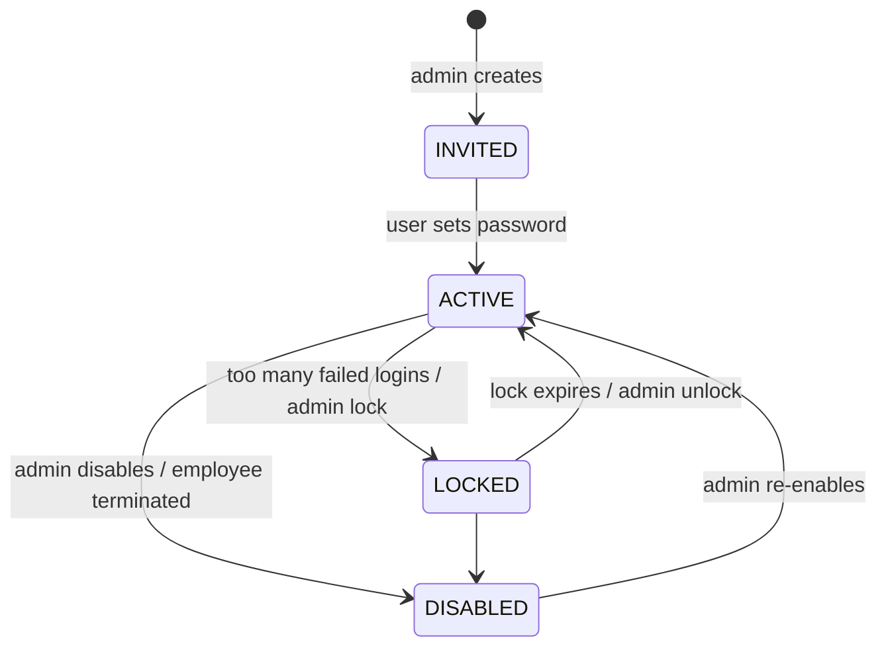
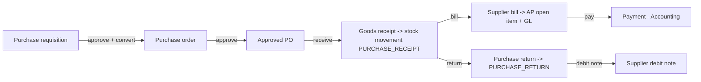
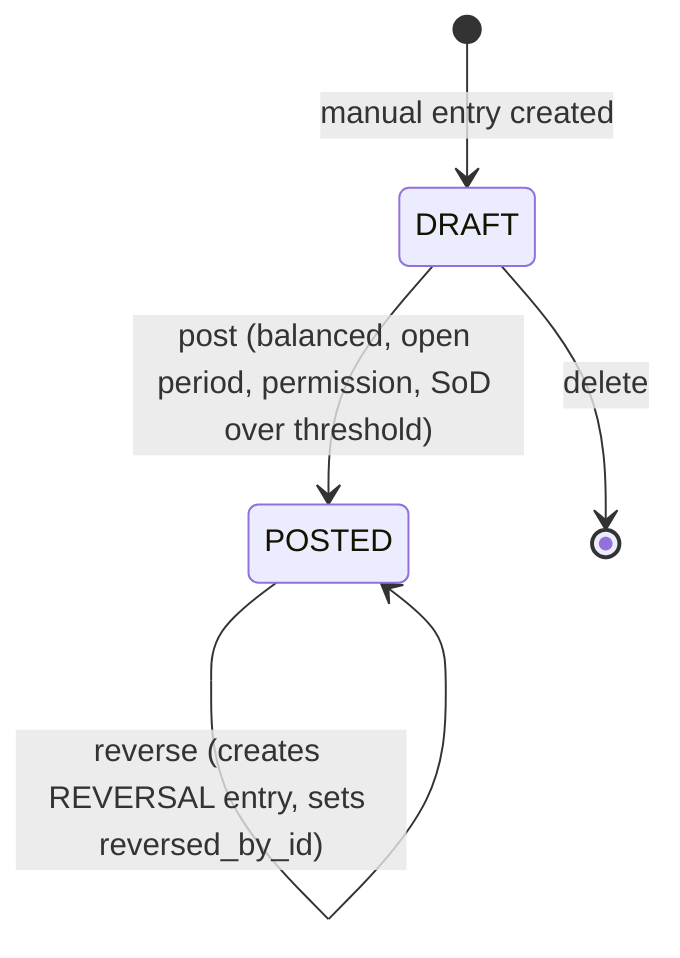
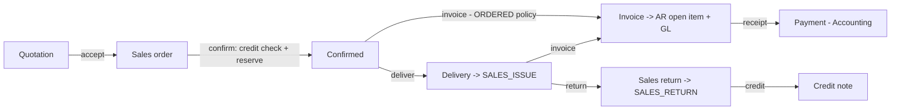
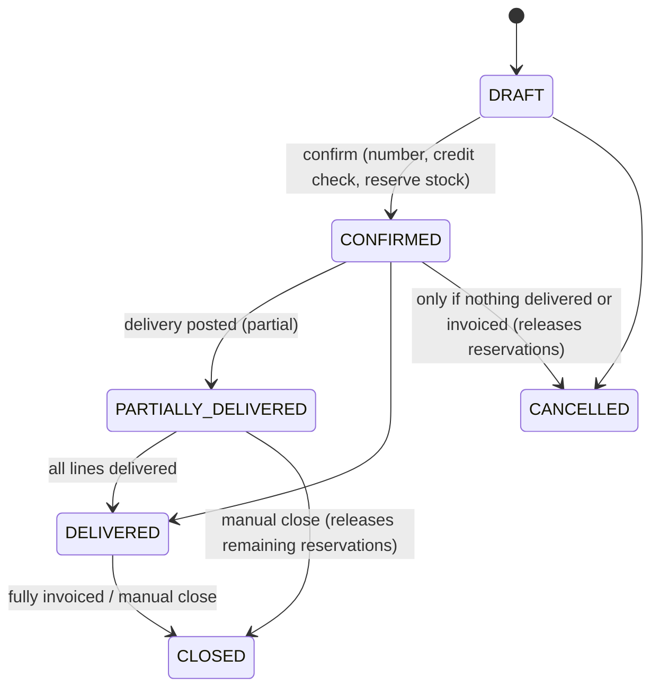

# ERP System — Product Specification

Status: **Approved baseline (Phase 1)**.

This document defines **what** the system does: scope, actors, business rules, document lifecycles and acceptance criteria.

- **How** it is built: [ARCHITECTURE.md](ARCHITECTURE.md).
- **How data is stored**: [DATABASE.md](DATABASE.md).
- **API**: [API.md](API.md).
- **Who may do what**: [SECURITY.md](SECURITY.md).

Requirement keywords: **MUST**, **SHOULD** and **MAY** follow RFC 2119.

---

## 1. Product overview

### 1.1 Purpose

The system is an integrated ERP for a **medium-sized organization** with 50–1,000 employees, one to several legal entities, and multiple branches and warehouses. It replaces disconnected spreadsheets and point tools for:

- procure-to-pay
- order-to-cash
- inventory
- general ledger
- HR
- payroll

Every operational transaction that has a financial effect is reflected in a **genuine double-entry general ledger** automatically, in the same database transaction.

### 1.2 Goals

1. **One source of truth** for stock, receivables, payables and the general ledger.
2. **Correctness by construction.** Posted records are immutable. Corrections are traceable reversals.
3. **Auditability.** Who did what and when is recorded for every business change.
4. **Segregated duties.** Permission-based, company- and branch-scoped access.
5. **Usability for operational staff.** Fast keyboard-friendly data entry, and clear document states.

### 1.3 Personas

| Persona | Primary modules | Typical permissions (see SECURITY.md §4.3 for roles) |
|---|---|---|
| System administrator | Admin, Auth | Manage users, roles, settings; view audit |
| Company administrator | Org, Admin | Company structure, branches, reference data |
| Warehouse clerk | Inventory | Receipts, issues, transfers, counts |
| Inventory manager | Inventory | Products, adjustments, count approval, valuation reports |
| Buyer | Procurement | Requisitions, POs, receipts |
| Procurement manager | Procurement | PO approval, supplier management |
| Sales representative | Sales | Quotations, orders |
| Sales manager | Sales | Order approval/credit override, price lists |
| Billing clerk | Sales, Accounting | Invoices, credit notes |
| AP clerk | Procurement, Accounting | Supplier bills, payments |
| AR clerk | Accounting | Customer receipts, allocations, dunning lists |
| Accountant | Accounting | Manual journals, reconciliation, reports |
| Financial controller | Accounting | Period close, reversals, CoA, posting into soft-closed periods |
| HR officer | HR | Employee records, assignments, leave |
| Payroll officer | Payroll | Payroll inputs, calculation |
| Payroll approver | Payroll | Approve and post payroll |
| Employee (self-service) | HR | Own profile, own leave requests, own payslips |
| Auditor (read-only) | All | Read everything including the audit log; change nothing |
| Integration (service account) | API | Scoped API token |

### 1.4 Scope summary (v1)

The following are **in scope**:

- The 10 modules in §3–§12, plus Partners master data (§5).
- Multi-company, multi-branch, departments.
- Multi-currency documents with a single base (functional) currency per company.
- Sales and purchase tax with a single rate per tax code.
- Moving-average inventory costing.
- Payroll with configurable components and a pluggable statutory rule hook.

The following are **out of scope for v1**. Each has a placeholder in the design and is listed in DECISIONS.md §3:

- Consolidation and inter-company transactions
- Lots and serial numbers
- FIFO costing
- Landed costs
- Manufacturing (BOM/MRP)
- Fixed asset register and depreciation schedules (depreciation can be posted manually)
- Bank statement import and automatic reconciliation (manual reconciliation flags are in scope)
- Budgeting
- Multi-rate compound tax and e-invoicing integrations
- Country-specific statutory payroll packs (only the hook is in scope)
- Time tracking, shift rosters and attendance-driven pay (basic daily attendance records are in scope, ADR-039)
- Recruitment
- CRM pipeline
- POS
- E-commerce connectors
- Mobile native apps
- SSO/OIDC (designed for, but not delivered; see SECURITY.md §3.6)

---

## 2. Cross-cutting functional requirements

### 2.1 Organization context

- **G-1.** Every business record belongs to exactly one **company**. Users work in one active company at a time and can switch between companies they are assigned to.
- **G-2.** Branch-scoped users see only documents for their branches. A document's branch is derived from its warehouse, or is explicit when there is no warehouse.
- **G-3.** Documents carry optional **analytic dimensions**, **branch** and **department**, which flow to journal lines.

### 2.2 Documents (common behaviour)

Common document behaviour covers quotations, orders, receipts, deliveries, invoices, bills, payments, movements, journal entries, payroll runs and leave requests.

- **G-4.** Every document has an explicit lifecycle (state machine). The UI shows the state and offers only the actions that are valid for it **and** permitted to the user.
- **G-5.** `DRAFT` documents are freely editable and deletable by users with the edit permission. Submitted or posted documents are not editable. They are changed only by defined actions such as cancel, reverse, credit note or return.
- **G-6.** Documents get a **gapless, human-readable number** per company, document type and fiscal year (e.g. `INV-2026-000123`). The number is assigned when the document leaves draft (on submit, confirm or post). Prefixes are configurable per company.
- **G-7.** Line amounts are computed by the server. Client-sent totals are ignored, although they may be compared to warn of stale UI.
- **G-8.** Every document supports attachments and an internal notes thread. Notes are append-only.
- **G-9.** Every state change and every edit is audit-logged (§12).
- **G-10.** Documents snapshot data that must not change retroactively: addresses, tax registration numbers, exchange rates, unit costs at posting, and the employee's department on a payslip.
- **G-11.** Concurrent edits are detected through optimistic locking. The second writer gets a conflict and must reload.

### 2.3 Money, quantities and rounding

- **G-12.** Every amount has an explicit currency. Each company has one **base currency**, which is immutable after the first posting.
- **G-13.** A document in a foreign currency stores an **exchange rate** (1 document currency = rate × base). The default comes from `org.exchange_rates` for the document date (latest rate on or before that date). It can be overridden by users with `org.exchange_rate.override`.
- **G-14.** Rounding:
  - Extended amounts are rounded to the currency's minor units using the company rounding mode (default HALF_UP).
  - Line math: `net = round(qty × unit_price × (1 − discount%/100))`.
  - Tax-exclusive: `tax = round(net × rate%/100)` with PER_LINE tax rounding (default), or computed on the per-tax-code sum with PER_DOCUMENT tax rounding.
  - Tax-inclusive (`prices_include_tax`): `gross = round(qty × unit_price × (1 − d))`, `net = round(gross / (1 + rate))`, `tax = gross − net`.
  - Base amounts: `round(doc_amount × rate)`, computed **per line**. Header base totals are sums of the line base amounts.
  - Any residual difference between Σ debits and Σ credits introduced by currency conversion is posted to the `ROUNDING_DIFFERENCE` account, if it is within tolerance.
- **G-15.** Quantities are entered in a document UoM and converted to the product's base UoM for stock. Conversions follow DATABASE.md §5.5.

### 2.4 Approvals

- **G-16.** v1 uses **permission-based approvals with thresholds**, not a general workflow engine:
  - Requisitions need `procurement.requisition.approve`.
  - POs need `procurement.purchase_order.approve`, and `approve_high` above the company threshold.
  - Credit overrides need `sales.order.override_credit`.
  - Leave needs the employee's manager (assignment) or `hr.leave.approve`.
  - Payroll needs `payroll.run.approve`.
  - Manual journals need `accounting.journal_entry.post`.
- **G-17.** **Segregation of duties.** A user cannot approve a document they created or last submitted. This applies to requisitions, POs, payroll runs and manual journal entries above a configurable amount. The rule is enforced server-side. It can be disabled per company only by a system administrator (audit-logged), for very small teams.

### 2.5 Search, lists and export

- **G-18.** Every list supports server-side pagination, filtering by key fields, sorting, a quick search (`q`) and CSV export of the filtered set. Exports are permission-checked and audit-logged.

---

## 3. Authentication and authorization (Auth)

### 3.1 Features

- Email and password login, with optional TOTP MFA per user. MFA can be **mandatory per role** (`requires_mfa`). The defaults are in SECURITY.md §3.5: system admins and the finance, payroll, HR-manager and company-admin roles.
- An invitation flow: an admin creates a user, and the user sets a password through a single-use link.
- Password reset by email with a single-use, short-lived token.
- Session management: users list their active sessions and revoke them. Admins can revoke all of a user's sessions.
- Account lockout with progressive delays (SECURITY.md §3.4).
- Service accounts and API tokens, scoped to a company and optionally to a subset of permissions, with mandatory expiry.
- Roles: system roles (seeded, immutable) and custom roles composed from permissions.
- Role assignments: (user, role, company [, branches]) with optional validity dates.

### 3.2 User states

Disabling a user revokes all of their sessions and API tokens immediately.

### 3.3 Acceptance criteria (examples)

- A user without an assignment in company X receives `404` for every `/companies/X/...` resource, and their company switcher does not list X.
- Removing a permission from a role takes effect on the next request. Permissions are resolved per request, with a cache of at most 60 s that is invalidated on change.
- After 5 failed logins, the 6th attempt within 15 minutes is delayed and the account is locked temporarily. The response does not reveal whether the email exists.

---

## 4. Organization management (Org)

### 4.1 Features

- **Companies (legal entities):** legal name, tax registration, country, base currency, timezone, fiscal-year start month, rounding settings, document number prefixes, logo.
- **Branches:** physical or organizational sites within a company.
- **Departments:** a tree per company, optionally linked to a branch. Used as an analytic dimension and in HR.
- **Reference data:**
  - currencies (global; activate per use)
  - exchange rates per company and date
  - countries
  - tax codes (sales/purchase, rate, validity)
  - payment terms (net days, end-of-month)

### 4.2 Rules

- A company's base currency cannot change after the first posted journal entry.
- A branch or department cannot be deactivated while it has active warehouses (for branches), current or future employee assignments, active departments (sub-departments, or departments tied to the branch), active positions or current department heads. New or moved departments, assignments and positions need active units; reactivating a unit needs an active parent.
- Departments form a tree without cycles. A department tied to a branch is used only in that branch; a position tied to a department is held only in that department.
- Tax codes cannot be deleted once used. They are deactivated or end-dated instead. A tax code's rate cannot change once it is used: create a new code with validity dates.

---

## 5. Partners (customers and suppliers)

- **Partner** holds the shared identity: code, name, legal name, tax registration, contacts, addresses and bank details (encrypted).
- **Customer profile:** customer group, default currency, payment terms, default tax code, credit limit (base currency) and an on-hold flag.
- **Supplier profile:** supplier group, default currency, payment terms, default tax code and lead time.
- One partner may be both a customer and a supplier.
- Partner groups drive account determination (for example, separate receivable accounts for related-party customers) and price-list selection.
- `BLOCKED` partners cannot be used on new documents. Open documents can still be completed.
- Changing bank details for a partner requires `partners.partner.manage_bank` and is audit-logged with old and new values redacted (only `last4` is shown). An email notification is sent to the procurement manager as a fraud control.

---

## 6. Inventory management

### 6.1 Catalog

- **Product** (template) with a type:
  - **STOCKABLE**: tracked quantity and value.
  - **CONSUMABLE**: purchasable and issuable, but no stock tracking; expensed on purchase.
  - **SERVICE**: no stock.
- **Variants (SKUs).** Every product has ≥ 1 variant. Products without variants have a single default variant automatically. Variants are defined by attribute values (e.g. Size=M, Color=Red). The combination is unique per product.
- **Categories:** a tree. They drive account determination (inventory, COGS, revenue, expense accounts) and reporting.
- **Units of measure:**
  - Global UoM categories and units with conversion factors.
  - A per-product base UoM, plus optional purchase and sales UoMs.
  - Product-specific conversions across categories, for example 1 BOX = 12 EA.
  - The base UoM is locked after the first transaction.
- SKU and barcode are unique per company.

### 6.2 Warehouses and locations

- A warehouse belongs to a branch. Locations form a tree within a warehouse.
- Location types:
  - `INTERNAL`: storable and pickable.
  - `RECEIVING`: inbound staging.
  - `SHIPPING`: outbound staging.
  - `QUARANTINE`: not available for sale or reservation.
  - `TRANSIT`: goods between warehouses.
- **Available-to-promise** excludes QUARANTINE and TRANSIT quantities. `warehouse_stock.on_hand` counts only INTERNAL, RECEIVING and SHIPPING locations. QUARANTINE and TRANSIT are tracked in `stock_balances` only.

### 6.3 Stock movements

Every quantity change is a **stock movement** (document) with lines. When a movement posts, it produces **inventory transactions**: an immutable ledger, one row per location affected. Posting updates the balances atomically.

| Movement type | From → To | Typical source | Valuation effect |
|---|---|---|---|
| `OPENING` | — → location | Data migration / go-live | In at the provided unit cost |
| `PURCHASE_RECEIPT` | — → location | Procurement goods receipt | In at the PO unit price converted to base at the receipt date rate |
| `PURCHASE_RETURN` | location → — | Procurement purchase return | Out at the current average cost |
| `SALES_ISSUE` | location → — | Sales delivery | Out at the current average cost |
| `SALES_RETURN` | — → location | Sales return | In at the original issue unit cost (from the delivery line) |
| `TRANSFER` | location → location (same or different warehouse) | Inventory | No value change (same company valuation) |
| `TRANSFER_SHIP` / `TRANSFER_RECEIVE` | location → TRANSIT, then TRANSIT → location | Inter-warehouse two-step transfer | No value change |
| `ADJUSTMENT` / `SCRAP` | ± location | Inventory adjustment (with reason code) | In: at a user-provided cost (default: current average). Out: at the current average |
| `COUNT_ADJUSTMENT` | ± location | Posted physical count | As adjustment |
| `REVERSAL` | Mirror of the original | Correction of a posted movement | Mirror of the original values |

### 6.4 Rules

- **INV-1.** Stock can never go negative at a location or warehouse. An issue that exceeds available stock fails with `INSUFFICIENT_STOCK`, listing the variant, location, requested and available quantities.
- **INV-2.** Reserved stock is not available to other documents. An issue that consumes its own reservation may use the reserved quantity.
- **INV-3.** Posted movements are immutable. Corrections create a `REVERSAL` movement, which may itself fail if the stock has since been consumed.
- **INV-4.** **Moving-average cost** is kept per (company, variant):
  - Receipt: `new_value = old_value + round(qty_in × unit_cost)`, and `qty += qty_in` (every value is rounded to base-currency minor units, INV-5).
  - Issue: `value_out = round(qty_out × old_value / old_qty)`, except that when `qty_out = old_qty`, `value_out = old_value`. This prevents residual value from being left behind.
  - Transfers do not change the valuation.
- **INV-5.** Inventory value posted to the GL is always the `value_base` of the inventory transactions, rounded to base-currency minor units. The sum of inventory transaction values therefore equals the item valuation total, which equals the GL inventory accounts exactly, provided only inventory postings touch those control accounts.
- **INV-6.** Reservations are created when a sales order is confirmed (configurable). They are released when the order is cancelled and consumed by deliveries. Reserving more than is available fails. A partial reservation is allowed, and the order line shows a backorder quantity.
- **INV-7.** Adjustments require a reason code. Adjustments above a configurable value require `inventory.adjustment.approve`.
- **INV-8.** **Physical counts:**
  1. Start: snapshot the system quantity.
  2. Enter counted quantities.
  3. Complete.
  4. Post: a `COUNT_ADJUSTMENT` posts the difference between counted and **current** quantity.

  Locations under count MAY be frozen. That is a setting, off by default. The freeze is not implemented in v1 (ADR-035): the difference is computed against the current quantity, read under lock at posting, so movements during a count are still accounted for.

### 6.5 Stock movement state machine

```mermaid
stateDiagram-v2
  [*] --> DRAFT
  DRAFT --> POSTED: post (locks, validates, writes ledger, publishes event)
  DRAFT --> CANCELLED: cancel
  POSTED --> POSTED: reverse (creates new REVERSAL movement; original gets reversed_by link)
```

---

## 7. Procurement (procure-to-pay)

### 7.1 Flow

### 7.2 State machines

**Purchase requisition:** `DRAFT → SUBMITTED → APPROVED | REJECTED`; `APPROVED → PARTIALLY_ORDERED → ORDERED`; `DRAFT | SUBMITTED | APPROVED → CANCELLED`.

**Purchase order:**

```mermaid
stateDiagram-v2
  [*] --> DRAFT
  DRAFT --> PENDING_APPROVAL: submit (number assigned)
  PENDING_APPROVAL --> APPROVED: approve (SoD; threshold permission)
  PENDING_APPROVAL --> DRAFT: reject (reason)
  APPROVED --> PARTIALLY_RECEIVED: receipt posted (some qty)
  PARTIALLY_RECEIVED --> RECEIVED: all lines fully received
  APPROVED --> RECEIVED
  RECEIVED --> CLOSED: fully billed / manual close
  PARTIALLY_RECEIVED --> CLOSED: manual close (short-close remaining qty)
  DRAFT --> CANCELLED
  PENDING_APPROVAL --> CANCELLED
  APPROVED --> CANCELLED: only if nothing received
```

`billing_status` is tracked separately: `NOT_BILLED → PARTIALLY_BILLED → BILLED`.

Clarifications (ADR-036):

- Receipt progress follows the stockable lines' net received quantity (received − returned). A purchase return can therefore move an order back from `RECEIVED` to `PARTIALLY_RECEIVED`, and the returned quantity can be received again.
- An order without stockable lines has nothing to receive. It closes from `APPROVED`, manually or when fully billed.
- `CLOSED` orders take no more receipts. Bills and debit notes against them can still be posted.
- Cancelling or closing an order cancels its draft receipts. Cancelling frees the requisition quantities it was converted from.

Approved POs are not editable. To change one, cancel it (if nothing was received) or close it short and create a new PO. *PO revisions/amendments are a future feature.*

**Goods receipt / purchase return:** `DRAFT → POSTED`, or `DRAFT → CANCELLED`. A posted receipt is corrected by a purchase return.

**Supplier bill / debit note:** `DRAFT → POSTED`, or `DRAFT → CANCELLED`. A posted bill is corrected by a debit note. Debit notes may only reference bills of the same supplier, and their total cannot exceed the bill's remaining non-credited amount.

### 7.3 Rules

- **PRC-1.** Receipt quantity ≤ (ordered − received + returned) × (1 + over-receipt tolerance).
- **PRC-2.** A receipt is valued at the PO line's net unit price (after discount, excluding recoverable tax), converted at the receipt date's exchange rate.
- **PRC-3.** **Three-way match** on bill posting, for `RECEIVED_STOCK` lines:
  - Billed qty ≤ received − returned − previously billed (within the qty tolerance).
  - Bill unit price within the price tolerance of the PO price.
  - On mismatch, `match_status = EXCEPTION` and posting is blocked, unless a user with `procurement.supplier_bill.override_match` overrides it with a reason.
  - Price differences are posted to `PURCHASE_PRICE_VARIANCE`.
- **PRC-4.** Service and consumable lines can be billed against PO lines without a receipt, if the PO line's product type is not STOCKABLE. When `require_receipt_before_bill = true`, stockable lines require a receipt.
- **PRC-5.** The supplier invoice number must be unique per supplier, to detect duplicate bills.
- **PRC-6.** Bills may be created without a PO (direct bills) for SERVICE and CONSUMABLE products. Permission `procurement.supplier_bill.create_direct` is required.

---

## 8. Accounting and finance

### 8.1 Concepts

| Concept | Definition |
|---|---|
| Chart of accounts (CoA) | Per-company tree of accounts. Leaf accounts are postable; group accounts aggregate. |
| Account type | ASSET, LIABILITY, EQUITY, REVENUE, EXPENSE. These determine normal balance and statement placement. **Normal balance:** debit for ASSET and EXPENSE; credit for LIABILITY, EQUITY and REVENUE. |
| Account subtype | Finer classification that drives behaviour: BANK/CASH (payments), RECEIVABLE/PAYABLE (control accounts with open items), INVENTORY, GRNI, TAX_*, RETAINED_EARNINGS, etc. (DATABASE.md §5.8) |
| Control account | An account that only system postings may touch (AR, AP, inventory, GRNI, tax control). Manual journal lines to control accounts are rejected. |
| Fiscal year | A contiguous date range (usually 12 months) per company. It is `OPEN` or `CLOSED`. |
| Accounting period | A monthly subdivision of a fiscal year: `OPEN`, `SOFT_CLOSED` (only users with `accounting.period.post_soft_closed` may post) or `CLOSED` (nobody may post). |
| Journal | A categorized book with its own numbering: GEN, SAL, PUR, BNK, CSH, INV, PAY, CLS, OPN. |
| Journal entry | A dated, balanced set of ≥ 2 journal lines in one period. |
| Journal line | One debit **or** credit to one account, with optional partner, branch, department and tax code. Stores both the base amount (debit/credit) and the document-currency amount. |
| General ledger | All posted journal lines, by account. |
| Trial balance | Per account: opening balance, Σ debits, Σ credits and closing balance for a date range. Total debits = total credits. |
| Open item | AR/AP subledger entry for an invoice, credit note, bill, debit note or unapplied payment, with its open (unsettled) amount. |
| Payment | Money in (customer receipt) or out (supplier payment, payroll disbursement) through a bank or cash account. |
| Allocation | Settlement of an open item by a payment, or netting of a credit note against an invoice. |

### 8.2 Default chart of accounts template (`STANDARD_SME`)

These are seeded on company creation. They are editable, except that system-required accounts cannot be deleted.

| Code | Name | Type / subtype | Control |
|---|---|---|---|
| 1000 | Cash on hand | ASSET / CASH | |
| 1010 | Bank – main | ASSET / BANK | |
| 1100 | Accounts receivable | ASSET / RECEIVABLE | ✔ |
| 1150 | Supplier advances | ASSET / PREPAYMENT | |
| 1200 | Inventory | ASSET / INVENTORY | ✔ |
| 1300 | Input tax recoverable | ASSET / TAX_RECEIVABLE | ✔ |
| 1500 | Fixed assets | ASSET / FIXED_ASSET | |
| 1590 | Accumulated depreciation | ASSET / ACCUMULATED_DEPRECIATION | |
| 2000 | Accounts payable | LIABILITY / PAYABLE | ✔ |
| 2050 | Goods received not invoiced | LIABILITY / GRNI | ✔ |
| 2100 | Output tax payable | LIABILITY / TAX_PAYABLE | ✔ |
| 2150 | Customer advances | LIABILITY / CUSTOMER_ADVANCE | |
| 2200 | Salaries payable | LIABILITY / PAYROLL_LIABILITY | |
| 2210 | Payroll deductions payable | LIABILITY / PAYROLL_LIABILITY | |
| 2220 | Employer contributions payable | LIABILITY / PAYROLL_LIABILITY | |
| 2300 | Accrued liabilities | LIABILITY / ACCRUED_LIABILITY | |
| 3000 | Share capital | EQUITY / EQUITY | |
| 3100 | Retained earnings | EQUITY / RETAINED_EARNINGS | |
| 3900 | Opening balance equity | EQUITY / OPENING_BALANCE_EQUITY | |
| 4000 | Sales revenue | REVENUE / OPERATING_REVENUE | |
| 4100 | Sales returns and allowances | REVENUE / OPERATING_REVENUE | |
| 4900 | Other income | REVENUE / OTHER_INCOME | |
| 5000 | Cost of goods sold | EXPENSE / COST_OF_GOODS_SOLD | |
| 5100 | Inventory adjustments | EXPENSE / COST_OF_GOODS_SOLD | |
| 5200 | Purchase price variance | EXPENSE / COST_OF_GOODS_SOLD | |
| 6000 | Operating expenses (general) | EXPENSE / OPERATING_EXPENSE | |
| 6100 | Salaries and wages | EXPENSE / PAYROLL_EXPENSE | |
| 6150 | Employer contributions | EXPENSE / PAYROLL_EXPENSE | |
| 6900 | Depreciation | EXPENSE / DEPRECIATION | |
| 7000 | FX gains and losses | EXPENSE / FX_GAIN_LOSS | |
| 7100 | Rounding differences | EXPENSE / OTHER_EXPENSE | |

The default account mappings bind each mapping key (DATABASE.md §5.8) to these accounts.

### 8.3 Invariants (MUST)

- **ACC-1.** Every posted journal entry satisfies **Σ debit = Σ credit** in base currency and has ≥ 2 lines. The application enforces this, and a deferred database trigger enforces it again at commit.
- **ACC-2.** Each line has exactly one non-zero side (debit XOR credit), and the amount is non-negative.
- **ACC-3.** Posted entries are **immutable**. Corrections are made by:
  - **Reversal:** a new entry with debits and credits swapped, dated on the original date if that period is open, otherwise on a chosen date in an open period, and linked both ways.
  - **Adjustment:** a new entry for the difference.
  - Operational documents are corrected by their own corrective documents (credit note, debit note, return, reversal movement), which post their own entries.
- **ACC-4.** A posting date must fall in an `OPEN` period, or a `SOFT_CLOSED` period for privileged users. Posting into `CLOSED` periods is impossible for everyone, including administrators. A closed period must first be **reopened** with `accounting.period.reopen`; reopening is audit-logged with a mandatory reason and is only possible if the fiscal year is not closed.
- **ACC-5.** System entries are idempotent per source event. Replaying an event never double-posts.
- **ACC-6.** Control-account balances equal the sum of their subledgers:
  - AR control = Σ open RECEIVABLE items.
  - AP control = Σ open PAYABLE items.
  - Inventory = Σ item valuations.

  This is verified by the nightly invariant job.
- **ACC-7.** The balance sheet balances: Assets = Liabilities + Equity + (Revenue − Expenses) for the current, unclosed year.

### 8.4 Journal entry state machine

System-generated entries are created directly in the posting transaction and never exist as drafts that users can see.

A reversal is dated in a period that takes postings (normally today's), mirrors every line and links both entries (`reversal_of_id` / `reversed_by_id`). An entry is reversed at most once, and a reversal is not reversed again. Above the company's `manual_entry_approval_threshold_base`, a manual entry must be posted by someone other than its creator (G-16, ADR-038).

### 8.5 Period and year close

1. **Soft close** (`accounting.period.soft_close`). Only privileged users (`accounting.period.post_soft_closed`) can post; manual entries only while the company setting `allow_manual_entries_in_soft_closed` is on.
2. **Close** (`accounting.period.close`). Preconditions:
   - There are no DRAFT manual entries dated in the period. Drafts must be posted, moved or deleted.
   - All earlier periods are closed.
   - The trial balance is balanced.

   On close, `period_balances` snapshots are written.
3. **Reopen** (`accounting.period.reopen`). The year must be open and a reason is required. Periods reopen latest first: no later period may be closed. Snapshots are deleted.
4. **Year-end close** (`accounting.fiscal_year.close`). Preconditions: all 12 periods are closed. The close:
   - Creates a `CLOSING` entry in the CLS journal, dated on the last day of the year. It zeroes every REVENUE and EXPENSE account into **retained earnings**.
   - Marks the year `CLOSED`.
   - Creates the next fiscal year and its periods if they do not already exist.

   Balance-sheet accounts carry forward naturally, because balances are cumulative. The close runs synchronously (ADR-038). The closing entry is the only posting the last, already closed period accepts; that period's snapshot is refreshed with it.

### 8.6 Posting matrix (automatic entries)

Notation: Dr/Cr account mapping keys (DATABASE.md §5.8), resolved through account determination with the scope shown in brackets. When several scopes are listed, they are tried **left to right**, then `DEFAULT`. For example, `[category, warehouse]` means: product category (the category itself, then each ancestor up the tree), then warehouse, then the company default. The first match wins. All amounts are in base currency. Document-currency amounts are carried on the lines. **Credit notes and debit notes post the mirror image of the corresponding invoice or bill.**

| Source event | Debit | Credit | Subledger effect |
|---|---|---|---|
| `inventory.stock_movement.posted` OPENING | INVENTORY_ASSET [category, warehouse] | INVENTORY_OPENING | — |
| … PURCHASE_RECEIPT | INVENTORY_ASSET [category, warehouse] | GRNI | — |
| … PURCHASE_RETURN | GRNI (at the original receipt value, `referenceValueBase`) | INVENTORY_ASSET (at average cost `valueBase`); the difference goes to PURCHASE_PRICE_VARIANCE (Dr or Cr by sign) | — |
| … SALES_ISSUE | COGS [category] | INVENTORY_ASSET [category, warehouse] | — |
| … SALES_RETURN | INVENTORY_ASSET | COGS [category] | — |
| … ADJUSTMENT / SCRAP / COUNT_ADJUSTMENT (increase) | INVENTORY_ASSET | INVENTORY_ADJUSTMENT [reason code] | — |
| … (decrease) | INVENTORY_ADJUSTMENT [reason code] | INVENTORY_ASSET | — |
| … TRANSFER (warehouses mapped to different inventory accounts) | INVENTORY_ASSET [dest warehouse] | INVENTORY_ASSET [source warehouse] | No entry if the accounts are identical |
| … REVERSAL | Mirror of the original movement's entry | | — |
| `procurement.supplier_bill.posted` | GRNI (receipt value) for RECEIVED_STOCK lines; PURCHASE_PRICE_VARIANCE for (bill net base − receipt value), Dr or Cr by sign; PURCHASE_EXPENSE [category] for SERVICE/NON_STOCK_GOODS lines; TAX_INPUT [tax code] | AP_CONTROL [supplier group] (total) | AP open item +total |
| `procurement.debit_note.posted` | AP_CONTROL | Mirror of bill lines | AP open item (negative) |
| `sales.invoice.posted` | AR_CONTROL [customer group] (total) | SALES_REVENUE [category] (net per line); TAX_OUTPUT [tax code] | AR open item +total |
| `sales.credit_note.posted` | SALES_RETURNS [category] (net); TAX_OUTPUT | AR_CONTROL | AR open item (negative) |
| `accounting.payment` INBOUND (customer) | Bank/cash GL account | AR_CONTROL (full amount) | Allocations reduce open items; any unallocated remainder becomes a **negative AR open item** (on-account credit) |
| `accounting.payment` OUTBOUND (supplier) | AP_CONTROL (full amount) | Bank/cash | Allocations reduce open items; any unallocated remainder becomes a **negative AP open item** (on-account debit) |
| Payment allocation with FX difference | FX_REALIZED_LOSS, or AR/AP control | AR/AP control, or FX_REALIZED_GAIN | — |
| `accounting.expense` posted | Expense accounts (lines); TAX_INPUT | Bank/cash | — |
| `payroll.run.posted` | SALARY_EXPENSE [pay component, department] for earnings; EMPLOYER_CONTRIBUTION_EXPENSE [component] | SALARIES_PAYABLE (net); PAYROLL_DEDUCTION_LIABILITY [component] for deductions; EMPLOYER_CONTRIBUTION_LIABILITY [component] | — |
| `payroll.run.paid` | SALARIES_PAYABLE | Bank (`payment_bank_account_id`); an `accounting.payments` row of kind OTHER is created | — |
| Payment void | Mirror of the payment entry; allocations reversed | | Open items restored |

**Unallocated payments (v1).** A posted payment opens a negative open item for its full amount, and allocations net it against invoices or bills (ADR-038). The unallocated part therefore stays on the AR/AP control account as a negative open item. This keeps the invariant "control account = Σ open items" simple. The CUSTOMER_ADVANCE and SUPPLIER_ADVANCE mapping keys are reserved for explicit prepayment documents, a future feature (ADR-014).

### 8.7 Accounts receivable and payable

- Open items are created by invoice, credit note, bill and debit note postings, and by unallocated payment remainders.
- **Allocation.** A payment, or a negative open item such as a credit note or an unapplied payment, is allocated to positive open items of the **same partner, same kind and same currency**. Cross-currency allocation is not supported in v1. Each allocation:
  - reduces `open_amount` on both sides
  - updates status
  - computes the realized FX difference = amount × (payment rate − item rate), in base currency, and posts it. Each item falls at its own rate, and an allocation that settles an item takes exactly its remaining base amount, so no base residue is left on the control account.
- An allocation can be undone (`accounting.payment.unallocate`). That reverses the FX entry and restores the open amounts.
- **Ageing:** buckets for current, 1–30, 31–60, 61–90 and >90 days past due, by due date and as of a date.
- **Customer statement:** opening balance, documents, payments and closing balance for a date range.
- **Credit check (Sales).** Exposure = Σ open AR (base) + Σ confirmed-but-uninvoiced order totals (base). If exposure plus the new order exceeds the credit limit, the result is BLOCK or WARN per the company setting.

### 8.8 Payments

- Payment state machine: `DRAFT → POSTED → VOIDED`. A void creates a reversal entry, reverses allocations, and needs `accounting.payment.void` plus a reason. The payment's open item ends as `VOIDED`. Allocations given on a draft are applied when it is posted.
- A payment is created in the payment's currency, which must equal the bank account currency.
- Batch supplier payment proposal: select open AP items due by a date and generate draft payments per supplier. This is a v1.1 nice-to-have, listed in DEVELOPMENT_PLAN Phase 8 as optional.
- Bank reconciliation in v1 is manual. A user marks posted bank-account journal lines as reconciled against a statement reference. The marks are stored in `accounting.bank_reconciliation_marks`, never on the immutable journal lines. A future phase adds statement import.

### 8.9 Expenses

Expense vouchers cover immediate expenses paid from a bank or cash account (petty cash, card spend). Each has lines with an expense account, tax code, branch and department. The lifecycle is `DRAFT → POSTED → REVERSED`. Expenses owed to suppliers on credit must go through supplier bills instead. Employee expense claims and reimbursements are out of scope for v1.

### 8.10 Financial reports (owned by Accounting)

- Trial balance (period or date range, with or without zero balances, by branch)
- General ledger detail (by account, date range, with running balance)
- Journal report
- Profit and loss (period, YTD, comparative)
- Balance sheet (as of a date)
- AR/AP ageing, customer and supplier statements
- Tax summary (output vs input by tax code and period)
- Cash and bank book

All report amounts reconcile to the GL. Phase 8 computes every report live from posted lines and returns JSON; file exports come with the export infrastructure (ADR-038). Period-close snapshots record what each close saw.

---

## 9. Sales (order-to-cash)

### 9.1 Flow

### 9.2 State machines

- **Quotation:** `DRAFT → SENT → ACCEPTED | REJECTED | EXPIRED` (EXPIRED is set by a daily job after `valid_until`); `DRAFT | SENT → CANCELLED`. ACCEPTED creates a sales order in DRAFT.
- **Sales order:**

  `invoice_status` is tracked separately: `NOT_INVOICED → PARTIALLY_INVOICED → INVOICED`.
- **Delivery:** `DRAFT → POSTED | CANCELLED`.
- **Sales return:** `DRAFT → RECEIVED | CANCELLED`. RECEIVED posts a `SALES_RETURN` movement and MAY auto-create a draft credit note.
- **Invoice / credit note:** `DRAFT → POSTED`, or `DRAFT → CANCELLED`. Posted invoices are corrected only by credit notes.

Clarifications (ADR-037):

- A quotation is accepted only within its validity; the draft order it creates keeps the quoted prices and links back to it. That order is cancelled, never deleted.
- Delivery progress follows the stockable lines' delivered quantity; returns do not move an order back. An order without stockable lines has nothing to deliver and closes from `CONFIRMED` when fully invoiced.
- A confirmed order with nothing delivered is cancelled, not closed, unless it was already invoiced (ORDERED policy). Closing and cancelling release the remaining reservations and cancel draft deliveries; cancelling also cancels draft invoices. `CLOSED` orders take no more deliveries, but invoices for what was delivered and credit notes can still be posted.
- Automatic draft credit notes on return receipt (the MAY above) are not implemented in v1; the credit note is created from the invoice, naming the return.

### 9.3 Rules

- **SAL-1. Pricing.** The price list is chosen in this order: explicit on the order, then the customer group's list, then the company default for the currency. Within a list, the item with the highest `min_quantity` ≤ the ordered quantity for the variant, UoM and date wins. A manual price override requires `sales.order.override_price`, and a discount above the configured threshold requires `sales.order.discount_high`.
- **SAL-2. Credit check** on confirm, per §8.7. Customers on hold cannot be confirmed without `sales.order.override_credit`.
- **SAL-3. Reservation** on confirm (if enabled). If stock is short, a partial reservation is made and the line shows the backorder quantity.
- **SAL-4. Delivery quantity** ≤ ordered − delivered. A delivery posts a `SALES_ISSUE` that consumes the reservation, and records the line's `unit_cost_base` from inventory.
- **SAL-5. Invoice policy:**
  - `DELIVERED`: invoiceable qty = delivered − returned − invoiced (+ credited back).
  - `ORDERED`: invoiceable qty = ordered − returned − invoiced. Use this for services and prepayments. Non-stockable lines always follow this rule.

  An invoice can combine several deliveries of the same order. Invoices without an order (direct invoices) are allowed for SERVICE products with `sales.invoice.create_direct`.
- **SAL-6. Credit notes** reference an invoice, line by line, and for returned goods also the sales return. The credited quantity cannot exceed the invoiced quantity minus quantities already credited (nor, per return line, the returned quantity minus what was already credited), and the credited unit price cannot exceed the invoiced one. Only credits for returned goods give the order line back its invoiceable quantity ("credited back" in SAL-5); price-only credits do not.
- **SAL-7. Returns** reference a posted delivery. Returned qty ≤ delivered − already returned. Stock comes back at the original unit cost.
- **SAL-8.** Revenue is recognized at invoice. COGS is recognized at delivery. Delivered-not-invoiced goods appear in the "uninvoiced deliveries" report. Accruing unbilled revenue is out of scope in v1 (ADR-015).

---

## 10. HR management

### 10.1 Features

- **Employee master:**
  - Personal data. Sensitive fields (date of birth, national ID, bank details) are encrypted and visible only with `hr.employee.read_sensitive`.
  - Contact details and documents.
  - Optional link to a system user, which enables self-service.
- **Employment assignments:** effective-dated, non-overlapping records of branch, department, position, manager, employment type and FTE. The current assignment is the one effective today.
- Positions and job titles, and department heads (effective-dated).
- **Leave management:**
  - Leave types with annual entitlement.
  - An accrual job grants annual entitlement on the leave-year start, or monthly pro-rata (configurable).
  - Leave requests, approved by the manager or HR.
  - Balances are derived from an append-only leave ledger.
  - Public holidays are excluded from day counts. Weekends are configurable per company: default Saturday and Sunday, but configurable for regions with other weekend days.
- **Leave details (ADR-039):** the leave year is the calendar year; ANNUAL types grant the entitlement at the year start (pro rata by hire month, to half days), MONTHLY types one twelfth per month; the first accrual of a year closes the previous one (its positive balance expires, up to the type's maximum is carried forward). Requests stay within one leave year and count working days of the employee's branch; a half day books 0.5 of a single working day. Submission needs the available balance (balance less other submitted days), approval the balance, unless the type allows a negative balance. HR or the employee's direct or indirect manager decides; nobody decides their own request. Approved leave covering today makes an active employee ON_LEAVE.
- **Attendance (basic, ADR-039):** one record per employee and day (present, absent, half day, remote, on leave, holiday; clock-in and clock-out times; minutes worked), kept by HR or clocked in and out by the employee in self-service. Payroll does not read it.
- **Documents and bank accounts:** documents are stored files (downloads audited); bank accounts are field-encrypted, listed masked and revealed only with step-up; payroll pays the primary account.
- Employee lifecycle: `ONBOARDING → ACTIVE ⇄ ON_LEAVE → TERMINATED`. Termination:
  - closes the current assignment
  - cancels leave after the termination date
  - deactivates the linked user (through the Auth facade)
  - publishes `hr.employee.terminated`; Payroll ends the compensation at the termination date, so the last regular run pays the prorated final period (ADR-039)

### 10.2 Rules

- **HR-1.** Assignments cannot overlap for the same employee (exclusion constraint).
- **HR-2.** Leave requests cannot exceed the available balance, unless the type allows a negative balance (setting). They cannot overlap other approved leave of the same employee.
- **HR-3.** A manager sees their direct and indirect reports' basic data, but not sensitive fields or compensation, unless they hold the relevant permissions.
- **HR-4.** Employees see only their own record through self-service endpoints (`/me/...`).

---

## 11. Payroll

### 11.1 Features

- **Pay components:** EARNING, DEDUCTION or EMPLOYER_CONTRIBUTION. Calculation types:
  - `FIXED` (amount)
  - `PERCENT_OF_BASE`
  - `PERCENT_OF_GROSS`
  - `INPUT` (per-period variable input such as overtime or bonus)
  - `STATUTORY` (delegated to a pluggable `StatutoryRule` implementation identified by `statutory_rule_code`; v1 ships a flat-percentage example rule and a "none" rule)
- **Salary structures:** sets of components with default rates and amounts. Each employee's **compensation** is effective-dated: structure, base amount, pay schedule, and overrides.
- Pay schedules and payroll periods.
- **Payroll run lifecycle:**

```mermaid
stateDiagram-v2
  [*] --> DRAFT
  DRAFT --> CALCULATING: calculate (async job)
  CALCULATING --> CALCULATED: job done
  CALCULATING --> DRAFT: job failed (errors listed)
  CALCULATED --> DRAFT: recalculate / edit inputs
  CALCULATED --> APPROVED: approve (SoD: approver ≠ calculator)
  APPROVED --> CALCULATED: unapprove (before posting)
  APPROVED --> POSTED: post (GL entry via event; payslips final)
  POSTED --> PAID: mark paid (bank account, date; GL entry)
  DRAFT --> CANCELLED
  CALCULATED --> CANCELLED
```

- Payslips are generated per employee, with lines per component. A PDF is rendered asynchronously and is visible in self-service after POSTED.
- **Calculation (ADR-039):** asynchronous; the whole run is calculated in one transaction, so its payslips appear together. A run with issues (negative net, missing assignment) is not approved. Approval needs a user other than the one who requested the calculation and not paid in the run. Changing inputs sends a calculated run back to DRAFT. Off-cycle runs pay their own inputs only. FINAL_SETTLEMENT runs are not offered in v1. Pay schedules and payroll are in the base currency; a compensation's base amount is the pay of one full period of its schedule.
- A bank payment file export (CSV, generic format) is produced for PAID or APPROVED runs. Bank-specific formats are future work.

### 11.2 Calculation rules

- **PAY-1.** The employees included are those with an active assignment and an effective compensation overlapping the period. Partial periods (hire or termination inside the period) are prorated by **calendar days** by default, or by working days if configured. Proration applies per compensation segment to the base and to FIXED and PERCENT_OF_BASE earnings; FIXED deductions and contributions are not prorated.
- **PAY-2.** Order of evaluation:
  1. Earnings, by sequence.
  2. Gross.
  3. Deductions, by sequence; statutory rules may use the gross and the taxable gross.
  4. Employer contributions.
  5. Net = gross − deductions.

  The net must be ≥ 0. Otherwise the employee is flagged and the run cannot be approved.
- **PAY-3.** All amounts are rounded to currency minor units per line. The payslip total is the sum of its lines.
- **PAY-4.** Posted runs are immutable. Corrections are made through an OFF_CYCLE run with adjustment inputs, which can be negative only through a dedicated deduction component.
- **PAY-5.** Only one REGULAR run per period (unless cancelled). A period is PROCESSED when its regular run is POSTED.
- **PAY-6.** Payroll data visibility:
  - `payroll.payslip.read` covers all payslips in scope.
  - Employees see only their own payslips.
  - Aggregated reports require `payroll.report.read`.
  - Per-employee pay in reports also requires `payroll.payslip.read`.

---

## 12. Administration and audit

### 12.1 Features

- User administration: invite, disable, unlock, reset MFA, assign roles per company and branch, and view sessions. The UI is in Admin; the logic is the Auth facade.
- Role administration: create and edit custom roles, and view effective permissions of a user per company.
- Company settings screens (aggregating module settings), document numbering prefixes, and feature flags.
- **Audit log viewer:** filter by company, user, module, entity, action and date range, then export (export is itself audit-logged). Entity history: from any document, "History" shows its audit entries.
- Retention policy configuration (system admin only).
- **System health page:**
  - job status
  - incomplete event publications
  - the last invariant-check results

### 12.2 Audit requirements

- **AUD-1.** These events are recorded:
  - every create, update and delete of business entities, with a field-level diff (sensitive values redacted)
  - every state transition
  - every login, logout and failed login
  - every password or MFA change
  - every role or permission change
  - every permission-denied event on a mutating endpoint
  - every export
  - every view of sensitive data (e.g. revealing a national ID or bank account)
  - every period close or reopen
  - every settings change
- **AUD-2.** Audit records are written **in the same transaction** as the change. If the business change commits, its audit record exists.
- **AUD-3.** The audit log is append-only. The application role cannot update or delete it. Retention follows DATABASE.md §10.
- **AUD-4.** Each audit record includes the actor, actor type, company, time (UTC), request ID, IP and user agent.

---

## 13. Reporting and analytics

Reports owned by Reporting are cross-module, operational reports, built on each module's published views. Financial statements belong to Accounting (§8.10); the report centre lists them and exports them, but Accounting computes them (ADR-040). Report codes are in API.md §17.11.

| Report | Source | Notes |
|---|---|---|
| Stock on hand (by warehouse/location; filters warehouse, location, product, category) | inventory views | As of now (with reserved and available); as of a date via the ledger |
| Stock valuation (by variant/category) | inventory views | Now or as of a date; reconciles to the GL inventory accounts; `inventory.valuation.read` |
| Stock movement summary (opening, purchases, sales, transfers, adjustments, closing) and inventory transaction history | inventory views | A reversal counts as what it reverses |
| Inventory adjustments (adjustments, scrap, count differences, with reasons) | inventory views | Reconciles to the adjustment expense |
| Slow-moving / no-movement items | inventory views | Configurable days; transfers do not count as movement |
| Warehouse summary (SKUs, on hand, reserved, inbound, outbound, movements) | inventory views | |
| Purchases by supplier / product / category / branch / month | procurement views | Bills net of debit notes |
| Supplier analysis (orders, receipts, received and billed value, on-time receipts, lead time, open payables) | procurement + accounting views | |
| Purchase orders with receipt and billing progress; receiving | procurement views | |
| Receipts pending billing (GRNI detail) | procurement views | Reconciles to the GRNI account |
| Outstanding supplier bills | procurement + accounting views | From Accounting's open items |
| Sales summary; sales by customer / product / branch / period | sales views | Net of credit notes; reconciles to revenue and output tax |
| Invoice status and payment status | sales + accounting views | Payment status from Accounting's open items |
| Order backlog and uninvoiced deliveries | sales views | |
| Gross margin by product/category | sales + inventory views | Revenue (invoice) vs COGS (delivery and return cost); COGS reconciles to the GL |
| Trial balance, general ledger, income statement, balance sheet, AR/AP ageing, cash book | Accounting (§8.10) | Exportable from the report centre |
| Cash and bank position; expenses by account / month / branch / department | accounting views | From the posted ledger; expenses equal the income statement's |
| Headcount (by department/branch/position/employment type) and turnover | hr views | Equals HR's headcount |
| Attendance and leave taken | hr views | |
| Payroll summary by period / department / component | payroll views | `payroll.report.read`; no per-employee figures |
| Dashboards | KPIs: sales MTD, AR overdue, AP due next 7 days, stock value, low-stock count (out of stock or fully committed: v1 has no reorder points), open POs, headcount | Per-role dashboards (executive, sales, finance, operations, HR); widgets by permission |

- Reports return within 2 s (p95) for standard parameter ranges (one period) on the volume dataset; pages are bounded and keyset-paginated, with totals. Larger requests run as **async exports** (CSV, XLSX, PDF; CSV safe against formula injection; row and size limits; files expire after 7 days). The user polls the export; e-mail notification follows with the notification infrastructure.
- Every report enforces the same company and branch scoping and permissions as the underlying data; reports read through a read-only database role.
- Saved report parameters can be stored per user, or shared within the company.
- Reports are per company; consolidated multi-company reporting is out of scope for v1.

---

## 14. Non-functional requirements

See [ARCHITECTURE.md §10](ARCHITECTURE.md) for performance, availability and data-volume targets, and [SECURITY.md](SECURITY.md) for security requirements. In addition:

- **NFR-1.** The web UI supports current evergreen browsers (latest two versions of Chrome, Edge, Firefox and Safari), at desktop width primarily. Tablet use is supported for warehouse screens.
- **NFR-2.** Accessibility is WCAG 2.2 AA.
- **NFR-3.** All user-facing dates and numbers are formatted per the user's locale. Currency amounts show the currency code.
- **NFR-4.** Data import:
  - CSV import with validation and dry-run for products, partners, opening stock, opening balances (a journal in the OPN journal), employees and the chart of accounts.
  - Imports are all-or-nothing per file, or chunked with a per-row error report for large files.
- **NFR-5.** Go-live data migration uses OPENING movements and OPENING journal entries. Opening AR/AP is imported as open items, with offsetting entries to OPENING_BALANCE_EQUITY.

---

## 15. Glossary

| Term | Meaning |
|---|---|
| Base currency | The company's functional currency. All GL balances are in it. |
| GRNI | Goods Received Not Invoiced. A liability clearing account between receipt and bill. |
| COGS | Cost of goods sold. |
| SKU / variant | The stock-keeping unit. A specific sellable or storable variant of a product. |
| Open item | An unsettled receivable or payable document amount. |
| Posting | Making a document final and creating its ledger effects (GL and/or stock). |
| Reversal | A new posted record that exactly negates a previous one. |
| Control account | A GL account whose balance must equal a subledger. It is not available for manual entries. |
| SoD | Segregation of duties. |
| Soft close | Period state in which only privileged users can post. |
| Account determination | Rules mapping business context (category, warehouse, tax code, …) to GL accounts. |
