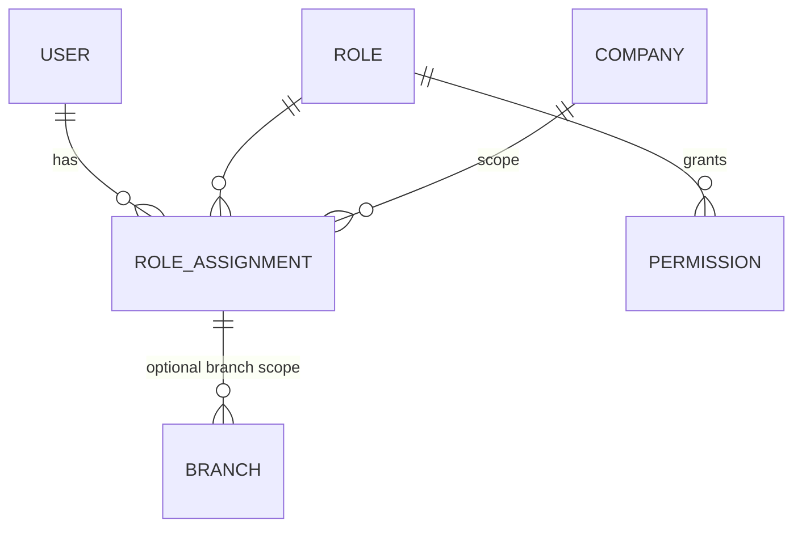

# ERP System — Security Architecture

Status: **Approved baseline (Phase 1)**. The verification baseline is **OWASP ASVS 4.0.3 Level 2**.

Related: [ARCHITECTURE.md](ARCHITECTURE.md) · [API.md](API.md) · [DATABASE.md](DATABASE.md)

---

## 1. Principles

1. **The backend enforces everything.** The frontend hides what a user cannot do, purely for UX. It is never a security control.
2. **Deny by default.** Every controller method carries exactly one of `@PublicEndpoint`, `@AuthenticatedEndpoint` (any authenticated principal, e.g. reference data and `/me`) or `@RequiresPermission(...)`. `ArchitectureTests` fails the build otherwise. At runtime, a handler without an annotation is denied (403), anonymous access is allowed only to `@PublicEndpoint` handlers, and unknown paths require authentication (401).
3. **Defense in depth for tenant isolation.** Isolation is enforced at four levels:
   - path company check
   - application query filters
   - PostgreSQL RLS
   - composite foreign keys
4. **Least privilege** for users, API tokens, database roles and infrastructure identities.
5. **Every security-relevant action is audited** in the same transaction as the change.
6. **Secrets never live in code, logs or the database in plaintext.**

## 2. Threat model summary

| Asset | Main threats | Key controls |
|---|---|---|
| Financial records (GL, AR/AP) | Fraudulent postings, tampering with history, posting into closed periods | Permissions, SoD, immutability triggers, period locks, audit log, nightly invariant checks |
| Inventory | Theft concealment through adjustments | Reason codes, adjustment approval thresholds, audit, count variance reports |
| Payments / bank details | Supplier bank detail fraud (BEC), unauthorized payments | Separate `manage_bank` permission, change notifications, reveal-audit, payment post/void permissions, MFA for finance roles |
| Payroll and HR PII | Data leakage, insider snooping | Field-level encryption, reveal endpoints with audit, payroll permissions, row scoping |
| Accounts | Credential stuffing, session hijacking, CSRF | Argon2id, rate limiting, lockout, MFA, `__Host-` HttpOnly cookies, CSRF tokens, session rotation |
| Multi-company boundary | IDOR, cross-company data access | Path company membership, 404 masking, RLS, composite FKs, automated cross-company tests |
| API tokens | Leakage, over-privilege | Prefix for secret scanning, hashing, expiry, company and permission down-scoping |
| Supply chain | Vulnerable dependencies, malicious packages | Lockfiles, dependency and container scanning, SBOM, pinned versions, Renovate with review |

---

## 3. Authentication

### 3.1 Identities

- **Human users** (`auth.users.user_type = 'HUMAN'`) authenticate with email, password and optional TOTP MFA.
- **Service accounts** (`user_type = 'SERVICE'`) have no password and authenticate only with API tokens. They receive role assignments like humans do.
- Email is the login identifier. It is case-insensitive (`citext`) and unique across the deployment.

### 3.2 Passwords

- **Hashing:** Argon2id via Spring Security `Argon2PasswordEncoder` (BouncyCastle) with parameters **m = 19 MiB, t = 2, p = 1**, a 16-byte salt and a 32-byte hash. These follow the OWASP Password Storage Cheat Sheet minimum. The parameters are configurable. Hashes are **upgraded on successful login** when the parameters change (`upgradeEncoding`).
- **Policy** follows NIST SP 800-63B:
  - Minimum length is 12 characters; maximum is 128.
  - All Unicode is allowed. NFKC normalization is applied.
  - There are no composition rules and no periodic expiry.
  - Passwords are rejected if they appear in the bundled list of the top 100,000 breached passwords, or if they contain the user's email local-part or name. The bundled file (`auth/breached-passwords.txt`, NCSC list from SecLists, MIT) keeps only the entries of 12 or more characters (about 1,200), because shorter ones fail the length rule anyway. Passwords with fewer than 5 distinct characters are also rejected.
  - Optionally, passwords are checked against the HIBP k-anonymity API (`erp.security.password.hibp-check=false` by default, because it is an external call). *Not implemented in Phase 3; planned with the production-readiness work (Phase 12).*
- Changing the password requires the current password. The change rotates the session ID and revokes all **other** sessions and all password-reset tokens.
- **Password reset and invite tokens:**
  - 32 random bytes (base64url), single-use.
  - Stored as a SHA-256 hash in `auth.user_tokens`.
  - Valid for 30 minutes (reset) or 72 hours (invite).
  - The reset request always returns `202`, whether or not the account exists.
  - Email links carry the token in the URL fragment (`<public-base-url>/reset-password#token=…`), so it does not reach server logs or `Referer` headers (ADR-032).
  - A successful reset deletes all of the user's sessions.

### 3.3 Sessions (browser)

- Sessions are **server-side** rows in `auth.sessions` (ADR-028). They are never JWTs for browser sessions. This keeps revocation immediate and avoids storing tokens in browser storage.
- Session cookie: `__Host-erp_session`, `Secure`, `HttpOnly`, `SameSite=Lax`, `Path=/`, with no `Domain`. The value is a 256-bit random secret; the database stores only its SHA-256 hash. (Only the `local` profile, over plain HTTP, drops `Secure` and therefore the `__Host-` prefix.)
- **Idle timeout** is 30 minutes, configurable per deployment. The **absolute timeout** is 12 hours, after which the user must re-authenticate. The absolute timeout is enforced with the session's `absolute_expires_at`, checked on every request.
- The session ID is **rotated** on login, MFA completion, password change and privilege elevation, to protect against session fixation.
- Each user may have at most **5 concurrent sessions**. When the limit is exceeded, the oldest session is invalidated. Users can list and revoke sessions; admins can revoke all of a user's sessions.
- Disabling or locking a user, or removing all their assignments, invalidates their sessions immediately by deleting them by user ID. API tokens of a disabled user stop working at the same moment (the user status is checked on every request).
- **Step-up re-authentication** (password re-entry within the last 5 minutes) is required for:
  - disabling MFA
  - creating API tokens
  - revealing sensitive fields (Phases 4 and 9)
  - changing one's own email (email changes, with verification of the new address through an `EMAIL_VERIFY` token, are not implemented yet)

  Step-up is `POST /api/v1/me/reauthenticate {password}`. It rotates the session secret. Failed confirmations count against a per-user budget (5 per 15 minutes).

### 3.4 Login protection

- Login responses are generic (`Invalid email or password`) and take the same time for unknown emails: a dummy Argon2 hash is verified.
- **Progressive throttling:** see the §9 limits. After **5 consecutive failures**, the account is temporarily locked for 15 minutes (`locked_until`). After 3 such locks within 24 hours, an admin must unlock the account. Locks are audit-logged, and the user is notified by email.
- Every attempt is recorded in `auth.login_attempts`: email hash, IP, outcome and reason. The table is append-only for `erp_app`; a `SECURITY DEFINER` purge function removes rows after 90 days.

### 3.5 Multi-factor authentication

- **TOTP** (RFC 6238): SHA-1, 6 digits, 30 s step, ±1 step tolerance. The secret is 20 random bytes, **encrypted** with the field-encryption key (§7.3).
- **Replay protection:** a code's time step must be greater than `last_used_step`.
- **Recovery codes:** 10 codes of 10 characters each, stored as SHA-256 hashes and single-use. Regenerating them invalidates the old ones.
- MFA is **mandatory** for:
  - system admins
  - roles flagged `requires_mfa`: FINANCIAL_CONTROLLER, ACCOUNTANT, AP_CLERK, PAYROLL_OFFICER, PAYROLL_APPROVER, HR_MANAGER and COMPANY_ADMIN by default
  - any user holding a permission flagged `is_sensitive` (§4.2), which includes `*.manage_bank` and all `payroll.*`

  A user who has such a role but has not enrolled is forced into enrollment after the password step: the session is restricted (`403 MFA_ENROLLMENT_REQUIRED`) except for `GET /me`, the TOTP setup and confirm endpoints and logout. Users for whom MFA is mandatory cannot disable it (`409 MFA_MANDATORY`); an administrator can reset it (`POST /admin/users/{id}/reset-mfa`).
- Login flow: password OK → `401 MFA_REQUIRED` + challenge (an HttpOnly cookie valid for 5 minutes, allowing 5 attempts) → `POST /auth/login/mfa` → the session is established.

### 3.6 API tokens (integrations)

- Format: `erp_pat_<8-char public prefix>_<43-char base64url secret>`, with 256 bits of entropy. The `erp_pat_` prefix is registered with secret-scanning tools.
- Stored as a SHA-256 hash, plus the prefix for identification. Because the secret is high-entropy, a slow hash is not needed. The secret is shown **once**.
- Every token has a **mandatory expiry** of at most 365 days and an optional company restriction. It also has an optional `allowed_permissions` set: its effective permissions are the user's permissions **∩** the allowed set.
- `Authorization: Bearer` is accepted only over TLS (terminated at the load balancer, which does not forward plain HTTP). Bearer requests skip CSRF and ignore cookies. A request with an invalid bearer token is `401`; it never falls back to a cookie.
- Tokens cannot manage passwords, MFA, sessions or step-up: those endpoints require a browser session. Personal tokens need `auth.api_token.manage_own` in at least one company and a recent step-up; service-account tokens are managed by `auth.service_account.manage`.
- Tokens can be revoked by the owner or an admin. `last_used_at` is updated at most once per minute.

### 3.7 SSO (future)

The design supports adding OIDC (Entra ID, Google Workspace, Okta) through Spring Security OAuth2 Login. A user would be linked to an external identity through a planned `auth.external_identities` table (issuer, subject). Authorization would remain local (roles and assignments). SSO is not delivered in v1 (see DECISIONS.md, open question Q-3).

---

## 4. Authorization

### 4.1 Model



- A **permission** is an atomic capability with the code `<module>.<resource>.<action>`. Permissions are defined **in code**, in a per-module `Permissions` class, and synced to `auth.permissions` at startup. Unknown codes in the database are flagged as deprecated, never silently deleted.
- A **role** is a named set of permissions. **System roles** are seeded and their permission sets are maintained by migrations. **Custom roles** are created by admins.
- A **role assignment** binds (user, role, company), with optional validity dates and an optional set of branches.
- **Effective permissions** for (user, company) are the union of the permissions of all roles assigned to that user in that company and currently valid. They are cached per (user, company) for at most 60 seconds, and the cache is invalidated on any assignment or role change.
- **Branch scope** for (user, company) is the union of the branch sets of the assignments. If any assignment has no branch rows, the user can see **all branches**.

### 4.2 Permission catalogue (v1)

This is the authoritative list. New permissions require updating this table, the module's `Permissions` class and the seed migration `R__seed_auth_permissions_and_roles.sql` (ADR-030); `PermissionCatalogIntegrationTest` checks that all three agree.

| Module | Permissions |
|---|---|
| auth | `auth.user.read`, `auth.user.manage`, `auth.role.read`, `auth.role.manage`, `auth.role_assignment.manage`, `auth.service_account.manage`, `auth.api_token.manage_own` |
| admin | `admin.audit.read`, `admin.audit.read_global`, `admin.settings.manage`, `admin.system.read` |
| org | `org.company.create`, `org.company.manage`, `org.branch.read`, `org.branch.manage`, `org.department.read`, `org.department.manage`, `org.exchange_rate.read`, `org.exchange_rate.manage`, `org.exchange_rate.override`, `org.tax_code.read`, `org.tax_code.manage`, `org.payment_terms.read`, `org.payment_terms.manage` |
| partners | `partners.partner.read`, `partners.partner.manage`, `partners.partner.read_bank`, `partners.partner.manage_bank`, `partners.customer.manage`, `partners.supplier.manage` |
| inventory | `inventory.product.read`, `inventory.product.manage`, `inventory.warehouse.read`, `inventory.warehouse.manage`, `inventory.stock.read`, `inventory.valuation.read`, `inventory.movement.read`, `inventory.movement.create`, `inventory.movement.post`, `inventory.movement.reverse`, `inventory.adjustment.manage`, `inventory.adjustment.approve`, `inventory.count.manage`, `inventory.count.post`, `inventory.settings.manage` |
| procurement | `procurement.requisition.read`, `procurement.requisition.create`, `procurement.requisition.approve`, `procurement.purchase_order.read`, `procurement.purchase_order.create`, `procurement.purchase_order.approve`, `procurement.purchase_order.approve_high`, `procurement.purchase_order.cancel`, `procurement.purchase_order.close`, `procurement.receipt.read`, `procurement.receipt.create`, `procurement.receipt.post`, `procurement.return.manage`, `procurement.supplier_bill.read`, `procurement.supplier_bill.create`, `procurement.supplier_bill.create_direct`, `procurement.supplier_bill.post`, `procurement.supplier_bill.override_match`, `procurement.settings.manage` |
| sales | `sales.price_list.read`, `sales.price_list.manage`, `sales.quotation.read`, `sales.quotation.manage`, `sales.order.read`, `sales.order.create`, `sales.order.confirm`, `sales.order.override_credit`, `sales.order.override_price`, `sales.order.discount_high`, `sales.order.cancel`, `sales.order.close`, `sales.delivery.read`, `sales.delivery.create`, `sales.delivery.post`, `sales.return.manage`, `sales.invoice.read`, `sales.invoice.create`, `sales.invoice.create_direct`, `sales.invoice.post`, `sales.invoice.send`, `sales.settings.manage` |
| accounting | `accounting.account.read`, `accounting.account.manage`, `accounting.account_mapping.manage`, `accounting.fiscal_year.manage`, `accounting.fiscal_year.close`, `accounting.period.read`, `accounting.period.soft_close`, `accounting.period.close`, `accounting.period.reopen`, `accounting.period.post_soft_closed`, `accounting.journal.manage`, `accounting.journal_entry.read`, `accounting.journal_entry.create`, `accounting.journal_entry.post`, `accounting.journal_entry.reverse`, `accounting.ar.read`, `accounting.ap.read`, `accounting.bank_account.read`, `accounting.bank_account.manage`, `accounting.payment.read`, `accounting.payment.create`, `accounting.payment.post`, `accounting.payment.void`, `accounting.payment.allocate`, `accounting.payment.unallocate`, `accounting.expense.read`, `accounting.expense.create`, `accounting.expense.post`, `accounting.bank_reconciliation.manage`, `accounting.report.read`, `accounting.settings.manage` |
| hr | `hr.employee.read`, `hr.employee.manage`, `hr.employee.read_sensitive`, `hr.employee.manage_bank`, `hr.employee.terminate`, `hr.position.manage`, `hr.leave.read`, `hr.leave.approve`, `hr.leave.adjust`, `hr.leave.configure` |
| payroll | `payroll.configuration.manage`, `payroll.compensation.read`, `payroll.compensation.manage`, `payroll.run.read`, `payroll.run.prepare`, `payroll.run.approve`, `payroll.run.post`, `payroll.run.pay`, `payroll.payslip.read`, `payroll.report.read` |
| reporting | `reporting.sales.read`, `reporting.procurement.read`, `reporting.inventory.read`, `reporting.hr.read`, `reporting.export.create`, `reporting.saved_report.share` |

Permissions flagged `is_sensitive` require MFA-enrolled users (§3.5). They are:

- `*.manage_bank`, `*.read_bank`
- `hr.employee.read_sensitive`
- `payroll.*` (all payroll permissions)
- `accounting.period.reopen`, `accounting.payment.void`
- `auth.role.manage`, `auth.role_assignment.manage`

### 4.3 System roles (seeded)

The "Key permissions" column lists roles' permissions by pattern. The exact permission sets are defined in the seed migration. Here, `*.read` means read permissions of the named modules.

| Role code | Key permissions |
|---|---|
| `COMPANY_ADMIN` | `org.*`, `auth.role_assignment.manage` (within the company), `admin.audit.read`, all `*.settings.manage` |
| `AUDITOR` | All company-scoped `*.read` permissions (not the global-only `admin.system.read`), plus `accounting.report.read`, `admin.audit.read`, `inventory.valuation.read`, `accounting.ar.read`, `accounting.ap.read` — **no** write permissions, **no** `*.read_sensitive` / `read_bank` / payroll |
| `WAREHOUSE_CLERK` | `inventory.product.read`, `inventory.stock.read`, `inventory.movement.read/create/post`, `inventory.count.manage`, `procurement.receipt.read/create/post`, `sales.delivery.read/create/post`, `procurement.purchase_order.read`, `sales.order.read` |
| `INVENTORY_MANAGER` | `WAREHOUSE_CLERK` + `inventory.product.manage`, `inventory.warehouse.manage`, `inventory.adjustment.*`, `inventory.count.post`, `inventory.movement.reverse`, `inventory.valuation.read`, `reporting.inventory.read` |
| `BUYER` | `partners.partner.read`, `partners.supplier.manage`, `procurement.requisition.*` except approve, `procurement.purchase_order.read/create`, `procurement.receipt.read`, `inventory.product.read`, `inventory.stock.read` |
| `PROCUREMENT_MANAGER` | `BUYER` + `procurement.requisition.approve`, `procurement.purchase_order.approve/approve_high/cancel/close`, `procurement.return.manage`, `reporting.procurement.read` |
| `SALES_REP` | `partners.partner.read`, `partners.customer.manage`, `sales.price_list.read`, `sales.quotation.*`, `sales.order.read/create/confirm`, `inventory.stock.read`, `inventory.product.read` |
| `SALES_MANAGER` | `SALES_REP` + `sales.order.override_credit/override_price/discount_high/cancel/close`, `sales.price_list.manage`, `sales.return.manage`, `reporting.sales.read` |
| `BILLING_CLERK` | `sales.invoice.*` except `create_direct`, `sales.order.read`, `sales.delivery.read`, `accounting.ar.read` |
| `AR_CLERK` | `accounting.ar.read`, `accounting.payment.read/create/post/allocate`, `partners.partner.read`, `accounting.bank_account.read`, `sales.invoice.read` |
| `AP_CLERK` | `accounting.ap.read`, `procurement.supplier_bill.read/create/post`, `accounting.payment.read/create/post/allocate`, `partners.partner.read`, `partners.partner.read_bank`, `accounting.bank_account.read` |
| `ACCOUNTANT` | `accounting.*` except `period.close/reopen`, `fiscal_year.close`, `payment.void`, `account_mapping.manage`; plus `accounting.report.read` and read access to Sales and Procurement documents |
| `FINANCIAL_CONTROLLER` | All `accounting.*`, `procurement.supplier_bill.override_match`, `sales.invoice.create_direct`, `procurement.supplier_bill.create_direct`, `org.exchange_rate.*`, `org.tax_code.*`, `partners.partner.manage_bank` |
| `HR_OFFICER` | `hr.employee.read/manage`, `hr.position.manage`, `hr.leave.*` |
| `HR_MANAGER` | `HR_OFFICER` + `hr.employee.read_sensitive`, `hr.employee.manage_bank`, `hr.employee.terminate`, `reporting.hr.read` |
| `PAYROLL_OFFICER` | `payroll.configuration.manage`, `payroll.compensation.*`, `payroll.run.read/prepare`, `payroll.payslip.read`, `hr.employee.read` |
| `PAYROLL_APPROVER` | `payroll.run.read/approve/post/pay`, `payroll.payslip.read`, `payroll.report.read` |
| `EMPLOYEE` | None beyond the self-service endpoints. These are authorized by the employee link, not by permissions. |

**System administrator** (`auth.users.is_system_admin = true`) is a deployment-level flag, not a role. It grants these global permissions:

- `auth.user.*`, `auth.role.*`, `auth.role_assignment.manage`, `auth.service_account.manage`
- `admin.*`
- `org.company.create`

It does **not** grant access to company business data. A system admin who needs that must be assigned roles in the company like anyone else, and that assignment is audited. This separates platform administration from business data access.

### 4.4 Enforcement points (request pipeline)

| # | Layer | Mechanism | Failure |
|---|---|---|---|
| 1 | Authentication | Spring Security filter chain (session or bearer) | 401 |
| 2 | Company membership | `CompanyContextInterceptor`: path `{companyId}` → the user has a valid assignment in it (and the API token's company restriction matches) → sets `RequestContext.company`, branch scope and effective permissions | 404 |
| 3 | Permission | `@RequiresPermission("…")` on every controller method that is neither `@PublicEndpoint` nor `@AuthenticatedEndpoint`, evaluated by `EndpointAccessInterceptor` (a Spring MVC interceptor that runs before argument binding) against the effective permissions. Several codes mean all of them are required (`allOf`); `anyOf` is not needed yet. Denials of unsafe methods are audited (`PERMISSION_DENIED`). | 403 (or 404 if the caller lacks even the resource's read permission) |
| 4 | Data scope | Application queries always include `company_id = :ctx` (the repository base API offers no un-scoped `findById`) plus a branch filter for branch-scoped resources (`branch_id = ANY(:scope)`). Self-service endpoints filter by the linked employee. Manager access filters by the reporting tree. | 404 |
| 5 | Business authorization | Domain policies: SoD (creator ≠ approver), thresholds (`approve_high`, adjustment value, journal SoD amount), state checks | 403 `SOD_VIOLATION` / 409 / 422 |
| 6 | Database | RLS by `app.company_id`; composite same-company FKs; `erp_app` role privileges; immutability triggers | 404 / 500 (should never be reached; alert if it is) |

**Branch-scoped resources** are filtered by `branch_id ∈ scope` when the user's scope is restricted:

- warehouses, and the stock levels and movements of those warehouses
- POs, receipts, sales orders, deliveries and invoices (by `branch_id`)
- employees (by current assignment branch)

Company-wide resources (CoA, partners, products, journal entries) are not branch-filtered. Users who need restricted finance views get roles without the relevant permissions.

### 4.5 IDOR protection

- All resource identifiers are UUIDv7. They are unguessable enough to avoid trivial enumeration, but **never relied on** for security.
- Every lookup is `WHERE company_id = :ctx AND id = :id` (plus the branch filter). A resource from another company or an out-of-scope branch is indistinguishable from a non-existent one (404).
- Foreign IDs in request bodies (`customerId`, `variantId`, `locationId`, `accountId`, …) are validated as belonging to the active company, and to the user's branch scope where relevant, before use. Composite FKs reject any miss at the database.
- **Automated test (mandatory from Phase 3):** an `IdorSuiteTest` enumerates every endpoint with a path or body ID, creates fixtures in companies A and B, authenticates as a full-permission user of A only, and asserts a 404 (or 422 for body references) for every B identifier. Every new endpoint is covered automatically by OpenAPI introspection.
  - *Phase 3 implementation:* `EndpointSecurityMatrixTest` enumerates the registered handler methods (there is no OpenAPI document yet). For every endpoint it asserts 401 for anonymous callers, 404 for a member of company A addressing company B, and 403 for a member without the required permission. `AuthorizationIntegrationTest` adds fixture-based IDOR cases: another company's branch through one's own company path (GET, PATCH, actions), another company's role assignment, and foreign branch IDs in an assignment body (422). Each later module adds its fixture cases.

### 4.6 Segregation of duties (SoD)

The rules are enforced in domain policies. They are configurable per company only through system settings, and every change is audited.

| Rule | Default |
|---|---|
| Requisition approver ≠ requester | on |
| PO approver ≠ creator or submitter | on |
| Manual journal entry poster ≠ creator, when the total is > the configurable threshold | on (threshold 0 = always) |
| Payroll run approver ≠ the user who calculated it | on |
| Supplier bank detail change ≠ payment poster for that supplier within 24 hours (warning + notification) | warn |
| Credit override by a user other than the order creator | off (warning only) |

---

## 5. Tenant (company) boundaries

- The deployment hosts **one organization**, which may have many companies. Companies are the isolation unit for data and for authorization.
- Users are global identities. Their access to each company is granted explicitly.
- Cross-company operations are limited to:
  - a user's company list
  - system-admin global audit search and user administration
  - system jobs

  Each of these code paths is annotated `@GlobalAccess` and allowlisted (DATABASE.md §3). `@GlobalAccess` is only valid together with `@RequiresPermission`, and system administrators have no company data access without an assignment (ADR-032).
- Consolidated multi-company reporting is out of scope for v1. When it is added, it will require an explicit permission and a dedicated read path, and will not weaken RLS.
- Multi-organization SaaS hosting is **not** supported by this design without adding an `organization_id` tier (DECISIONS.md, Q-1).

---

## 6. Input validation and output handling

- **Validation** follows API.md §7:
  - strict DTOs with unknown fields rejected
  - Bean Validation on request shape
  - domain validation for business rules
  - size limits: 1 MB per JSON body (10 MB for import endpoints), 25 MB per file upload
  - array length limits (e.g. ≤ 500 lines per document request)
- **SQL injection:** jOOQ with bound parameters only. Dynamic sort and filter use allowlisted field maps. Raw SQL strings are forbidden outside migrations (Semgrep rule). Report SQL is static and reviewed.
- **XSS:** React escapes output by default. `dangerouslySetInnerHTML` is forbidden (ESLint rule). PDF and email templates use auto-escaping engines (Thymeleaf). The API returns JSON with `Content-Type: application/json` and `nosniff`.
- **CSV/XLSX injection:** in exports, cells starting with `=`, `+`, `-`, `@`, tab or CR are prefixed with `'`.
- **File uploads:**
  - Content types are allowlisted and verified by magic bytes (Apache Tika).
  - Storage keys are random and never derived from filenames.
  - Original filenames are sanitized for `Content-Disposition`.
  - Files are never executed or served inline from the API origin.
  - An optional ClamAV scan runs before activation.
  - XLSX parsing uses Apache POI with XXE-safe settings and zip-bomb limits.
- **Deserialization:** Jackson default typing is disabled. Java serialization is never used.
- **SSRF:** the server never fetches user-supplied URLs in v1. Future webhooks require an allowlist and egress controls.
- **Mass assignment:** create and update DTOs list only writable fields. Server-controlled fields (`status`, `number`, totals, `companyId`, `version`, audit fields) are never bound from input.
- **Decimal handling:** amounts are parsed as `BigDecimal` from strings. Scale and precision are checked. NaN and Infinity are impossible.

---

## 7. Sensitive data handling

### 7.1 Classification

| Class | Examples | Handling |
|---|---|---|
| **Secret** | Password hashes, TOTP secrets, token hashes, encryption keys, DB credentials | Never returned by any API. Never logged. Keys live in KMS or the secret manager. |
| **Restricted** | National ID, date of birth, bank account numbers (employees, partners, company), salary, compensation, payslips | Field-level encryption (bank, national ID, DOB, TOTP). Masked by default (`****1234`). Reveal requires a permission plus step-up auth and is audit-logged (`VIEW_SENSITIVE`). Compensation and payslips are permission-gated. |
| **Confidential** | Financial records, prices, costs, partner data, employee contact data | RBAC and company/branch scoping. Exports are audit-logged. |
| **Internal** | Reference data, product names | RBAC |

### 7.2 Encryption

- **In transit:**
  - TLS 1.2+ (prefer 1.3) at the load balancer, with HSTS.
  - TLS to PostgreSQL with `sslmode=verify-full`.
  - TLS to S3 and SMTP.
- **At rest:**
  - Managed PostgreSQL storage encryption (KMS).
  - S3 SSE-KMS.
  - Encrypted backups and snapshots.
- **Field level:** `platform.crypto.FieldEncryptor` uses AES-256-GCM with a random 96-bit nonce. The stored value is `version(1 byte) || nonce || ciphertext || tag` in `bytea`. The associated data (AAD) is `table.column:row_id`, which prevents ciphertext from being swapped between rows.

### 7.3 Key management

- Keys are data-encryption keys (DEKs) **wrapped by a KMS key** (envelope encryption).
- At startup, the application unwraps the active DEK and the previous DEKs (identified by `key_version`), and holds them only in memory.
- **Rotation:** a new DEK version is used for new writes. A background job re-encrypts old rows in chunks. Old versions are retired once no rows reference them.
- **Local development** uses a static development key from `.env`, which is never valid outside local environments. A startup check refuses the development key when `prod` is active.
- *Phase 3 status (ADR-031):* keys are supplied as `ERP_FIELD_ENCRYPTION_KEYS` (`<version>:<base64>[,...]`) from the secret manager; `prod` refuses to start without them, and other profiles generate an ephemeral key with a warning. KMS unwrapping and the re-encryption job are deferred (Q-9, Phase 12).

### 7.4 Masking, minimization and logs

- APIs return masked values (`last4`) by default.
- Logs never contain request or response bodies for `/auth/**` or for endpoints marked `@SensitivePayload`.
- A logback redaction converter masks the keys `password`, `secret`, `token`, `authorization`, `cookie`, `nationalId`, `accountNumber`, `iban`, `dateOfBirth`.
- Logs carry user IDs, not emails or names.
- Error messages never echo restricted values.
- **Personal data lifecycle:** terminated employees' restricted data is retained for the statutory period. After that, a pseudonymization job clears restricted fields and keeps the financial records (payslips stay, with the national ID removed). The retention periods depend on jurisdiction (DECISIONS.md, Q-4).

---

## 8. Audit logging

- Specification: PRODUCT_SPEC.md §12.2. Storage: DATABASE.md §5.11.
- The audit record is written through `AuditPort` **in the business transaction**.
- Security events that must persist even when the business transaction fails are written in a **separate transaction** (`REQUIRES_NEW`):
  - failed logins
  - permission denials on mutating endpoints
  - CSRF failures
  - rate-limit lockouts
- **Diffs:**
  - Field-level `{old, new}` for updates.
  - Restricted fields are recorded as `"***"`, which shows that the field changed without revealing the value.
  - Large text fields are truncated to 1 KB.
  - Line collections are recorded as added, removed and changed line summaries.
- **Integrity:**
  - `erp_app` has INSERT and SELECT only, and a trigger blocks UPDATE and DELETE.
  - The audit log is partitioned monthly. Old partitions are exported to object storage with **S3 Object Lock (compliance mode)** before they are dropped. Retention follows DATABASE.md §10.
  - A future option adds a hash chain per partition for tamper evidence (DECISIONS.md, ADR-016).
- Reading the audit log requires `admin.audit.read` (company) or `admin.audit.read_global`. Viewing it is itself not audited, but exports are.

---

## 9. Rate limiting and abuse protection

Limits are enforced in two places:

- **Coarse** limits at the load balancer or WAF, per IP: for example, 100 requests per second with a burst of 200.
- **Application** limits (ADR-029):
  - authentication limits (login, password forgot, token redemption, step-up) count rows in PostgreSQL (`auth.login_attempts`, `auth.throttle_events`), so they are shared across instances
  - the general session, token and anonymous budgets use an in-memory fixed one-minute window per instance (anonymous requests: 300 per minute per IP)

| Scope | Key | Limit (default, configurable) |
|---|---|---|
| Login | account (email hash) | 5 per minute, plus the lockout policy (§3.4) |
| Login | IP | 20 per minute |
| MFA verification | challenge | 5 attempts, then the challenge is invalid |
| Password forgot | email hash / IP | 3 per hour / 10 per hour |
| Invitation and reset acceptance | IP | 10 per hour |
| Authenticated API (session) | user | 600 per minute (per instance; no separate burst) |
| API token | token | 1,200 per minute (configurable per token) |
| Report exports | user | 10 per hour |
| File uploads | user | 60 per hour |
| Expensive synchronous reports | user | 30 per minute |

A 429 response includes a `Retry-After` header. Limit hits are counted in metrics, and sustained abuse raises an alert.

---

## 10. Transport, headers, CORS and CSRF

### 10.1 Security headers

**API responses** (set by the backend):

```
Strict-Transport-Security: max-age=63072000; includeSubDomains
X-Content-Type-Options: nosniff
Content-Security-Policy: default-src 'none'; frame-ancestors 'none'
Referrer-Policy: no-referrer
Cache-Control: no-store
Cross-Origin-Resource-Policy: same-origin
```

**SPA HTML** (set by nginx or the CDN):

```
Content-Security-Policy: default-src 'self'; script-src 'self'; style-src 'self' 'unsafe-inline'; img-src 'self' data: blob:; font-src 'self'; connect-src 'self'; frame-ancestors 'none'; base-uri 'none'; form-action 'self'; object-src 'none'; upgrade-insecure-requests
Strict-Transport-Security: max-age=63072000; includeSubDomains
X-Content-Type-Options: nosniff
Referrer-Policy: strict-origin-when-cross-origin
Permissions-Policy: camera=(), microphone=(), geolocation=(), payment=(), usb=()
Cross-Origin-Opener-Policy: same-origin
```

`style-src 'unsafe-inline'` is accepted because Radix UI positions elements with inline style attributes. Scripts remain strictly `'self'`, and there are no inline scripts. This should be revisited in Phase 12, using nonces or hashes if feasible.

Hashed static assets are cached as immutable. `index.html` is served with `no-cache`.

### 10.2 CORS

The SPA and API are served from the **same origin**, so CORS is **disabled**: no `Access-Control-Allow-Origin`. If a separate origin is ever required, it needs an explicit allowlist of exact origins, `Allow-Credentials` only for those origins, and an ADR.

### 10.3 CSRF

*Status (Phase 3):* the CSRF filter, cookie (`XSRF-TOKEN`, `SameSite=Strict`, `Secure` except in the `local` profile), header (`X-CSRF-Token`), the `Origin`/`Referer` check against `erp.security.allowed-origins`, the bearer-token exemption and `GET /api/v1/auth/csrf` are active. Login is CSRF-protected too (against login CSRF), and a successful login issues a new CSRF token. Rejections are audited (`CSRF_REJECTED`). Spring Boot's default in-memory user is disabled, so no generated password is ever logged.

- Spring Security's CSRF protection applies to all cookie-authenticated unsafe methods. The token is delivered in the `XSRF-TOKEN` cookie (readable by JavaScript and `SameSite=Strict`) and must be echoed in the `X-CSRF-Token` header. The token is BREACH-masked.
- As an additional check, the `Origin` header (or `Referer` when `Origin` is absent) must match one of the configured origins (`ERP_SECURITY_ALLOWED_ORIGINS`) on unsafe cookie-authenticated methods.
- Bearer-token requests are exempt, because they are not ambient credentials.

---

## 11. Secure development lifecycle

| Control | Tool | Gate |
|---|---|---|
| Dependency vulnerabilities (backend and frontend) | OWASP Dependency-Check or Trivy fs, and `npm audit --omit=dev` | Fail on High or Critical with a fix available |
| Dependency updates | Renovate (grouped, weekly) | Human review |
| SAST | CodeQL (Java, TypeScript) plus Semgrep custom rules (raw SQL, `double` in domain, missing `@RequiresPermission`, `dangerouslySetInnerHTML`) | Fail on new High findings |
| Secret scanning | gitleaks (pre-commit and CI); push protection | Fail |
| Container scanning | Trivy image scan; distroless or minimal base; non-root user; read-only root FS | Fail on Critical |
| SBOM | CycloneDX for backend and frontend, attached to releases | — |
| DAST | OWASP ZAP baseline against staging (Phase 12) | Report; fail on High |
| Penetration test | External, before production go-live (Phase 12) | Findings fixed or risk-accepted |
| Code review | Branch protection, 1 approval. Changes under `auth/`, `platform/security`, `platform/crypto`, `accounting/application/posting`, `db/migration` need CODEOWNERS approval from 2 reviewers | — |
| Security tests | Authz matrix, IDOR suite, RLS suite, CSRF, session, rate-limit and header tests (§13) | Fail |

---

## 12. Infrastructure security (production baseline)

- The application and database run in private subnets. Only the load balancer is public. The DB security group allows only the application and the migration job.
- Workload identities use least-privilege IAM: S3 bucket prefix access, KMS decrypt for the DEK key only, and secret manager read for specific secrets.
- Human access to production goes through SSO with MFA and is time-bound. There is no standing DB access. The `erp_support` break-glass role is logged.
- Backups follow DATABASE.md and ARCHITECTURE.md §8. Restore drills run monthly.
- Containers run as non-root, with no shell in the image and a read-only file system. Resource limits are set.

---

## 13. Security test plan (cumulative by phase)

| Test | Introduced |
|---|---|
| Deny-by-default: every endpoint has a permission or public annotation | Phase 2 |
| RLS isolation tests for every company-scoped table | Phase 2 (framework); each module adds its tables |
| Password hashing, lockout, reset token single-use and expiry, session rotation, idle and absolute timeout, concurrent session cap | Phase 3 |
| CSRF required for cookie sessions; not for bearer | Phase 3 |
| TOTP enrollment, replay protection, recovery codes | Phase 3 |
| Authorization matrix: for each endpoint, a user without the permission gets 403/404 and a user with it gets success | Phase 3 onwards (auto-generated from annotations) |
| IDOR suite (§4.5) | Phase 3 onwards |
| SoD rules | Each module phase |
| Sensitive field masking and reveal audit | Phases 4 (partners) and 9 (HR) |
| Rate limits | Phase 3 |
| Security headers | Phase 2 (API), Phase 11 (SPA) |
| ZAP baseline, dependency and container scans, pentest | Phase 12 |
